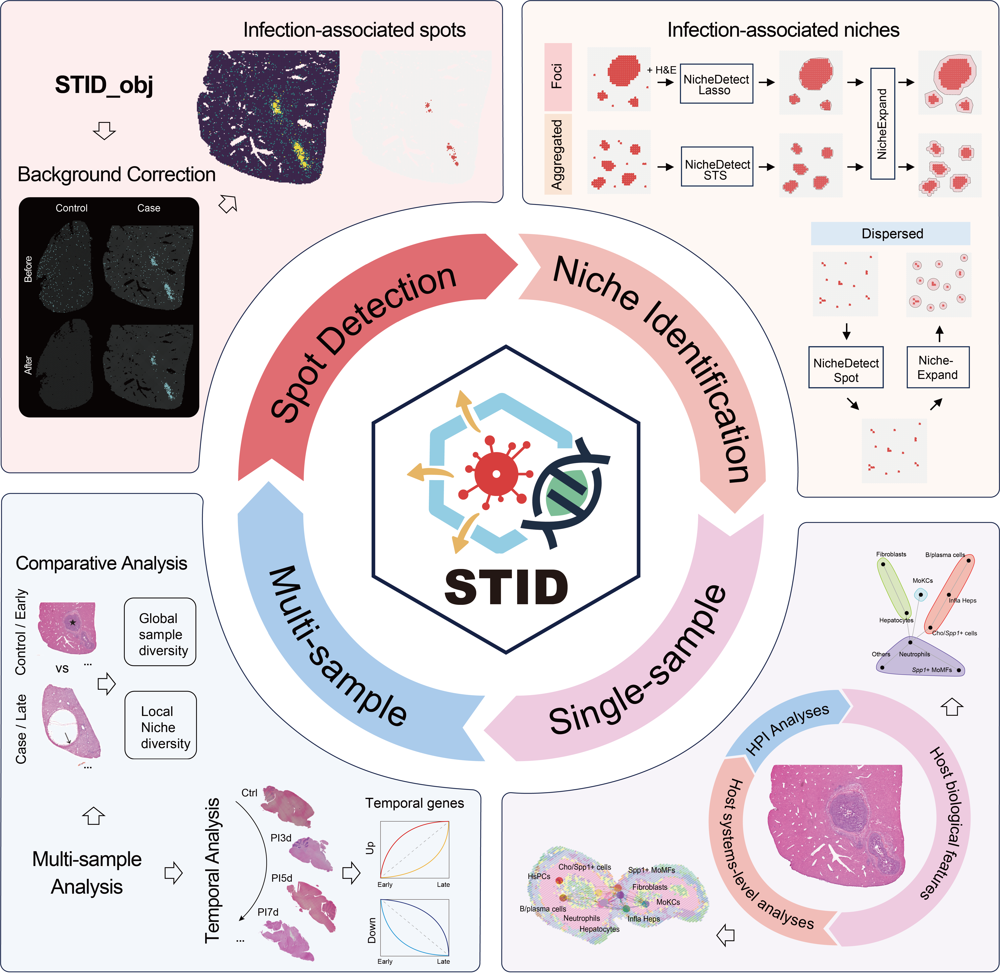

<!-- README.md is generated from README.Rmd. Please edit that file -->

# STID: Spatial Transcriptomics toolkit for Infectious Diseases

<!-- badges: start -->

<!-- badges: end -->

## Overview

Spatial transcriptomic studies of infectious diseases still rely on
fragmented data analysis processes. Here, we developed STID, a
standardized framework for spatial transcriptomic analysis of infectious
diseases, that leverages the Seurat ecosystem and incorporates Python
based modules. STID provides an extensible infection-specific data
structure and supports a full suite of analyses, such as pathogen
background correction, infection-associated spot and niche
identification, single-sample niche characterization, and multi-sample
comparative and temporal analyses. Moreover, STID is broadly applicable
to spatial transcriptomic data from infectious diseases caused by
bacteria, viruses, and parasites, and enables systematic
characterization of the structural features, cellular composition,
molecular functions, and host–pathogen interactions within pathogen
infected and/or host responsive niches. Overall, STID provides an
accessible, reproducible, and extensible framework for analyzing
infection-associated spatial transcriptomic data and for dissecting
host–pathogen interactions in their native spatial microenvironments.

<div align="center">



Graphical abstract

</div>

### Key Features

- STID provides a convenient, efficient, and reproducible standardized
  framework for spatial transcriptomic analysis of infectious diseases
- STID constructs an infection-specific data structure
- STID enables accurate identification and characterization of
  pathogen-infected and host-responsive niches
- STID supports comparative and temporal analyses of multi-sample
  spatial transcriptomic data

### Key Functionalities

| Function Category      | Supported Methods                             |
|:-----------------------|:----------------------------------------------|
| Data conversion        | `h5ad2rds`, `rds2h5ad`                        |
| Preprocessing          | `Seurat_pipeline`, `anno_SingleR`             |
| Background correction  | `CorrectBackground`                           |
| Spot detection         | `SpotDetect_Gene`, `SpotDetect_Geneset`       |
| Niche identification   | `NicheDetect_Lasso`, `NicheDetect_STS`, etc.  |
| Single-Sample analysis | `CalSampComp`, `CalSampDEGs`, etc.            |
| Multi-Sample analysis  | `CalSampPathoTrack`, `CalSampGeneTrend`, etc. |

## Installation

### Configure

- mirrors

To ensure stable and fast installation, users may configure CRAN and
Bioconductor mirrors depending on their location.

``` r
# Recommended for users in China
options("repos" = c(CRAN="https://mirrors.tuna.tsinghua.edu.cn/CRAN/"))
options(BioC_mirror="https://mirrors.tuna.tsinghua.edu.cn/bioconductor")

# Recommended for users outside China
options("repos" = c(CRAN="https://cloud.r-project.org"))
options(BioC_mirror = "https://bioconductor.org")
```

- library path

Given the number of dependencies, it is strongly recommended to use an
isolated library path.

This prevents conflicts with existing R environments and improves
reproducibility.

``` r
dir.create("./library_STID/", showWarnings = FALSE) 
.libPaths("./library_STID/")  # modify as needed
.libPaths()
```

- additional configuration

``` r
# Increase download timeout to avoid failures caused by unstable network connections
options(timeout = 300)

# Enable parallel compilation to accelerate package installation
Sys.setenv(MAKEFLAGS = paste0("-j", parallel::detectCores() - 2))

# Optimize compilation flags (reduce debug info and improve performance)
Sys.setenv(
  PKG_CFLAGS = "-O2 -g0 -DNDEBUG",
  PKG_CXXFLAGS = "-O2 -g0 -DNDEBUG"
)
```

### Pre-installation requirements

It is recommended to use R version 4.5 or higher. If your R version is
lower than 4.5, installation will become difficult, as many dependent
packages need to be compiled and installed. It is recommended that you
first install the following packages:

> Installation from source is recommended

``` r
# Core infrastructure package
install.packages("rlang") # >= 1.1.7


# These packages require network access (e.g., GitHub or external sources).
# Installation failures (e.g., "Error in download.file") are often caused by network issues.
# Retry installation or consider using a proxy/VPN if necessary.
# Note: this is not a complete list, but these are the most failure-prone packages.
install.packages("openssl") # >= 2.3.5
install.packages("curl") # >= 7.0.0 
install.packages("systemfonts")


# These packages are recommended to be installed as binary versions
# to avoid compilation errors and reduce installation time
install.packages("Matrix", type = "binary") # >= 1.6.5
install.packages("RcppArmadillo", type = "binary")
install.packages("uwot", type = "binary")
install.packages("units", type = "binary")
install.packages("ggforce", type = "binary")
```

### Install STID

If installation fails, we recommend re-running the installation command
multiple times and using the dependency checking utility to identify
missing packages. Problematic packages should then be installed
individually until all dependencies are successfully resolved.

> When prompted to update packages, select “3: None” to avoid
> overwriting previously installed versions (e.g., Matrix). Installation
> from source is recommended.

``` r
if (!requireNamespace("remotes", quietly = TRUE)) {
    install.packages("remotes")
}

remotes::install_github("YulongQin/STID")
```

> If the installation fails, please refer to the [installation
> tutorial](https://yulongqin.github.io/STID/articles/01_Installation.html)
> for manual dependency setup

## Quick Start

You can click
[here](https://yulongqin.github.io/STID/articles/00_Quick_Start.html) to
access the quick start tutorial, which provides a concise overview of
the main functions and workflow of STID.

For a more detailed step-by-step guide, please refer to the following
tutorials:

- [01_Installation](https://yulongqin.github.io/STID/articles/01_Installation.html)
- [02_PreProcssing](https://yulongqin.github.io/STID/articles/02_PreProcssing.html)
- [03_Background_correction](https://yulongqin.github.io/STID/articles/03_Background_correction.html)
- [04_Infection_spot_detection](https://yulongqin.github.io/STID/articles/04_Infection_spot_detection.html)
- [05_Infection_niche_detection](https://yulongqin.github.io/STID/articles/05_Infection_niche_detection.html)
- [06_SingleSampNiche_analysis](https://yulongqin.github.io/STID/articles/06_SingleSampNiche.html)
- [07_MultiSampNiche_analysis](https://yulongqin.github.io/STID/articles/07_MultiSampNiche.html)

## Resources

### Project

- GitHub Repository: Access the source code and contribute to STID on
  [GitHub](https://github.com/YulongQin/STID.git).

### Tutorials

- Online Tutorial: For a comprehensive guide on using STID, visit our
  [tutorial website](https://yulongqin.github.io/STID/).

### Data availability

- Gene_Geneset

  A dataset containing gene and gene set information, available in the
  [R
  package](https://github.com/YulongQin/STID/blob/d305ee31337ee7290981a50ed08cd74746a1ff70/data/Gene_Geneset.rda).

- Raw data

  You can access the Raw data used in the tutorial from the [Figshare
  repository](https://doi.org/10.6084/m9.figshare.31839988). Some data
  are unavailable or partially available due to constraints set by the
  original authors. Please contact the original authors for data access
  requests.

### Code availability

- The version used in this study has been archived on
  [Zenodo](https://doi.org/10.5281/zenodo.20353070).
- All analysis scripts required to reproduce the article results are
  available at the
  [article_code](https://github.com/YulongQin/STID/tree/main/article_code).

## Citation

If you use STID in your research, please cite:

Qin Y (2026). *STID: A Standardized Spatial Transcriptomics Analysis
Framework for Infectious Diseases*.
<https://github.com/YulongQin/STID.git>,
<https://yulongqin.github.io/STID/>,
<https://github.com/YulongQin/STID>.
