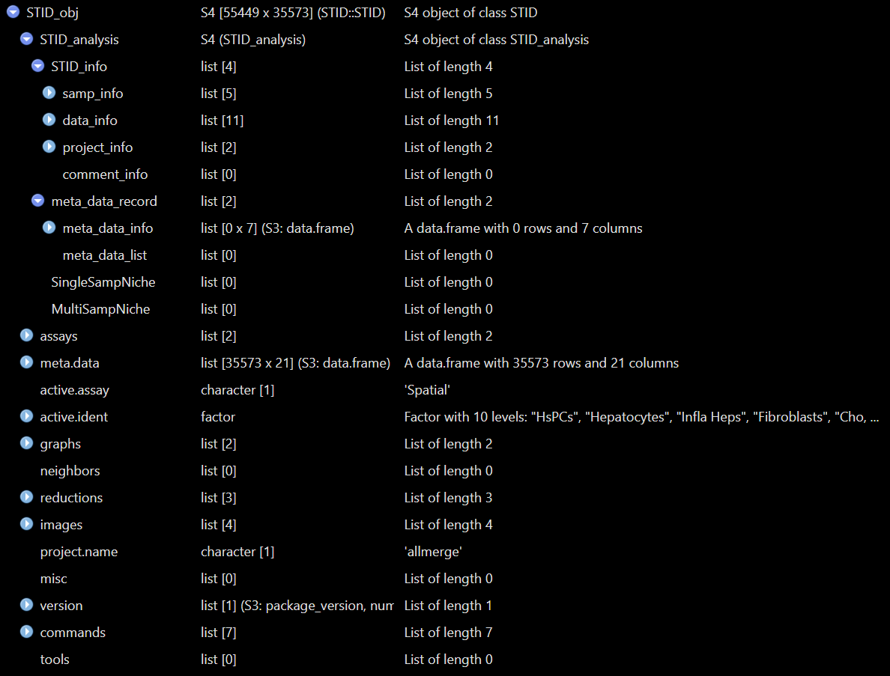

# Load and preprocess

## Overview

This vignette describes how to load and preprocess spatial
transcriptomics data before constructing an `STID` object for downstream
spatial transcriptomic analysis of infectious diseases.

Preprocessing standardizes the input object so that the data are
normalized, dimensionally reduced, clustered, and annotated in a format
compatible with downstream STID modules.

This vignette covers:

- loading an example Seurat object;
- running a Seurat-based preprocessing workflow;
- annotating spatial spots or cells with a reference-based method;
- converting a processed Seurat object into an `STID` object.


Preprocessing modules in the STID workflow.

> **Note:** Update the example dataset name, organism information,
> pathogen gene prefix, and metadata column names according to the
> dataset used in your analysis.

> **Reference code:** For more runnable code examples, please refer to
> the [article
> code](https://github.com/YulongQin/STID/tree/main/article_code).

## Prerequisites

``` r
library(tidyverse)
library(Seurat)
library(STID)
```

`SingleR` and `celldex` are only required for the optional
reference-based annotation step.

## Example data

The example data can be downloaded from
[Figshare](https://doi.org/10.6084/m9.figshare.31839988). In this
vignette, we use the `stRNA_AE` dataset as an example. Alveolar
echinococcosis (AE) is a Stereo-seq-based mouse tissue dataset infected
with *Echinococcus multilocularis*.

> **Note:** Replace `./stRNA_AE.rds` with the correct local path or a
> package-provided example dataset.

``` r
stRNA <- readRDS(file = "./stRNA_AE.rds")
stRNA <- suppressMessages(UpdateSeuratObject(stRNA))
# stRNA <- NormalizeData(stRNA)
meta_data <- stRNA@meta.data
table(meta_data$batch)
```

If the input Seurat object already contains reliable clustering results
and cell-type annotations, you can skip the
[`Seurat_pipeline()`](https://yulongqin.github.io/STID/reference/Seurat_pipeline.md)
and
[`anno_SingleR()`](https://yulongqin.github.io/STID/reference/anno_SingleR.md)
sections and convert the object directly into an `STID` object.

> **Note:** Confirm that the metadata column used for sample identity,
> such as `batch`, exists in `stRNA@meta.data`.

## Seurat preprocessing pipeline

This step is optional. Skip it if the input Seurat object has already
been normalized, dimensionally reduced, and clustered.

STID provides the wrapper function
[`Seurat_pipeline()`](https://yulongqin.github.io/STID/reference/Seurat_pipeline.md)
to streamline Seurat-based preprocessing, including normalization,
feature selection, dimensionality reduction, and clustering.

``` r
stRNA <- Seurat_pipeline(
  seurat_obj = stRNA,
  data_type = "stRNA",
  resolution_index = seq(0.1, 1.3, 0.2),
  runTSNE_index = FALSE,
  assay_nm = NULL
)
```

#### Details

The preprocessing pipeline performs:

- data normalization and scaling;
- identification of highly variable features;
- principal component analysis (PCA);
- graph-based clustering across multiple resolutions.

The `resolution_index` argument controls clustering granularity. Adjust
this parameter according to the expected spatial complexity and
biological heterogeneity of the dataset.

> **Note:** Update `data_type`, `resolution_index`, `runTSNE_index`, and
> `assay_nm` when applying this workflow to other platforms or assay
> structures.

## Cell-type annotation using SingleR

This step is optional. Skip it if cell-type annotations are already
available in the Seurat metadata.

Reference-based annotation can help interpret spatial spots or cells by
mapping query profiles to a reference dataset with known cell-type
labels.

``` r
# library(SingleR)
# library(celldex)

# ref <- celldex::MouseRNAseqData()

stRNA <- anno_SingleR(
  seurat_obj = stRNA,
  ref_obj = ref,
  seurat_colnm = "seurat_clusters",
  ref_colnm = "label.main"
)
```

The
[`anno_SingleR()`](https://yulongqin.github.io/STID/reference/anno_SingleR.md)
function annotates query spots or cells using the `SingleR` framework.
The resulting annotations are stored in the Seurat object.

> **Note:** Replace
> [`MouseRNAseqData()`](https://rdrr.io/pkg/SingleR/man/datasets.html)
> with a reference dataset that matches the species, tissue, and
> experimental context of the query data. Also confirm that
> `seurat_colnm` and `ref_colnm` exist in the corresponding objects.

## Convert the Seurat object into an STID object

To support spatial transcriptomic analysis of infectious diseases, STID
uses a dedicated object class that stores sample information, pathogen
metadata, and platform-specific spatial information.

Before conversion, confirm the following information:

- the sample identifier column;
- the sample group column;
- the cell-type annotation column;
- the host organism;
- the pathogen group and organism;
- the pathogen gene list;
- the spatial bin size, data format, and platform.

``` r
pathogen_genes <- grep("^EmuJ-", rownames(stRNA), value = TRUE)

STID_obj <- as.STID(
  stRNA,
  samp_colnm = "batch",
  samp_grp_colnm = "group",
  celltype_colnm = "anno",
  host_org = "mouse",
  pathogen_grp = "parasite",
  pathogen_org = "EmuJ",
  pathogen_genes = pathogen_genes,
  binsize = 50,
  data_format = "square_grid",
  data_platform = "StereoSeq"
)

print(STID_obj)
```

The [`as.STID()`](https://yulongqin.github.io/STID/reference/as.STID.md)
function converts a processed Seurat object into an `STID` object. The
generated object is used as the standard input for downstream STID
analyses.

> **Note:** These assumptions are dataset-specific. Update `samp_colnm`,
> `samp_grp_colnm`, `celltype_colnm`, `host_org`, `pathogen_grp`,
> `pathogen_org`, `pathogen_genes`, `binsize`, `data_format`, and
> `data_platform` before using this workflow for another dataset.

## Inspect the STID object

The following figure shows the structure of `STID` object.


STID class structure

The following figures show example views of the generated `STID` object.



Example view of the raw STID object.


Printed summary of the raw STID object.

## Notes

- Verify that all metadata columns passed to
  [`as.STID()`](https://yulongqin.github.io/STID/reference/as.STID.md)
  are present in `stRNA@meta.data`.
- Check the pathogen gene prefix carefully, because an incorrect pattern
  may remove pathogen-derived features from downstream analysis.

## Next steps

This vignette generated a processed `STID` object containing spatial
coordinates, sample information, and host–pathogen metadata. In the next
vignette, we will use this object to correct pathogen-derived background
signals before detecting infection-associated spots.

## Session information

``` r
sessionInfo()
#> R version 4.2.0 (2022-04-22 ucrt)
#> Platform: x86_64-w64-mingw32/x64 (64-bit)
#> Running under: Windows 10 x64 (build 22000)
#> 
#> Matrix products: default
#> 
#> locale:
#> [1] LC_COLLATE=Chinese (Simplified)_China.utf8 
#> [2] LC_CTYPE=Chinese (Simplified)_China.utf8   
#> [3] LC_MONETARY=Chinese (Simplified)_China.utf8
#> [4] LC_NUMERIC=C                               
#> [5] LC_TIME=Chinese (Simplified)_China.utf8    
#> 
#> attached base packages:
#> [1] stats     graphics  grDevices utils     datasets  methods   base     
#> 
#> loaded via a namespace (and not attached):
#>  [1] digest_0.6.35     R6_2.6.1          jsonlite_1.8.8    lifecycle_1.0.5  
#>  [5] evaluate_1.0.1    cachem_1.1.0      rlang_1.1.7       cli_3.6.5        
#>  [9] rstudioapi_0.15.0 fs_1.6.3          jquerylib_0.1.4   bslib_0.8.0      
#> [13] ragg_1.3.0        rmarkdown_2.29    pkgdown_2.2.0     textshaping_0.3.6
#> [17] desc_1.4.3        tools_4.2.0       htmlwidgets_1.6.4 yaml_2.3.10      
#> [21] xfun_0.49         fastmap_1.2.0     compiler_4.2.0    systemfonts_1.0.4
#> [25] htmltools_0.5.8.1 knitr_1.49        sass_0.4.9
```
