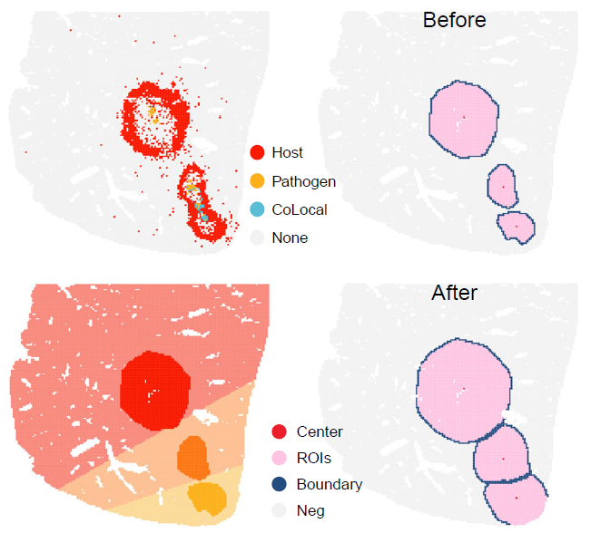

# Infection-associated niche identification

## Overview

This vignette describes how to identify infection-associated spatial
niches using `STID` after preprocessing, background correction when
required, and infection-associated spot detection.

`STID` supports three complementary niche identification modes according
to the spatial organization of positive spots:

- **Foci-type niches**, which represent highly localized
  infection-associated regions;
- **Aggregated-type niches**, which represent spatially clustered
  positive regions with broader regional structure;
- **Dispersed-type niches**, which represent spatially distributed
  positive spots without strong regional aggregation.

This vignette covers:

- preparing example `STID` objects for niche identification;
- detecting infection-associated spots from pathogen-derived and
  host-response signals;
- identifying foci-type niches using lasso-based spatial boundary
  detection;
- identifying aggregated-type niches using regional spatial
  transcriptomic signal aggregation;
- identifying dispersed-type niches at the positive-spot level;
- visualizing niche boundaries and distance-dependent signal profiles.

> **Note:** Update the input object names, sample identifiers, metadata
> columns, pathogen gene list, host-response gene list, gene-set
> collections, detection thresholds, niche-detection parameters,
> plotting colors, output group names, and figure paths according to the
> dataset used in your analysis.


Overview of the three infection-associated niche identification
strategies.

## Prerequisites

``` r
library(tidyverse)
library(Seurat)
library(STID)
```

## Example data

The foci-type example uses the AE `STID_obj_after` object generated in
the pathogen background correction workflow，and the analysis focuses on
the `DPI_4d` sample.

The aggregated-type and dispersed-type examples use the `PI4d` and
`PI3d` samples from the `stRNA_JEV` dataset, respectively.

The `stRNA_JEV` example data can be downloaded from
[Figshare](https://doi.org/10.6084/m9.figshare.31839988).

> **Note:** Replace `./stRNA_JEV.rds`, `STID_obj_after`, `DPI_4d`,
> `PI4d`, and `PI3d` with the corresponding file path, object names, and
> sample identifiers used in your dataset.

``` r
stRNA <- readRDS(file = "./stRNA_JEV.rds")
stRNA <- suppressMessages(UpdateSeuratObject(stRNA))
# stRNA <- NormalizeData(stRNA)
meta_data <- stRNA@meta.data
table(meta_data$new_samp)
```

If the input Seurat object already contains reliable normalization,
metadata, and annotation fields, it can be converted directly into an
`STID` object. Otherwise, run the preprocessing workflow described in
the loading and preprocessing vignette before continuing.

> **Note:** Confirm that the metadata columns passed to
> [`as.STID()`](https://yulongqin.github.io/STID/reference/as.STID.md),
> including `new_samp`, `new_cell`, and `grp` in this example, are
> present in `stRNA@meta.data`.

### Construct the STID object

The JEV example uses viral genes as pathogen-derived features and
selected interferon- and inflammation-associated genes as host-response
markers.

``` r
pathogen_genes <- c(
  "NS5", "C", "NS3", "NS1", "E", "Prm", "NS4aAlt", "NS4bAlt", "NS2a", "NS2b"
)
host_response_genes <- c("Cxcl10", "Ifitm3", "Isg15", "Irf7", "Ccl5", "Ccl2")
```

``` r
STID_obj <- as.STID(
  stRNA,
  samp_colnm = "new_samp",
  samp_grp_colnm = "grp",
  celltype_colnm = "new_cell",
  host_org = "mouse",
  pathogen_grp = "virus",
  pathogen_org = "JEV",
  pathogen_gene = pathogen_genes,
  data_format = "square_grid",
  data_platform = "StereoSeq",
  binsize = 35
)

print(STID_obj)
```

### Infection-associated spot detection

Niche identification requires positive spots as input. In this example,
pathogen-associated spots are defined from aggregated viral gene signal,
and host-response spots are defined from either host-response genes or
gene-set scores.

> **Note:** If positive spots have already been generated in the
> infection-associated spot detection workflow, this section can be
> skipped. Update the metadata keys in later sections to match the
> previously generated detection results.

``` r
COLOR_DIS_CON <- list(
  dis = c("grey95", "#E34D4A"),
  con = c("#440154FF", "#3B528BFF", "#21908CFF", "#5DC863FF", "#FDE725FF")
)
```

``` r
pathogen_signal <- GetGeneStat(
  STID_obj = STID_obj,
  features = pathogen_genes,
  prefix = "all_gene",
  func = "sum"
)

STID_obj <- AddMetaColumn(
  STID_obj = STID_obj,
  add_data = pathogen_signal,
  meta_key = "raw",
  ignore_rownm = FALSE
)

pathogen_signal_columns <- grep(
  "all_gene",
  colnames(STID_obj@meta.data),
  value = TRUE
)

STID_obj <- SpotDetect_Gene(
  STID_obj = STID_obj,
  features = pathogen_genes,
  feature_colnm = pathogen_signal_columns,
  PosThres_prob = 0,
  PosThres_count = 1,
  col = COLOR_DIS_CON,
  black_bg = FALSE,
  pt_size = 0.25,
  blur_method = NULL,
  blur_n = 1,
  blur_sigma = 0.5,
  plot_method = "single",
  grp_nm = "JEV_correct_before_all_gene_white"
)

STID_obj <- SpotDetect_Gene(
  STID_obj = STID_obj,
  features = host_response_genes,
  feature_colnm = pathogen_signal_columns,
  PosThres_prob = 0,
  PosThres_count = 4,
  col = COLOR_DIS_CON,
  black_bg = FALSE,
  pt_size = 0.25,
  blur_method = NULL,
  blur_n = 1,
  blur_sigma = 0.5,
  plot_method = "single",
  grp_nm = "JEV_correct_before_host_gene_white"
)
```

``` r
Gene_Geneset <- STID::Gene_Geneset

pcd_geneset_df <- Gene_Geneset$Mouse$Geneset$Mouse_PCD_geneset
pcd_geneset_list <- lapply(pcd_geneset_df, function(x) na.omit(x))

STID_obj <- SpotDetect_Geneset(
  STID_obj = STID_obj,
  geneset_list = pcd_geneset_list,
  score_method = "AddModuleScore",
  n_iter = 5,
  nbin = 24,
  seed = 10,
  PosThres_prob = 0.75,
  PosThres_score = 0,
  pt_size = 0.25,
  col = COLOR_DIS_CON,
  black_bg = FALSE,
  blur_method = NULL,
  plot_method = "single",
  grp_nm = "JEV_correct_before_PCD_white"
)

viral_response_geneset_df <- Gene_Geneset$Mouse$Geneset$Mouse_GO_BP_Detect_viral_geneset
colnames(viral_response_geneset_df) <- gsub(
  "GOBP_",
  "",
  colnames(viral_response_geneset_df)
)
viral_response_geneset_list <- lapply(viral_response_geneset_df, function(x) na.omit(x))

STID_obj <- SpotDetect_Geneset(
  STID_obj = STID_obj,
  geneset_list = viral_response_geneset_list,
  score_method = "AddModuleScore",
  n_iter = 5,
  nbin = 24,
  PosThres_prob = 0.75,
  PosThres_score = 0,
  pt_size = 0.25,
  col = COLOR_DIS_CON,
  black_bg = FALSE,
  blur_method = NULL,
  plot_method = "single",
  grp_nm = "JEV_correct_before_GO_viral_white"
)
```

## Foci-type niche identification

For foci-type niches, clear infectious foci were first confirmed in H&E
images. `NicheDetect_Lasso` was then used to delineate foci-associated
niches by integrating infected spots, host-response spots, cell-type
annotations, and H&E histology.

Foci-type niche identification is designed for highly localized
infection-associated regions. This example uses the background-corrected
object `STID_obj_after` from the background correction workflow and
focuses on the `DPI_4d` sample.

> **Note:** Replace `STID_obj_after`, `DPI_4d`, `anno`, `batch`, color
> vectors, marker genes, gene-set names, and metadata keys with the
> corresponding values from your dataset.

``` r
STID_obj_foci <- STID_obj_after

foci_celltype_colors <- c(
  "HsPCs" = "#E41A1C",
  "Hepatocytes" = "grey95",
  "Infla Heps" = "#4DAF4A",
  "Fibroblasts" = "#984EA3",
  "Cho/Spp1+ cells" = "#FFFF33",
  "Spp1+ MoMFs" = "#FF7F00",
  "MoKCs" = "#377EB8",
  "Neutrophils" = "#F781BF",
  "B/plasma cells" = "#A65628",
  "Others" = "#8DA0CB"
)
```

``` r
STID_obj_lasso <- NicheDetect_Lasso(
  STID_obj = STID_obj_foci,
  meta_key = "coord",
  group_by = "anno",
  col = foci_celltype_colors,
  grp_nm = "CE_lasso"
)

print(STID_obj_lasso)

foci_lasso_key <- "M2_NicheDetect_Lasso_CE_lasso"
lasso_meta <- GetMetaData(
  STID_obj_lasso,
  meta_key = foci_lasso_key,
  add_coord = FALSE
)[[1]]
```


Foci-type niche boundary detected using lasso-based spatial delineation.

### Visualize foci-type niche regions

After niche identification, boundary spots were defined using kNN-based
neighborhood relationships, and each ROI center was estimated from
median spot coordinates. Distances to the nearest center were then
calculated, and bystander spots were assigned to the closest ROI.

The following plots show the spatial distribution of lasso-defined
regions of interest and the corresponding region labels.

``` r
FOCI_DARK <- c("#F81B02FF", "#FC7715FF", "#FCB11C")
FOCI_LIGHT <- c("#F88A7E", "#FCC093", "#FCDB9A")

Plot_Spatial(
  plot_data = lasso_meta,
  x_colnm = "x",
  y_colnm = "y",
  group_by = "ROI_region",
  facet_grpnm = "batch",
  datatype = "discrete",
  col = list(dis = c("grey95", "#FFC4E1", "#244D7F", "#EB1E2C"), con = NULL),
  pt_size = 1,
  vmin = NULL,
  vmax = "p99",
  title = NULL,
  subtitle = NULL,
  black_bg = FALSE
)

Plot_Spatial(
  plot_data = lasso_meta,
  x_colnm = "x",
  y_colnm = "y",
  group_by = "All_ROI_label2",
  facet_grpnm = "batch",
  datatype = "discrete",
  col = list(dis = c(FOCI_LIGHT, FOCI_DARK), con = NULL),
  pt_size = 1.1,
  vmin = NULL,
  vmax = "p99",
  title = NULL,
  subtitle = NULL,
  black_bg = FALSE
)
```

### Expand foci-type niche boundaries

`NicheExpand` can refine initial niches by adding bystander spots within
a selected distance from each ROI boundary.

Niche expansion can be used to include spatial neighborhoods surrounding
the detected foci. The expansion distance should be selected according
to platform resolution, bin size, and the expected physical scale of
infection-associated regions.

``` r
STID_obj_expand <- NicheExpand(
  STID_obj = STID_obj_lasso,
  meta_key = foci_lasso_key,
  pos_colnm = "ROI_label",
  center_colnm = "ROI_center",
  expand_dist = 8,
  grp_nm = "CE"
)

print(STID_obj_expand)

foci_expand_key <- "M2_NicheExpand_CE"
expand_meta <- GetMetaData(
  STID_obj_expand,
  meta_key = foci_expand_key,
  add_coord = TRUE
)[[1]]
```

> **Note:** Update `expand_dist` according to the bin size and the
> expected spatial radius of the niche boundary in your dataset.

``` r
Plot_Spatial(
  plot_data = expand_meta,
  x_colnm = "x",
  y_colnm = "y",
  group_by = "ROI_region",
  facet_grpnm = "batch",
  datatype = "discrete",
  col = list(dis = c("grey95", "#FFC4E1", "#244D7F", "#EB1E2C"), con = NULL),
  pt_size = 1,
  vmin = NULL,
  vmax = "p99",
  title = NULL,
  subtitle = NULL,
  black_bg = FALSE
)

Plot_Spatial(
  plot_data = expand_meta,
  x_colnm = "x",
  y_colnm = "y",
  group_by = "All_ROI_label2",
  facet_grpnm = "batch",
  datatype = "discrete",
  col = list(dis = c(FOCI_LIGHT, FOCI_DARK), con = NULL),
  pt_size = 1.1,
  vmin = NULL,
  vmax = "p99",
  title = NULL,
  subtitle = NULL,
  black_bg = FALSE
)
```



Expanded foci-type niche regions.

### Plot distance-dependent signal profiles

STID summarizes distance-dependent gradients from niche centers to
surrounding tissue. Gene-expression profiles are smoothed with GAMs,
while cell-composition profiles are calculated in distance bins; both
outputs can be visualized with niche boundaries annotated.

Distance profiles summarize how pathogen-derived genes, host-response
genes, or gene-set scores change from the niche center toward the
surrounding tissue.

``` r
foci_gene_detection_key <- "M1_SpotDetect_Gene_CE_correct_after_host_gene_white"
foci_pcd_detection_key <- "M1_SpotDetect_Geneset_CE_correct_after_PCD_white"
foci_parasite_geneset_key <- "M1_SpotDetect_Geneset_CE_correct_after_KEGG_Parasite_white"

# Profiles before niche expansion.
Plot_DistLine_Exp(
  STID_obj = STID_obj_lasso,
  features = c("EmuJ-002209100", "Spp1", "Il1b"),
  feature_colnm = "all_gene_nFeature(sum)",
  col = c("#F81B02FF", "#3B95C4FF", "#3B95C4FF", "#F81B02FF"),
  facet_grpnm = "batch",
  meta_key = list(c(foci_gene_detection_key, foci_lasso_key))
)

Plot_DistLine_Exp(
  STID_obj = STID_obj_lasso,
  features = NULL,
  feature_colnm = c("Necroptosis"),
  col = c("#3B95C4FF"),
  facet_grpnm = "batch",
  meta_key = list(c(foci_pcd_detection_key, foci_lasso_key))
)

Plot_DistLine_Exp(
  STID_obj = STID_obj_lasso,
  features = NULL,
  feature_colnm = c("Malaria"),
  col = c("#3B95C4FF"),
  facet_grpnm = "batch",
  meta_key = list(c(foci_parasite_geneset_key, foci_lasso_key))
)

# Profiles after niche expansion.
Plot_DistLine_Exp(
  STID_obj = STID_obj_expand,
  features = c("EmuJ-002209100", "Spp1", "Il1b"),
  feature_colnm = "all_gene_nFeature(sum)",
  col = c("#F81B02FF", "#3B95C4FF", "#3B95C4FF", "#F81B02FF"),
  facet_grpnm = "batch",
  meta_key = list(c(foci_gene_detection_key, foci_expand_key))
)

Plot_DistLine_Exp(
  STID_obj = STID_obj_expand,
  features = NULL,
  feature_colnm = c("Necroptosis"),
  col = c("#3B95C4FF"),
  facet_grpnm = "batch",
  meta_key = list(c(foci_pcd_detection_key, foci_expand_key))
)

Plot_DistLine_Exp(
  STID_obj = STID_obj_expand,
  features = NULL,
  feature_colnm = c("Malaria"),
  col = c("#3B95C4FF"),
  facet_grpnm = "batch",
  meta_key = list(c(foci_parasite_geneset_key, foci_expand_key))
)
```


Distance-dependent feature profiles for foci-type niches.

> **Note:** Replace the marker genes, gene-set names, metadata keys, and
> `facet_grpnm` with values that correspond to the features and sample
> metadata in your dataset.

## Aggregated-type niche identification

For aggregated-type niches, `NicheDetect_STS` automatically identifies
clustered positive regions after low-density filtering and kNN-based
refinement of positive spots. Region-level mode uses DBSCAN and hull
reconstruction to define niche regions, whereas spot-level mode uses kNN
graphs and connected components to delineate contiguous positive-spot
clusters.

Aggregated-type niche identification detects spatially clustered regions
based on pathogen-associated or host-response positive spots. In the JEV
example, the `PI4d` sample is used to illustrate aggregated spatial
organization.

> **Note:** Replace `PI4d`, detection metadata keys, positive-label
> columns, `density_thres`, `region_detect_method`, and output group
> names according to the spatial aggregation pattern and detection
> results in your dataset.

``` r
aggregated_sample_id <- "PI4d"

STID_obj_aggregated <- STID_obj

# Pathogen-associated aggregated niches.
STID_obj_aggregated <- NicheDetect_STS(
  STID_obj = STID_obj_aggregated,
  meta_key = "M1_SpotDetect_Gene_JEV_correct_before_all_gene_white",
  spatial_scale_method = "region",
  region_detect_method = "convex",
  update_spots = FALSE,
  ROI_size = NULL,
  density_thres = 1,
  pos_colnm = "Label_all_gene_nFeature(sum)",
  description = NULL,
  grp_nm = "STS_JEV_microbe_region",
  dir_nm = "M2_NicheDetect_STS"
)

pathogen_niche_key <- "M2_NicheDetect_STS_STS_JEV_microbe_region"
pathogen_meta <- GetMetaData(
  STID_obj_aggregated,
  meta_key = pathogen_niche_key,
  add_coord = FALSE
)[[1]]

# Host-response aggregated niches.
STID_obj_aggregated <- NicheDetect_STS(
  STID_obj = STID_obj_aggregated,
  meta_key = "M1_SpotDetect_Geneset_JEV_correct_before_GO_viral_white",
  spatial_scale_method = "region",
  region_detect_method = "convex",
  update_spots = TRUE,
  ROI_size = NULL,
  density_thres = 0.3,
  pos_colnm = "Label_RESPONSE_TO_VIRUS",
  description = NULL,
  grp_nm = "STS_JEV_host_region",
  dir_nm = "M2_NicheDetect_STS"
)

print(STID_obj_aggregated)

host_niche_key <- "M2_NicheDetect_STS_STS_JEV_host_region"
host_meta <- GetMetaData(
  STID_obj_aggregated,
  meta_key = host_niche_key,
  add_coord = FALSE
)[[1]]
```

#### Details

Key parameters include:

- `meta_key`: metadata key containing positive-spot detection results;
- `pos_colnm`: positive-label column used to define candidate spots;
- `spatial_scale_method`: spatial scale used for niche construction;
- `region_detect_method`: method used to delineate regional boundaries;
- `density_thres`: density threshold used to retain aggregated regions;
- `update_spots`: whether updated spot labels are written back to the
  object;
- `grp_nm`: group name used to store the aggregated niche results.

The `density_thres` parameter should be calibrated to the expected
compactness of pathogen-positive or host-response-positive regions.

### Visualize aggregated niches

The following plots show the spatial distributions of
pathogen-associated and host-response aggregated niches.

``` r
PATHOGEN_DARK <- c("#50C49FFF", "#FC7715FF", "#FCB11C", "#F81B02FF", "#3B95C4FF", "#B560D4FF")
PATHOGEN_LIGHT <- c("#BBBFA1", "#FCC093", "#FCDB9A", "#F88A7E", "#9DB7C4", "#D1CAD4")
HOST_DARK <- c("#F81B02FF", "#FC7715FF", "#FCB11C", "#B560D4FF")
HOST_LIGHT <- c("#F88A7E", "#FCC093", "#FCDB9A", "#D1CAD4")

Plot_Spatial(
  plot_data = pathogen_meta,
  x_colnm = "x",
  y_colnm = "y",
  group_by = "ROI_region",
  facet_grpnm = "new_samp",
  datatype = "discrete",
  col = list(dis = c("grey95", "#FFC4E1", "#244D7F", "#EB1E2C"), con = NULL),
  pt_size = 1,
  vmin = NULL,
  vmax = "p99",
  title = NULL,
  subtitle = NULL,
  black_bg = FALSE
)

Plot_Spatial(
  plot_data = pathogen_meta,
  x_colnm = "x",
  y_colnm = "y",
  group_by = "All_ROI_label2",
  facet_grpnm = "new_samp",
  datatype = "discrete",
  col = list(dis = c(PATHOGEN_LIGHT, PATHOGEN_DARK), con = NULL),
  pt_size = 1.1,
  vmin = NULL,
  vmax = "p99",
  title = NULL,
  subtitle = NULL,
  black_bg = FALSE
)

Plot_Spatial(
  plot_data = host_meta,
  x_colnm = "x",
  y_colnm = "y",
  group_by = "ROI_region",
  facet_grpnm = "new_samp",
  datatype = "discrete",
  col = list(dis = c("grey95", "#FFC4E1", "#244D7F", "#EB1E2C"), con = NULL),
  pt_size = 1,
  vmin = NULL,
  vmax = "p99",
  title = NULL,
  subtitle = NULL,
  black_bg = FALSE
)

Plot_Spatial(
  plot_data = host_meta,
  x_colnm = "x",
  y_colnm = "y",
  group_by = "All_ROI_label2",
  facet_grpnm = "new_samp",
  datatype = "discrete",
  col = list(dis = c(HOST_LIGHT, HOST_DARK), con = NULL),
  pt_size = 1.1,
  vmin = NULL,
  vmax = "p99",
  title = NULL,
  subtitle = NULL,
  black_bg = FALSE
)
```


Spatial distribution of pathogen-associated and host-response aggregated
niches.

### Plot distance-dependent signal profiles

Distance profiles can be used to compare molecular signal gradients from
the center of aggregated niches toward surrounding tissue.

``` r
Plot_DistLine_Exp(
  STID_obj = STID_obj_aggregated,
  features = c("NS5", "Ccl2"),
  feature_colnm = "all_gene_nFeature(sum)",
  loop_id = "D5_1",
  col = c("#F81B02FF", "#3B95C4FF", "#F81B02FF"),
  facet_grpnm = "grp",
  meta_key = list(c("M1_SpotDetect_Gene_JEV_correct_before_all_gene_white", pathogen_niche_key))
)

Plot_DistLine_Exp(
  STID_obj = STID_obj_aggregated,
  features = NULL,
  feature_colnm = c("RESPONSE_TO_VIRUS"),
  loop_id = "D5_1",
  col = "#3B95C4FF",
  facet_grpnm = "grp",
  meta_key = list(c("M1_SpotDetect_Geneset_JEV_correct_before_GO_viral_white", pathogen_niche_key))
)

Plot_DistLine_Exp(
  STID_obj = STID_obj_aggregated,
  features = NULL,
  feature_colnm = c("Necroptosis"),
  loop_id = "D5_1",
  col = "#3B95C4FF",
  facet_grpnm = "grp",
  meta_key = list(c("M1_SpotDetect_Geneset_JEV_correct_before_PCD_white", pathogen_niche_key))
)

Plot_DistLine_Exp(
  STID_obj = STID_obj_aggregated,
  features = c("NS5", "Ccl2"),
  feature_colnm = "all_gene_nFeature(sum)",
  loop_id = "D5_1",
  col = c("#F81B02FF", "#3B95C4FF", "#F81B02FF"),
  facet_grpnm = "grp",
  meta_key = list(c("M1_SpotDetect_Gene_JEV_correct_before_all_gene_white", host_niche_key))
)

Plot_DistLine_Exp(
  STID_obj = STID_obj_aggregated,
  features = NULL,
  feature_colnm = c("RESPONSE_TO_VIRUS"),
  loop_id = "D5_1",
  col = "#3B95C4FF",
  facet_grpnm = "grp",
  meta_key = list(c("M1_SpotDetect_Geneset_JEV_correct_before_GO_viral_white", host_niche_key))
)

Plot_DistLine_Exp(
  STID_obj = STID_obj_aggregated,
  features = NULL,
  feature_colnm = c("Necroptosis"),
  loop_id = "D5_1",
  col = "#3B95C4FF",
  facet_grpnm = "grp",
  meta_key = list(c("M1_SpotDetect_Geneset_JEV_correct_before_PCD_white", host_niche_key))
)
```


Distance-dependent feature profiles for aggregated niches.

### Compare pathogen-associated and host-response niches

[`CompareNiche()`](https://yulongqin.github.io/STID/reference/CompareNiche.md)
quantifies the spatial relationship between two niche definitions, such
as pathogen-associated niches and host-response niches.

``` r
CompareNiche(
  STID_obj = STID_obj_aggregated,
  meta_key1 = pathogen_niche_key,
  meta_key2 = host_niche_key,
  bins = 15
)
```


Spatial comparison between pathogen-associated and host-response
aggregated niches.

> **Note:** Update `loop_id`, `facet_grpnm`, `bins`, feature names,
> gene-set names, and metadata keys according to the samples and niche
> definitions used in your analysis.

## Dispersed-type niche identification

For dispersed-type niches, `NicheDetect_Spot` treats each positive spot
as an independent niche.

Dispersed-type niche identification is designed for infection-associated
signals that are spatially distributed rather than concentrated in
continuous regions. In the JEV example, the `PI3d` sample is used to
illustrate dispersed positive-spot organization.

> **Note:** Replace `PI3d`, positive-label columns, metadata keys, and
> output group names according to the dispersed infection-associated
> signal in your dataset.

``` r
dispersed_sample_id <- "PI3d"

STID_obj_dispersed <- NicheDetect_Spot(
  STID_obj = STID_obj,
  pos_colnm = "Label_all_gene_nFeature(sum)",
  meta_key = "M1_SpotDetect_Gene_JEV_correct_before_all_gene_white",
  description = NULL,
  grp_nm = "D3_1"
)

print(STID_obj_dispersed)

dispersed_niche_key <- "M2_NicheDetect_Spot_D3_1"
```

``` r
Plot_DistLine_Exp(
  STID_obj = STID_obj_dispersed,
  features = c("NS5", "Ccl2"),
  feature_colnm = "all_gene_nFeature(sum)",
  loop_id = "D3_1",
  col = c("#F81B02FF", "#3B95C4FF", "#F81B02FF"),
  distance_scale = FALSE,
  exp_scale = FALSE,
  facet_grpnm = "grp",
  meta_key = list(c("M1_SpotDetect_Gene_JEV_correct_before_all_gene_white", dispersed_niche_key))
)

Plot_DistLine_Exp(
  STID_obj = STID_obj_dispersed,
  features = NULL,
  feature_colnm = c("RESPONSE_TO_VIRUS"),
  loop_id = "D3_1",
  col = "#3B95C4FF",
  distance_scale = FALSE,
  exp_scale = FALSE,
  facet_grpnm = "grp",
  meta_key = list(c("M1_SpotDetect_Geneset_JEV_correct_before_GO_viral_white", dispersed_niche_key))
)

Plot_DistLine_Exp(
  STID_obj = STID_obj_dispersed,
  features = NULL,
  feature_colnm = c("Necroptosis"),
  loop_id = "D3_1",
  col = "#3B95C4FF",
  distance_scale = FALSE,
  exp_scale = FALSE,
  facet_grpnm = "grp",
  meta_key = list(c("M1_SpotDetect_Geneset_JEV_correct_before_PCD_white", dispersed_niche_key))
)
```


Distance-dependent feature profiles for dispersed-type niches.

## Notes

- Confirm that infection-associated positive spots have been generated
  before running niche identification.
- Select the niche identification mode according to the observed spatial
  organization of positive spots.
- Use foci-type detection for compact spatial regions, aggregated-type
  detection for broader clustered regions, and dispersed-type detection
  for non-contiguous positive spots.
- Calibrate `density_thres`, `expand_dist`, `ROI_size`, and thresholding
  parameters according to platform resolution, bin size, tissue
  structure, and expected infection burden.
- Verify all metadata keys generated by spot detection and niche
  detection before plotting or comparing niches.
- Replace example genes, gene sets, sample IDs, and visualization
  parameters with values that correspond to the biological system under
  investigation.

## Session information

``` r
sessionInfo()
#> R version 4.2.0 (2022-04-22 ucrt)
#> Platform: x86_64-w64-mingw32/x64 (64-bit)
#> Running under: Windows 10 x64 (build 22000)
#> 
#> Matrix products: default
#> 
#> locale:
#> [1] LC_COLLATE=Chinese (Simplified)_China.utf8 
#> [2] LC_CTYPE=Chinese (Simplified)_China.utf8   
#> [3] LC_MONETARY=Chinese (Simplified)_China.utf8
#> [4] LC_NUMERIC=C                               
#> [5] LC_TIME=Chinese (Simplified)_China.utf8    
#> 
#> attached base packages:
#> [1] stats     graphics  grDevices utils     datasets  methods   base     
#> 
#> loaded via a namespace (and not attached):
#>  [1] digest_0.6.35     R6_2.6.1          jsonlite_1.8.8    lifecycle_1.0.5  
#>  [5] evaluate_1.0.1    cachem_1.1.0      rlang_1.1.7       cli_3.6.5        
#>  [9] rstudioapi_0.15.0 fs_1.6.3          jquerylib_0.1.4   bslib_0.8.0      
#> [13] ragg_1.3.0        rmarkdown_2.29    pkgdown_2.2.0     textshaping_0.3.6
#> [17] desc_1.4.3        tools_4.2.0       htmlwidgets_1.6.4 yaml_2.3.10      
#> [21] xfun_0.49         fastmap_1.2.0     compiler_4.2.0    systemfonts_1.0.4
#> [25] htmltools_0.5.8.1 knitr_1.49        sass_0.4.9
```
