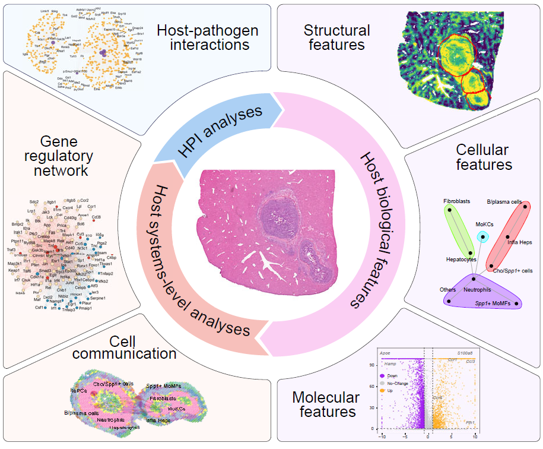
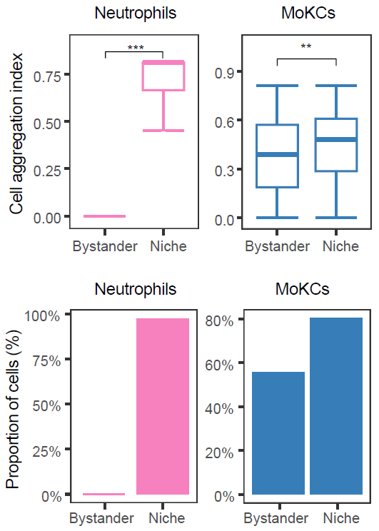
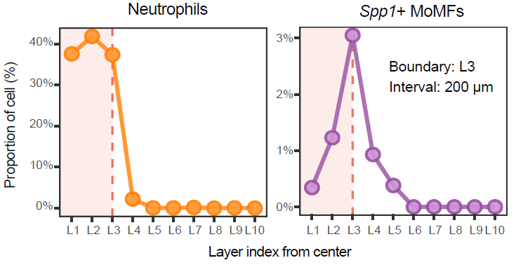

# Single-sample analysis

## Overview

This vignette presents a single-sample workflow in `STID` that starts
from expanded niche metadata and systematically evaluates tissue
composition, cell-type composition, spatial aggregation, colocalization,
cell–cell communication, regulatory networks, and host–pathogen
interactions within selected niches.

This vignette covers:

- constructing a single-sample niche object from expanded niche
  metadata;
- quantifying niche composition, aggregation, colocalization, and
  spatial gradients;
- identifying niche-associated genes and enriched pathways;
- inferring cell–cell communication, regulatory networks, and
  host-pathogen interaction.



Overview of single-sample niche analysis.

> **Note:** Before running the workflow, update the input `STID` object,
> niche metadata key, sample identifier, ROI columns, annotation
> columns, gene sets, reference database paths, pathogen gene prefix,
> plotting colors, and output group names to match the dataset under
> analysis.

> **Reference code:** For more runnable code examples, please refer to
> the [article
> code](https://github.com/YulongQin/STID/tree/main/article_code).

## Prerequisites

``` r
library(tidyverse)
library(Seurat)
library(STID)
```

> **Note:** The core workflow uses `tidyverse`, `Seurat`, and `STID`.
> Downstream sections additionally require resources such as `CellChat`,
> `NicheNet`, BLAST, ligand–receptor networks, and organism-specific
> STRING files. Prepare these dependencies before running the
> corresponding analyses.

## Example data

This example uses the expanded focal-niche object generated by the
infection-associated niche identification workflow. Here,
`STID_obj_expand` contains expanded niche boundaries for the AE dataset,
and the analysis focuses on the `DPI_4_2 (PI4d)` sample.

> **Note:** Replace `STID_obj_expand`, `M2_NicheExpand_AE_expand`,
> `DPI_4_2`, `batch`, `anno`, and ROI-related columns with the
> corresponding object name, metadata keys, sample identifier, and
> annotation columns in your dataset.

``` r
niche_key <- "Niche"
expanded_niche_key <- "M2_NicheExpand_AE_expand"
example_sample_id <- "DPI_4_2"
celltype_column <- "anno"
sample_column <- "batch"
```

### Add tissue-level annotations

Tissue-level annotations can be added before constructing the
single-sample niche object. In this example, liver zonation is
represented by nine periportal-to-pericentral layers and then collapsed
into three broader zones.

> **Note:** If tissue-level annotations are already available, skip this
> step and pass the existing metadata key to
> [`CreateSingleSampNiche()`](https://yulongqin.github.io/STID/reference/CreateSingleSampNiche.md).

``` r
geneset_list <- list(
  Pericentral = c(
    "Akr1c6", "Aldh1a1", "Car3", "Ces1c", "Cyp1a2", "Cyp2c37",
    "Cyp2c50", "Cyp2e1", "Gsta3", "Mgst1", "Mup11", "Mup17",
    "Mup18", "Oat", "Pon1", "Rgn"
  ),
  Periportal = c(
    "Alb", "Aldob", "Arg1", "Asl", "Cyp2f2", "Fbp1", "Hal",
    "Hpx", "Hsd17b13", "Mup20", "Pck1", "Slc25a47", "Trf", "Ass1"
  )
)

COLOR_DIS_CON <- STID::COLOR_DIS_CON

STID_obj_expand <- SpotDetect_Geneset(
  STID_obj_expand,
  geneset_list = geneset_list,
  score_method = "MeanExp",
  n_iter = 5,
  nbin = 24,
  seed = 10,
  PosThres_prob = 0,
  PosThres_score = 0,
  pt_size = 0.25,
  col = COLOR_DIS_CON,
  black_bg = FALSE,
  blur_method = NULL,
  plot_method = "single",
  grp_nm = "AE_detect_geneset_stratify"
)

expanded_meta <- GetMetaData(
  STID_obj_expand,
  meta_key = "M2_SpotDetect_Geneset_AE_detect_geneset_stratify",
  add_coord = TRUE
)[[1]]

expanded_meta <- expanded_meta %>%
  rownames_to_column(var = "cell_id") %>%
  group_by(.data[[sample_column]]) %>%
  mutate(PV_CV = Periportal - Pericentral) %>%
  mutate(label = cut_number(PV_CV, n = 9, labels = FALSE)) %>%
  mutate(label9 = paste0("Layer_", as.numeric(label))) %>%
  mutate(
    label3 = case_when(
      label9 %in% c("Layer_1", "Layer_2", "Layer_3") ~ "Pericentral",
      label9 %in% c("Layer_4", "Layer_5", "Layer_6") ~ "Midzone",
      TRUE ~ "Periportal"
    ),
    label3 = factor(label3, levels = c("Pericentral", "Midzone", "Periportal")),
    merge_label = if_else(ROI_region == "edge", "edge", label9, missing = label9)
  ) %>%
  ungroup() %>%
  column_to_rownames(var = "cell_id")

STID_obj_expand <- AddMetaData(
  STID_obj = STID_obj_expand,
  meta_key = "hep_layer9",
  add_data = expanded_meta
)
```

``` r
LAYER_COLORS <- c(
  "red",
  rev(c(
    "#440154FF", "#472D7BFF", "#3B528BFF", "#2C728EFF", "#21908CFF",
    "#27AD81FF", "#5DC863FF", "#AADC32FF", "#FDE725FF"
  ))
)

Plot_Spatial(
  plot_data = expanded_meta,
  x_colnm = "x",
  y_colnm = "y",
  group_by = "merge_label",
  facet_grpnm = sample_column,
  datatype = "discrete",
  col = list(dis = LAYER_COLORS, con = NULL),
  pt_size = 1.1,
  vmin = NULL,
  vmax = "p99",
  title = NULL,
  subtitle = NULL,
  black_bg = FALSE
)
```

## Construct a single-sample niche object

[`CreateSingleSampNiche()`](https://yulongqin.github.io/STID/reference/CreateSingleSampNiche.md)
organizes niche, edge, center, and bystander-region metadata for
downstream analyses.
[`AddSSNicheCells()`](https://yulongqin.github.io/STID/reference/AddSSNicheCells.md)
then adds selected cell-level or tissue-level labels to the
single-sample niche object.

> **Note:** Update `meta_key`, `ROI_type`, `pos_colnm`, `center_colnm`,
> `edge_colnm`, `all_label_colnm`, `all_dist_colnm`, and `other_colnm`
> to match the metadata generated in the niche identification workflow.

``` r
STID_obj_SS <- CreateSingleSampNiche(
  STID_obj = STID_obj_expand,
  niche_key = niche_key,
  meta_key = list(c(expanded_niche_key, "hep_layer9")),
  ROI_type = "ROI",
  pos_colnm = "ROI_label",
  center_colnm = "ROI_center",
  edge_colnm = "ROI_edge",
  all_label_colnm = "All_ROI_label",
  all_dist_colnm = "All_Dist2ROIcenter",
  other_colnm = "label9",
  description = NULL
)

STID_obj_SS <- AddSSNicheCells(
  STID_obj = STID_obj_SS,
  meta_key = "hep_layer9",
  select_colnm = "label3",
  niche_key = niche_key
)
```

## Quantify tissue and cell-type composition

[`CalSampComp()`](https://yulongqin.github.io/STID/reference/CalSampComp.md)
summarizes the relative abundance of tissue layers or cell types across
niches. Apply the same function to different annotation systems by
changing `group_by`.

> **Note:** Update `group_by` and `loop_id` according to the annotation
> columns and sample identifiers in your dataset.

``` r
col_lasso <- c(
  "HsPCs" = "#E41A1C",
  "Hepatocytes" = "grey95",
  "Infla Heps" = "#4DAF4A",
  "Fibroblasts" = "#984EA3",
  "Cho/Spp1+ cells" = "#FFFF33",
  "Spp1+ MoMFs" = "#FF7F00",
  "MoKCs" = "#377EB8",
  "Neutrophils" = "#F781BF",
  "B/plasma cells" = "#A65628",
  "Others" = "#8DA0CB"
)
col_lasso2 <- c(
  "HsPCs" = "#E41A1C",
  "Hepatocytes" = "#66C2A5",
  "Infla Heps" = "#4DAF4A",
  "Fibroblasts" = "#984EA3",
  "Cho/Spp1+ cells" = "#FFFF33",
  "Spp1+ MoMFs" = "#FF7F00",
  "MoKCs" = "#377EB8",
  "Neutrophils" = "#F781BF",
  "B/plasma cells" = "#A65628",
  "Others" = "#8DA0CB"
)

# Tissue-layer composition
CalSampComp(
  STID_obj = STID_obj_SS,
  niche_key = niche_key,
  group_by = "label9",
  loop_id = "LoopAllSamp",
  col = rev(c(
    "#440154FF", "#472D7BFF", "#3B528BFF", "#2C728EFF", "#21908CFF",
    "#27AD81FF", "#5DC863FF", "#AADC32FF", "#FDE725FF"
  )),
  return_data = FALSE
)

# Cell-type composition
CalSampComp(
  STID_obj = STID_obj_SS,
  niche_key = niche_key,
  group_by = celltype_column,
  loop_id = "LoopAllSamp",
  col = col_lasso,
  return_data = FALSE
)
```


Tissue-layer and cell-type composition within single-sample niches.

## Cell aggregation index

[`CalSampCAI()`](https://yulongqin.github.io/STID/reference/CalSampCAI.md)
measures whether cells of the same type form local aggregates within
niches. The analysis uses nearest-neighbor distances among same-type
cells and summarizes both regional aggregation scores and the fraction
of cells located in connected aggregates.

> **Note:** Set `k_neighbors` according to spatial geometry and
> resolution. Square-grid data commonly use eight neighbors, whereas
> hex-grid data commonly use six. Update `min_agg_size`, `dist_thres`,
> `group_by`, and `loop_id` according to the expected aggregate size.

``` r
cell_aggregation <- CalSampCAI(
  STID_obj = STID_obj_SS,
  niche_key = niche_key,
  group_by = celltype_column,
  loop_id = "LoopAllSamp",
  k_neighbors = 8,
  min_agg_size = 10,
  dist_thres = 1,
  col = col_lasso
)
```



Cell aggregation within single-sample niches.

## Colocalization analysis

[`CalSampCoLoc()`](https://yulongqin.github.io/STID/reference/CalSampCoLoc.md)
evaluates spatial colocalization between cell types or gene-expression
features. Proximity-based analysis summarizes neighborhood enrichment,
whereas expression-based analysis estimates whether neighboring features
improve prediction of a target feature.

> **Note:** Update `group_by`, `loop_id`, `method`, and `mistyR_params`
> according to the feature type, sample identifier, and spatial scale of
> interest. The `squidpy` option requires a Python environment
> accessible through `reticulate`.

``` r
# mistyR
cell_colocalization_mistyR <- CalSampCoLoc(
  STID_obj = STID_obj_SS,
  niche_key = niche_key,
  group_by = celltype_column,
  loop_id = example_sample_id,
  method = "mistyR",
  mistyR_params = c(15, 10),
  return_data = TRUE
)

# squidpy
cell_colocalization_squidpy <- CalSampCoLoc(
  STID_obj = STID_obj_SS,
  niche_key = niche_key,
  group_by = celltype_column,
  loop_id = example_sample_id,
  method = "squidpy",
  mistyR_params = c(15, 10),
  return_data = TRUE
)
```


Spatial colocalization analysis within single-sample niches.

Selected cell-type or gene-pair colocalization patterns can be displayed
directly in spatial coordinates.

> **Note:** Replace `group_use`, `features`, and `loop_id` with
> cell-type or gene pairs relevant to the biological question.

``` r
# Cell-type pair
Plot_SpatialCoLoc(
  STID_obj = STID_obj_SS,
  niche_key = niche_key,
  group_by = celltype_column,
  group_use = c("Neutrophils", "Spp1+ MoMFs"),
  loop_id = "LoopAllSamp"
)

# Gene pair
Plot_SpatialCoLoc(
  STID_obj = STID_obj_SS,
  niche_key = niche_key,
  group_by = NULL,
  group_use = NULL,
  features = c("Ccl3", "Ccr1"),
  loop_id = "LoopAllSamp"
)
```


Spatial visualization of selected colocalized cell types or genes.

## Cell composition gradient analysis

[`Plot_DistLine_Ratio()`](https://yulongqin.github.io/STID/reference/Plot_DistLine_Ratio.md)
summarizes how cell-type proportions change with distance from niche
centers. Cells are binned along the niche-to-bystander axis, and fitted
trends are used to visualize composition shifts across niche boundaries.

> **Note:** Update `celltypes`, `group_by`, `loop_id`, `facet_grpnm`,
> `meta_key`, and `coord_interval_ratio` according to the cell
> annotations, sample identifier, metadata key, and spatial scale used
> in your analysis.

``` r
Plot_DistLine_Ratio(
  STID_obj = STID_obj_SS,
  celltypes = c(
    "Hepatocytes", "Spp1+ MoMFs", "Neutrophils",
    "Fibroblasts", "Cho/Spp1+ cells"
  ),
  group_by = celltype_column,
  loop_id = example_sample_id,
  facet_grpnm = sample_column,
  meta_key = expanded_niche_key,
  coord_interval_ratio = 8
)
```



Distance-dependent niche-associated gradients.

## Differential gene expression analysis

[`CalSampDEGs()`](https://yulongqin.github.io/STID/reference/CalSampDEGs.md)
identifies genes associated with niches globally or within selected cell
types. This example compares niche and bystander regions using
[`Seurat::FindAllMarkers()`](https://satijalab.org/seurat/reference/FindAllMarkers.html)
with adjusted p-value and log fold-change thresholds. The resulting gene
sets can be used for downstream functional enrichment and regulatory
network analyses.

> **Note:** Update `assay_id`, `layer_id`, `group_by`, `group_value`,
> filtering thresholds, and `remove_genes` according to the input
> object, species, and analysis objective.

``` r
SS_DEGs <- CalSampDEGs(
  STID_obj = STID_obj_SS,
  niche_key = niche_key,
  assay_id = "Spatial",
  layer_id = "counts",
  loop_id = "LoopAllSamp",
  padj_thres = 0.05,
  logfc_thres = 1,
  adjust_method = "BH",
  col = col_lasso2,
  group_by = celltype_column,
  group_value = c("Infla Heps", "Fibroblasts", "Neutrophils", "MoKCs"),
  remove_genes = grep("^Gm", rownames(STID_obj_SS), value = TRUE)
)
```


Differentially expressed genes associated with single-sample niches.

## Gene set enrichment analysis

[`GeneEnrichment()`](https://yulongqin.github.io/STID/reference/GeneEnrichment.md)
tests functional enrichment using differential genes or user-supplied
up- and down-regulated gene sets. This example performs Gene Ontology
and KEGG over-representation analysis.

> **Note:** Replace `up_gene` and `down_gene` with genes derived from
> the differential expression results. Update `method`, `go_ont`, and
> organism-specific annotation settings to match the species and
> database used in your analysis.

``` r
up_gene <- SS_DEGs$DPI_4_2$data$Overall_DEGs$gene[SS_DEGs$DPI_4_2$data$Overall_DEGs$change == "Up"]
down_gene <- SS_DEGs$DPI_4_2$data$Overall_DEGs$gene[SS_DEGs$DPI_4_2$data$Overall_DEGs$change == "Down"]
enrichment_results <- GeneEnrichment(
  STID_obj = STID_obj_SS,
  DEGs = NULL,
  up_gene = up_gene,
  down_gene = down_gene,
  method = "GO_KEGG",
  go_ont = "BP",
  return_data = TRUE
)
```


Functional enrichment of niche-associated genes.

## Cell–cell communication analysis

[`CalSampCellComm()`](https://yulongqin.github.io/STID/reference/CalSampCellComm.md)
integrates ligand–receptor expression with spatial constraints to infer
niche-associated communication. The output summarizes signaling
pathways, sender and receiver cell types, and ligand–receptor pairs
within niches.

> **Note:** Update `group_by`, `assay_id`, `layer_id`, `loop_id`,
> `interaction.range`, spatial scaling parameters, and output directory
> according to the spatial platform, bin size, and communication model.

``` r
cell_communication <- CalSampCellComm(
  STID_obj = STID_obj_SS,
  niche_key = niche_key,
  group_by = NULL,
  assay_id = "Spatial",
  layer_id = "counts",
  loop_id = "LoopAllSamp",
  col = col_lasso2,
  is_Spatial = TRUE,
  spatial.factors = NULL,
  interaction.range = 250,
  return_data = TRUE,
  grp_nm = "CalSampCellComm",
  dir_nm = "M3_CalSampCellComm"
)
```


Cell-cell communication within single-sample niches.

## Gene regulatory network analysis

[`CalSampGRN()`](https://yulongqin.github.io/STID/reference/CalSampGRN.md)
prioritizes candidate ligands and downstream target genes using
ligand–receptor and ligand-target priors. This analysis links
sender-cell ligands to receiver-cell regulatory programs in the niche
microenvironment.

> **Note:** Update NicheNet reference paths, species-specific reference
> files, sender and receiver cell types, `target_features`, expression
> thresholds, top-ligand and top-target settings, and `loop_id`. The
> reference matrices and networks used in this section are not generated
> by `STID`; download the appropriate species-specific files from the
> official NicheNet resource, store them locally, and update the paths
> below. Retaining local copies and recording their versions improves
> reproducibility.

``` r
# Load NicheNet reference data downloaded from the official resource
ligand_target_matrix <- readRDS(
  "./inputdata/Demo/CalSampGRN/NicheNet_V2/ligand_target_matrix_nsga2r_final_mouse.rds"
)
lr_network <- readRDS(
  "./inputdata/Demo/CalSampGRN/NicheNet_V2/lr_network_mouse_21122021.rds"
)
weighted_networks <- readRDS(
  "./inputdata/Demo/CalSampGRN/NicheNet_V2/weighted_networks_nsga2r_final_mouse.rds"
)
gr_network <- readRDS(
  "./inputdata/Demo/CalSampGRN/NicheNet_V2/gr_network_mouse_21122021.rds"
)
sig_networks <- readRDS(
  "./inputdata/Demo/CalSampGRN/NicheNet_V2/signaling_network_mouse_21122021.rds"
)
ligand_tf_matrix <- readRDS(
  "./inputdata/Demo/CalSampGRN/NicheNet_V2/ligand_tf_matrix_nsga2r_final_mouse.rds"
)

ref_data <- list(
  ligand_target_matrix = ligand_target_matrix,
  lr_network = lr_network,
  weighted_networks = weighted_networks,
  gr_network = gr_network,
  sig_networks = sig_networks,
  ligand_tf_matrix = ligand_tf_matrix
)

DEGs_gene <- SS_DEGs$DPI_4_2$data$Overall_DEGs %>%
  filter(avg_log2FC > 1, p_val_adj < 0.05) %>%
  pull(gene) %>%
  unique()

# Infer ligand-driven regulatory networks within the niche
regulatory_network <- CalSampGRN(
  STID_obj = STID_obj_SS,
  niche_key = niche_key,
  group_by = NULL,
  ref_data = ref_data,
  sender_celltypes = c("Infla Heps", "Neutrophils", "Spp1+ MoMFs"),
  receiver_celltypes = c("Neutrophils", "Spp1+ MoMFs", "MoKCs", "Fibroblasts"),
  target_features = DEGs_gene,
  expression_pct = 0.1,
  top_ligand_num = 10,
  top_target_num = 10,
  loop_id = example_sample_id,
  return_data = TRUE
)
```


Ligand-driven regulatory networks within single-sample niches.

## Host–pathogen interaction analysis

This section evaluates host-pathogen relationships at gene and protein
levels. Gene-level analysis identifies host genes spatially correlated
with pathogen gene abundance, whereas protein-level analysis prioritizes
candidate associations supported by sequence similarity and host
protein-interaction networks.

### Host-pathogen gene correlation

[`CalSampGeneCor()`](https://yulongqin.github.io/STID/reference/CalSampGeneCor.md)
quantifies correlations between pathogen-derived genes and host genes
within selected niches. This analysis prioritizes host genes whose
spatial expression is associated with pathogen burden.

> **Note:** Update the pathogen gene prefix in `pattern`,
> top-pathogen-gene number, host target genes, feature column names,
> correlation method, assay and layer names, and `loop_id` according to
> the dataset and pathogen annotation scheme.

``` r
high_exp_pathogen_genes <- GetTopGenes(
  STID_obj_SS,
  top_n = 7,
  pattern = "EmuJ-",
  grp_by_samp = FALSE,
  grp_by_celltype = FALSE,
  assay_id = "Spatial",
  layer_id = "counts"
)

DEGs_gene <- SS_DEGs$DPI_4_2$data$Overall_DEGs %>%
  filter(avg_log2FC > 1, p_val_adj < 0.05) %>%
  pull(gene) %>%
  unique()

gene_correlations <- CalSampGeneCor(
  STID_obj = STID_obj_SS,
  loop_id = example_sample_id,
  niche_key = niche_key,
  p.features = high_exp_pathogen_genes,
  h.features = DEGs_gene,
  p.feature_colnm = "all_gene_nCount(sum)",
  method = "spearman",
  assay_id = "Spatial",
  layer_id = "counts",
  return_data = TRUE
)
```


Host-pathogen gene associations within single-sample niches.

### Host-pathogen protein association

[`CalSampPPI()`](https://yulongqin.github.io/STID/reference/CalSampPPI.md)
integrates pathogen and host protein FASTA files, symbol-to-protein
mappings, BLAST alignment, and STRING networks to infer candidate
host-pathogen protein associations.

> **Note:** Update FASTA files, symbol-to-protein mapping files, BLAST
> parameters, STRING version, score thresholds, pathogen features, and
> host features according to the organisms, protein identifiers, and
> confidence criteria used in your analysis. The pathogen and host FASTA
> files, symbol-to-protein mappings, BLAST resources, and STRING network
> data must be obtained from the corresponding official databases or
> project websites before this analysis. Store the files locally, verify
> that their identifiers are mutually compatible, and update all paths
> and version parameters below.

``` r
# Prepare officially sourced input files and analysis parameters
pathogen_fasta_path <- "./inputdata/Demo/CalSampPPI/EmuJ_protein.fa"
pathogen_symbol2protein_path <- "./inputdata/Demo/CalSampPPI/EmuJ_symbol2protein.txt"
host_fasta_path <- "./inputdata/Demo/CalSampPPI/mouse_protein.fa"
host_symbol2protein_path <- "./inputdata/Demo/CalSampPPI/mouse_symbol2protein.txt"

DEGs_gene <- SS_DEGs$DPI_4_2$data$Overall_DEGs %>%
  filter(avg_log2FC > 1, p_val_adj < 0.05) %>%
  pull(gene) %>%
  unique()

# Infer host-pathogen protein associations using sequence similarity and STRING interactions
protein_associations <- CalSampPPI(
  STID_obj = STID_obj_SS,
  p.fasta_path = pathogen_fasta_path,
  h.fasta_path = host_fasta_path,
  p.symbol2protein_path = pathogen_symbol2protein_path,
  h.symbol2protein_path = host_symbol2protein_path,
  p.features = high_exp_pathogen_genes,
  h.features = DEGs_gene,
  BLAST_tool = "blastp",
  dbtype = "prot",
  BLAST_args = "-evalue 1e-10 -max_target_seqs 5 -max_hsps 50 -num_threads 4",
  BLAST_fil_args = "pident > 40, evalue < 1e-10, bitscore > 100, length > 100",
  version_STRING = "12.0",
  score_thre_only = 100,
  score_thre_all = 800
)
```


Host-pathogen protein association network inferred from sequence
similarity and STRING interactions.

## Notes

- Confirm that ROI labels, center labels, edge labels, distance columns,
  tissue-layer labels, and cell-type annotations are present before
  downstream analysis.
- Select neighborhood size, distance thresholds, and bin numbers
  according to spatial resolution and expected niche size.
- Use dataset-specific gene sets, cell types, ligand–receptor
  references, and host-pathogen protein resources.

## Next steps

This vignette characterized infection-associated niches within
individual samples, including niche composition, spatial organization,
molecular programs, cell–cell communication, gene regulatory networks,
and host–pathogen interactions. In the next vignette, we will extend
these analyses to multiple samples to compare niche features across
conditions or model temporal niche dynamics during infection
progression.

## Session information

``` r
sessionInfo()
#> R version 4.2.0 (2022-04-22 ucrt)
#> Platform: x86_64-w64-mingw32/x64 (64-bit)
#> Running under: Windows 10 x64 (build 22000)
#> 
#> Matrix products: default
#> 
#> locale:
#> [1] LC_COLLATE=Chinese (Simplified)_China.utf8 
#> [2] LC_CTYPE=Chinese (Simplified)_China.utf8   
#> [3] LC_MONETARY=Chinese (Simplified)_China.utf8
#> [4] LC_NUMERIC=C                               
#> [5] LC_TIME=Chinese (Simplified)_China.utf8    
#> 
#> attached base packages:
#> [1] stats     graphics  grDevices utils     datasets  methods   base     
#> 
#> loaded via a namespace (and not attached):
#>  [1] digest_0.6.35     R6_2.6.1          jsonlite_1.8.8    lifecycle_1.0.5  
#>  [5] evaluate_1.0.1    cachem_1.1.0      rlang_1.1.7       cli_3.6.5        
#>  [9] rstudioapi_0.15.0 fs_1.6.3          jquerylib_0.1.4   bslib_0.8.0      
#> [13] ragg_1.3.0        rmarkdown_2.29    pkgdown_2.2.0     textshaping_0.3.6
#> [17] desc_1.4.3        tools_4.2.0       htmlwidgets_1.6.4 yaml_2.3.10      
#> [21] xfun_0.49         fastmap_1.2.0     compiler_4.2.0    systemfonts_1.0.4
#> [25] htmltools_0.5.8.1 knitr_1.49        sass_0.4.9
```
