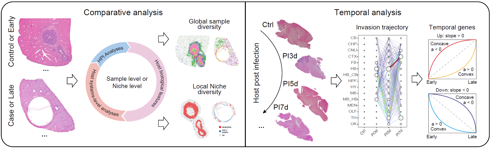

# Multi-sample niche analysis

## Overview

This vignette describes a multi-sample workflow for comparing
infection-associated niches across samples or ordered time points with
`STID`. It starts from single-sample niche objects and generates
multi-sample niche objects for comparative and temporal analyses.

The workflow covers:

- constructing multi-sample niche objects for comparative or temporal
  study designs;
- quantifying pathogen load, tissue composition, cell-type composition,
  and cell aggregation;
- identifying niche-associated genes and cell-cell communication
  patterns across samples;
- inferring pathogen invasion trajectories and temporal gene modules;
- measuring spatial organizational entropy during infection progression.

> **Dataset-specific settings:** Set the input `STID` object, sample
> identifiers, comparison mode, niche keys, metadata keys, annotation
> columns, color vectors, gene filters, output group names, and figure
> paths according to the dataset being analyzed.



Overview of multi-sample niche analysis.

## Prerequisites

``` r
library(tidyverse)
library(Seurat)
library(STID)
```

The workflow requires `tidyverse`, `Seurat`, and `STID`. It assumes that
single-sample niche objects have been generated as described in
`06_Single-sample_analysis.Rmd`. Temporal analyses also require
consistent sample ordering and harmonized metadata across time points.

## Example data

Two input strategies are provided. Comparative analysis uses a
single-sample niche object from the previous vignette. Temporal analysis
starts from the infection-associated niche object generated in
`05_Infection-associated_niche_identification.Rmd`, adds single-sample
niche metadata for each time point, and then combines the samples into a
temporal multi-sample object.

> **Dataset-specific settings:** Set `STID_obj_SS`, `STID_obj_detect`,
> `loop_id`, `compare_mode`, `niche_key`, metadata keys, ROI columns,
> and annotation columns to the corresponding objects and labels in the
> study. For temporal analyses, order `loop_id` according to the
> biological time course.

### Prepare a comparative multi-sample niche object

[`CreateMultiSampNiche()`](https://yulongqin.github.io/STID/reference/CreateMultiSampNiche.md)
aggregates selected single-sample niches into a multi-sample object. In
comparative mode, `loop_id` specifies the samples or sample groups to
compare.

``` r
STID_obj_MS <- CreateMultiSampNiche(
  STID_obj = STID_obj_SS,
  multi_id = NULL,
  loop_id = c("DPI_4_2", "DPI_79_1"),
  compare_mode = "Comparative",
  niche_key = "Niche",
  description = NULL
)
```

### Prepare a temporal multi-sample niche object

For temporal analysis, construct single-sample niche metadata for each
time point and then combine the ordered samples into a temporal
multi-sample object. The example creates separate microbial and host
niche tracks.

``` r
# Define tissue colors
col_lasso_tissue <- c(
  "OLF" = "#FFDEAD", "CTX_HPF" = "#8FBC8F", "HPF" = "#A0522D",
  "TH" = "#7FFFAA", "HY" = "#FFC0CB", "CNU" = "#FF8C00",
  "MB" = "#000080", "HB" = "#9932CC", "CB" = "#87CEEB",
  "FB" = "#FFFF00", "MEN" = "#FF0000", "CHP" = "#006400",
  "UK" = "#D2B48C", "MB_HY" = "#7B68EE", "MB_HY_HB" = "#EF6FD0",
  "HB_CB" = "#A9A9A9", "MB_HB" = "#FF1493", "CTX" = "#80AD80",
  "MB_CNU" = "#C1F1A4", "MB_CNU_HB" = "#B6A7E2", "TH_HY" = "#F7D89A"
)

col_lasso_tissue2 <- c(
  "OLF" = "#FFDEAD", "CTX_HPF" = "#8FBC8F", "HPF" = "#A0522D",
  "TH" = "#7FFFAA", "HY" = "#FFC0CB", "CNU" = "#FF8C00",
  "MB" = "#000080", "HB" = "#9932CC", "CB" = "#87CEEB",
  "FB" = "#FFFF00", "MEN" = "#FF0000", "CHP" = "#006400",
  "UK" = "#D2B48C", "MB_HY" = "#7B68EE", "MB_HY_HB" = "#EF6FD0",
  "HB_CB" = "#A9A9A9", "MB_HB" = "#FF1493", "CTX" = "#80AD80",
  "MB_CNU" = "#C1F1A4", "MB_CNU_HB" = "#B6A7E2", "TH_HY" = "#F7D89A"
)

# Define cell-type colors
col_lasso_cell <- c(
  "#E41A1C", "#377EB8", "#000080", "#4DAF4A", "#984EA3",
  "#FF7F00", "#FFFF33", "#A65628", "#F781BF", "#66C2A5",
  "#8DA0CB", "#E78AC3", "#A6D854", "#FFD92F", "#E5C494"
)
names(col_lasso_cell) <- unique(STID_obj_detect@meta.data$new_cell) %>% sort()

col_lasso_cell2 <- c(
  "#E41A1C", "#377EB8", "#000080", "#4DAF4A", "#984EA3",
  "#FF7F00", "#FFFF33", "#F781BF", "#66C2A5", "#8DA0CB",
  "#E78AC3", "#A6D854", "#FFD92F", "#E5C494"
)
names(col_lasso_cell2) <- c(
  "Adipocytes", "Astrocytes", "Dendritic cells", "Endothelial cells",
  "Epithelial cells", "Fibroblasts", "Macrophages", "Microglia",
  "Monocytes", "Neurons", "NK cells", "Oligodendrocytes", "T cells"
)

# Define color vectors used in the comparative examples.
# Update these vectors to match the levels of the column specified in `group_by`.
col_lasso <- col_lasso_cell
col_lasso2 <- col_lasso_cell2

# Construct single-sample niche metadata
STID_obj_SS <- CreateSingleSampNiche(
  STID_obj = STID_obj_detect,
  niche_key = "Niche_microbe",
  meta_key = list(c("M2_NicheDetect_STS_STS_JEV_multisamp_microbe_region")),
  ROI_type = "ROI",
  pos_colnm = "ROI_label",
  center_colnm = "ROI_center",
  edge_colnm = "ROI_edge",
  all_label_colnm = "All_ROI_label",
  all_dist_colnm = "All_Dist2ROIcenter",
  description = NULL
)

STID_obj_SS <- CreateSingleSampNiche(
  STID_obj = STID_obj_SS,
  niche_key = "Niche_host",
  meta_key = list(c("M2_NicheDetect_STS_STS_JEV_multisamp_host_region")),
  ROI_type = "ROI",
  pos_colnm = "ROI_label",
  center_colnm = "ROI_center",
  edge_colnm = "ROI_edge",
  all_label_colnm = "All_ROI_label",
  all_dist_colnm = "All_Dist2ROIcenter",
  description = NULL
)

STID_obj_SS <- AddSSNicheCells(
  STID_obj = STID_obj_SS,
  meta_key = "raw",
  select_colnm = "new_tissue",
  niche_key = "Niche_microbe"
)

STID_obj_SS <- AddSSNicheCells(
  STID_obj = STID_obj_SS,
  meta_key = "raw",
  select_colnm = "new_tissue",
  niche_key = "Niche_host"
)

# Construct multi-sample niche metadata
STID_obj_MS <- CreateMultiSampNiche(
  STID_obj = STID_obj_SS,
  multi_id = NULL,
  loop_id = c("D3_1", "D5_1", "D7_1"),
  compare_mode = "Temporal",
  niche_key = "Niche_microbe",
  description = NULL
)

STID_obj_MS <- CreateMultiSampNiche(
  STID_obj = STID_obj_MS,
  multi_id = NULL,
  loop_id = c("D3_1", "D5_1", "D7_1"),
  compare_mode = "Temporal",
  niche_key = "Niche_host",
  description = NULL
)
```

## Comparative multi-sample analysis

Most single-sample niche functions can be applied to multi-sample
objects by setting `samp_mode = "MS"` and specifying the relevant
multi-sample `loop_id`. This section compares composition, aggregation,
differential expression, and cell-cell communication across samples.

> **Dataset-specific settings:** Set `loop_id`, `samp_grp_index`,
> `meta_key`, `niche_key`, `group_by`, and color vectors for each
> comparison. Use `LoopAllMulti` to summarize all multi-sample groups or
> a specific identifier such as `Comparative_2_4` for one comparison.

### Tissue composition, cell-type composition, and cell aggregation

[`AddMSNicheCells()`](https://yulongqin.github.io/STID/reference/AddMSNicheCells.md)
appends selected metadata to the multi-sample niche object.
[`CalSampComp()`](https://yulongqin.github.io/STID/reference/CalSampComp.md)
compares pathogen-positive proportions or annotation-level composition,
and
[`CalSampCAI()`](https://yulongqin.github.io/STID/reference/CalSampCAI.md)
evaluates local aggregation of annotated cell populations.

``` r
# Pathogen-positive proportion
STID_obj_MS <- AddMSNicheCells(
  STID_obj = STID_obj_MS,
  loop_id = "Comparative_2_4",
  meta_key = "M1_SpotDetect_Gene_CE_correct_after_host_gene_white",
  select_colnm = "Label_all_gene_nFeature(sum)",
  niche_key = "Niche"
)

CalSampComp(
  STID_obj = STID_obj_MS,
  samp_mode = "MS",
  loop_id = "LoopAllMulti",
  samp_grp_index = TRUE,
  meta_key = "M1_SpotDetect_Gene_CE_correct_after_host_gene_white",
  niche_key = NULL,
  group_by = "Label_all_gene_nFeature(sum)",
  col = rev(c("#E41A1C", "#377EB8")),
  return_data = FALSE
)

# Tissue and cell-type composition
CalSampComp(
  STID_obj = STID_obj_MS,
  samp_mode = "MS",
  loop_id = "LoopAllMulti",
  samp_grp_index = TRUE,
  niche_key = NULL,
  group_by = "anno",
  col = col_lasso,
  return_data = FALSE
)

# Cell aggregation index
ms_cai <- CalSampCAI(
  STID_obj = STID_obj_MS,
  samp_mode = "MS",
  loop_id = "LoopAllMulti",
  samp_grp_index = TRUE,
  meta_key = NULL,
  niche_key = "Niche",
  group_by = "anno",
  k_neighbors = 8,
  min_agg_size = 10,
  dist_thres = 1,
  col = col_lasso
)
```


Pathogen-positive proportions, annotation composition, and aggregation
across multi-sample niches.

### Differential expression analysis

[`CalSampDEGs()`](https://yulongqin.github.io/STID/reference/CalSampDEGs.md)
identifies genes associated with selected cell populations or niche
groups across multi-sample comparisons. The example filters predicted
genes and pathogen-derived features before testing host transcriptional
differences.

> **Dataset-specific settings:** Set `loop_id`, `group_by`,
> `group_value`, `assay_id`, thresholds, gene filters, and `grp_nm` for
> the comparison and feature space. If the selected `niche_key` yields
> too few genes, use broader annotation groups or adjust the tested
> group set.

``` r
MS_DEGs <- CalSampDEGs(
  STID_obj = STID_obj_MS,
  samp_mode = "MS",
  loop_id = "Comparative_2_4",
  samp_grp_index = TRUE,
  logfc_thres = 2,
  group_by = "anno",
  group_value = c("Neutrophils", "Spp1+ MoMFs", "Fibroblasts", "B/plasma cells"),
  assay_id = "Spatial",
  padj_thres = 0.05,
  adjust_method = "BH",
  col = col_lasso,
  remove_genes = c(
    grep("^Gm", rownames(STID_obj_MS), value = TRUE),
    grep("^EmuJ", rownames(STID_obj_MS), value = TRUE)
  ),
  grp_nm = "Comparative_2_4_All"
)
```


Differential expression analysis across comparative multi-sample niches.

### Cell-cell communication analysis

Cell-cell communication results generated in the single-sample workflow
can be visualized in multi-sample niches by setting `samp_mode = "MS"`
in
[`Plot_NicheCellComm()`](https://yulongqin.github.io/STID/reference/Plot_NicheCellComm.md).
This reuses the same `CellComm_data` object for sample-level
comparisons.

> **Dataset-specific settings:** Use a `CellComm_data` object generated
> from the same expression matrix and annotation scheme. Set `loop_id`,
> signaling pathways, ligand-receptor pairs, and color vectors according
> to the comparison.

``` r
Plot_NicheCellComm(
  STID_obj = STID_obj_MS,
  CellComm_data = CellComm_data,
  samp_mode = "MS",
  loop_id = "Comparative_2_4",
  signaling = c("CXCL", "CCL", "SAA", "SPP1", "MIF", "VEGF", "FGF"),
  pairLR.use = NULL,
  col = col_lasso2
)
```


Cell-cell communication patterns across comparative multi-sample niches.

## Temporal multi-sample analysis

Temporal multi-sample analysis uses ordered sample identifiers to
evaluate changes in pathogen distribution, spatial organization, and
host transcriptional programs. The following sections assume that
`STID_obj_MS` contains temporal niches generated with
`compare_mode = "Temporal"`.

> **Dataset-specific settings:** Confirm that `loop_id` follows the
> biological time order, that metadata columns are harmonized across
> samples, and that `samp_grp_index` matches the structure of the
> temporal object.

### Pathogen invasion trajectory analysis

[`CalSampPathoTrack()`](https://yulongqin.github.io/STID/reference/CalSampPathoTrack.md)
infers potential pathogen propagation between adjacent time points by
combining pathogen-positive load in source annotations with the increase
in pathogen-positive load in target annotations.

For two adjacent time points, the propagation score is defined as:

``` math

\mathrm{score}_{source \to target} = \mathrm{Load}_{source,t} \times \left(\mathrm{Load}_{target,t+1} - \mathrm{Load}_{target,t}\right)
```

Only target annotations with increased pathogen-positive load are
retained. The resulting network summarizes the inferred direction and
relative magnitude of pathogen spread across tissues or cell types.

> **Dataset-specific settings:** Set `loop_id`, `pos_colnm`,
> `neg_value`, `meta_key`, `group_by`, `col`, `grp_nm`, and `dir_nm` to
> match the pathogen-detection metadata and annotation level. Use
> tissue-level or cell-type-level annotations according to the
> biological question.

``` r
CalSampPathoTrack(
  STID_obj = STID_obj_MS,
  loop_id = "Temporal_1_2_3",
  pos_colnm = "Label_all_gene_nFeature(sum)",
  neg_value = "neg",
  samp_grp_index = FALSE,
  meta_key = "M1_SpotDetect_Gene_JEV_multisamp_microbe_gene",
  niche_key = NULL,
  group_by = "new_cell",
  col = col_lasso_cell,
  return_data = FALSE,
  grp_nm = "Temporal_1_2_3_cell",
  dir_nm = "M4_CalSampPathoTrack"
)
```


Inferred pathogen invasion trajectories across temporal multi-sample
niches.

### Spatial organizational entropy analysis

[`CalSampOSE()`](https://yulongqin.github.io/STID/reference/CalSampOSE.md)
quantifies spatial organizational entropy (OSE) to evaluate changes in
local tissue or cell-type organization during infection. Higher entropy
indicates greater heterogeneity in local spatial organization.

Spots are grouped into local spatial units, unit-type frequencies are
summarized within each region, and entropy is normalized by the expected
number of observed unit types to improve comparability across regions
with different spot counts.

The adjusted entropy is:

``` math

E_{adjusted} = \frac{E_{observed}}{\mathrm{Expected\_covered\_species}(N, n)}
```

where `N` is the total number of possible unit types and `n` is the
number of observed local spatial units.

> **Dataset-specific settings:** Set `loop_id`, `meta_key`, `group_by`,
> color vectors, `grp_nm`, and `dir_nm` according to the temporal
> object. Use `only_plot = FALSE` when entropy values are needed for
> downstream statistics.

``` r
CalSampOSE(
  STID_obj = STID_obj_MS,
  loop_id = "Temporal_1_2_3",
  meta_key = "M1_SpotDetect_Gene_JEV_multisamp_microbe_gene",
  group_by = "new_cell",
  col = col_lasso_cell,
  only_plot = TRUE,
  return_data = FALSE,
  grp_nm = "Temporal_1_2_3_cell",
  dir_nm = "M4_CalSampOSE"
)
```


Spatial organizational entropy across temporal multi-sample niches.

### Temporal gene module identification

[`CalSampGeneTrend()`](https://yulongqin.github.io/STID/reference/CalSampGeneTrend.md)
identifies dynamic host transcriptional programs across ordered samples.
The function supports trend fitting for directional or nonlinear
temporal patterns and fuzzy clustering for module-level trajectories.

In fitting mode, genes are classified by linear and quadratic trend
components. In clustering mode, fuzzy c-means clustering groups genes
into temporal modules and identifies core genes by membership scores.

> **Dataset-specific settings:** Set `loop_id`, `meta_key`, `niche_key`,
> `group_by`, `gene_list`, `method`, gene filters, `grp_nm`, and
> `dir_nm` according to the temporal comparison. Use
> `method = "fitting"` for interpretable trend classes and
> `method = "mfuzz"` for module-level trajectories.

``` r
gene_trend_fit <- CalSampGeneTrend(
  STID_obj = STID_obj_MS,
  loop_id = "Temporal_1_2_3",
  samp_grp_index = FALSE,
  meta_key = "M1_SpotDetect_Gene_JEV_multisamp_microbe_gene",
  niche_key = NULL,
  group_by = NULL,
  gene_list = NULL,
  method = "fitting",
  col = col_lasso_cell,
  remove_genes = c(
    grep("^Gm", rownames(STID_obj_MS), value = TRUE),
    grep("Rik$", rownames(STID_obj_MS), value = TRUE)
  ),
  return_data = TRUE,
  grp_nm = "Temporal_1_2_3_fitting_all",
  dir_nm = "M4_CalSampGeneTrend"
)
gene_trend_mfuzz <- CalSampGeneTrend(
  STID_obj = STID_obj_MS,
  loop_id = "Temporal_1_2_3",
  samp_grp_index = FALSE,
  meta_key = "M1_SpotDetect_Gene_JEV_multisamp_microbe_gene",
  niche_key = NULL,
  group_by = NULL,
  gene_list = NULL,
  method = "mfuzz",
  col = col_lasso_cell,
  remove_genes = c(
    grep("^Gm", rownames(STID_obj_MS), value = TRUE),
    grep("Rik$", rownames(STID_obj_MS), value = TRUE)
  ),
  return_data = TRUE,
  grp_nm = "Temporal_1_2_3_mfuzz_all",
  dir_nm = "M4_CalSampGeneTrend"
)
```


Temporal gene modules across ordered multi-sample niches.

## Notes

Multi-sample analyses require consistent sample identifiers, annotation
columns, and niche metadata across selected samples. Review `loop_id`,
`compare_mode`, `niche_key`, `meta_key`, `group_by`, and output names
before running each section. For temporal analyses, `loop_id` must
follow the biological time course.

------------------------------------------------------------------------

## Session information

``` r
sessionInfo()
#> R version 4.2.0 (2022-04-22 ucrt)
#> Platform: x86_64-w64-mingw32/x64 (64-bit)
#> Running under: Windows 10 x64 (build 22000)
#> 
#> Matrix products: default
#> 
#> locale:
#> [1] LC_COLLATE=Chinese (Simplified)_China.utf8 
#> [2] LC_CTYPE=Chinese (Simplified)_China.utf8   
#> [3] LC_MONETARY=Chinese (Simplified)_China.utf8
#> [4] LC_NUMERIC=C                               
#> [5] LC_TIME=Chinese (Simplified)_China.utf8    
#> 
#> attached base packages:
#> [1] stats     graphics  grDevices utils     datasets  methods   base     
#> 
#> loaded via a namespace (and not attached):
#>  [1] digest_0.6.35     R6_2.6.1          jsonlite_1.8.8    lifecycle_1.0.5  
#>  [5] evaluate_1.0.1    cachem_1.1.0      rlang_1.1.7       cli_3.6.5        
#>  [9] rstudioapi_0.15.0 fs_1.6.3          jquerylib_0.1.4   bslib_0.8.0      
#> [13] ragg_1.3.0        rmarkdown_2.29    pkgdown_2.2.0     textshaping_0.3.6
#> [17] desc_1.4.3        tools_4.2.0       htmlwidgets_1.6.4 yaml_2.3.10      
#> [21] xfun_0.49         fastmap_1.2.0     compiler_4.2.0    systemfonts_1.0.4
#> [25] htmltools_0.5.8.1 knitr_1.49        sass_0.4.9
```
