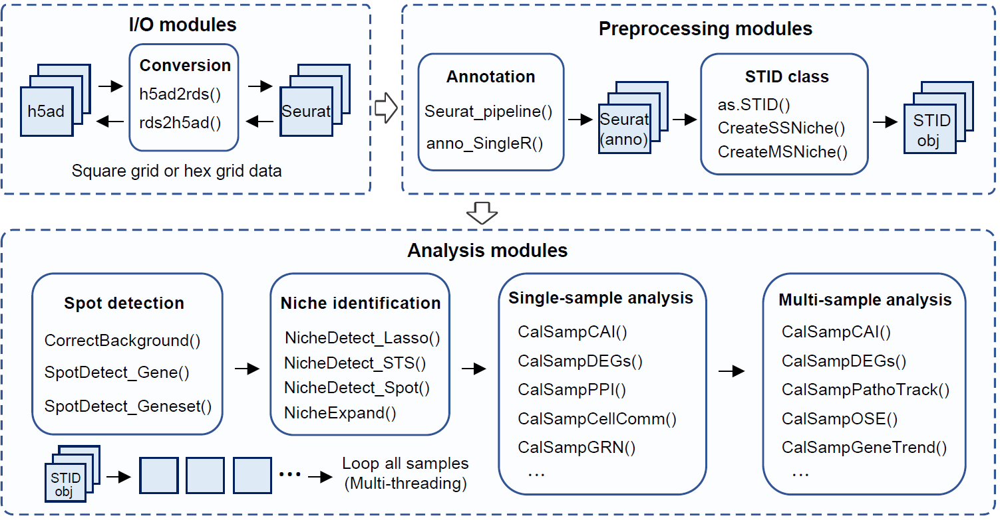

# Get started with STID

## Overview

`STID` provides an infection-aware workflow for spatial transcriptomics
data. Starting from a processed `Seurat` object, `STID` helps users
construct a standardized `STID` object, correct pathogen-derived
background signal, detect infection-associated spots, identify
infection-associated spatial niches, and perform downstream
single-sample or multi-sample niche analysis.

This vignette gives a minimal end-to-end workflow for first-time users.
It focuses on the main analysis logic and the key objects passed between
steps. For full parameter descriptions and complete worked examples, see
the dedicated vignettes listed at the end.



Overview of the STID workflow.

A typical analysis contains seven stages:

1.  Install `STID` and prepare the R environment.
2.  Load and preprocess spatial transcriptomics data.
3.  Convert the processed `Seurat` object into an `STID` object.
4.  Correct pathogen background signal using control or background
    samples.
5.  Detect infection-associated spots using pathogen genes or
    host-response gene sets.
6.  Identify infection-associated niches, including foci-type,
    aggregated-type, and dispersed-type niches.
7.  Quantify and compare niches within one sample or across multiple
    samples.

Most code chunks in this vignette are shown with `eval = FALSE` because
file paths, sample names, metadata columns, and thresholds are
dataset-specific. Replace the example values with those used in your
study before running the workflow.

## Installation

Install `STID` from GitHub. For reproducible analyses, we recommend
using a clean R library or a project-specific environment.

``` r
# Optional: use a project-specific library path
# dir.create("./library_STID/", showWarnings = FALSE)
# .libPaths("./library_STID/")

options(timeout = 300)
options(repos = c(CRAN = "https://cloud.r-project.org"))
options(BioC_mirror = "https://bioconductor.org")

if (!requireNamespace("remotes", quietly = TRUE)) {
  install.packages("remotes")
}

remotes::install_github("YulongQin/STID")
```

For installation troubleshooting, dependency checks, mirror
configuration, and platform-specific notes, see `01_Installation.Rmd`.

## Load packages

Load the core packages before starting the workflow. Optional downstream
analyses may require additional packages such as `SingleR`, `celldex`,
`CellChat`, `NicheNet`, `mistyR`, BLAST, and organism-specific
annotation resources.

``` r
library(tidyverse)
library(Seurat)
library(STID)
```

## Prepare input data

`STID` starts from a spatial transcriptomics object loaded into
`Seurat`. The object should contain expression data, spatial
coordinates, sample identifiers, and, when available, cell-type or spot
annotations.

``` r
stRNA <- readRDS("./stRNA_AE.rds")
stRNA <- suppressMessages(UpdateSeuratObject(stRNA))

# Inspect sample metadata before running STID
head(stRNA@meta.data)
table(stRNA@meta.data$batch)
```

If the object has not been processed yet, run a standard Seurat
preprocessing workflow. `STID` provides
[`Seurat_pipeline()`](https://yulongqin.github.io/STID/reference/Seurat_pipeline.md)
as a wrapper for common preprocessing steps, including normalization,
feature selection, dimensionality reduction, and clustering.

``` r
stRNA <- Seurat_pipeline(
  seurat_obj = stRNA,
  data_type = "stRNA",
  resolution_index = seq(0.1, 1.3, 0.2),
  runTSNE_index = FALSE,
  assay_nm = NULL
)
```

If reliable annotations already exist in `stRNA@meta.data`, this step
can be skipped. Otherwise, users may annotate clusters with a
reference-based method such as `SingleR`.

``` r
# library(SingleR)
# library(celldex)

# ref <- celldex::MouseRNAseqData()

stRNA <- anno_SingleR(
  seurat_obj = stRNA,
  ref_obj = ref,
  seurat_colnm = "seurat_clusters",
  ref_colnm = "label.main"
)
```

## Construct an STID object

Before conversion, define the metadata columns and pathogen gene list
used by the analysis. The following example assumes mouse host data,
`EmuJ-` pathogen genes, Stereo-seq square-grid data, and sample
information stored in the `batch` and `group` metadata columns.

``` r
pathogen_genes <- grep("^EmuJ-", rownames(stRNA), value = TRUE)

STID_obj <- as.STID(
  stRNA,
  samp_colnm = "batch",
  samp_grp_colnm = "group",
  celltype_colnm = "anno",
  host_org = "mouse",
  pathogen_grp = "parasite",
  pathogen_org = "EmuJ",
  pathogen_gene = pathogen_genes,
  binsize = 50,
  data_format = "square_grid",
  data_platform = "StereoSeq"
)

print(STID_obj)
```

Before moving on, check that the object contains the required metadata
and pathogen features:

- `samp_colnm` identifies individual samples.
- `samp_grp_colnm` identifies experimental groups or conditions.
- `celltype_colnm` stores cell-type or spot annotations, if available.
- `pathogen_gene` contains pathogen-derived features present in
  `rownames(stRNA)`.
- `data_format`, `data_platform`, and `binsize` match the spatial
  technology and coordinate system.

## Correct pathogen background signal

Background correction is recommended when background or uninfected
control samples are available. These samples are used to estimate
pathogen-associated background signal and reduce false-positive
infection calls.

``` r
background_sample_ids <- c("DPI_0_1")

STID_obj_corrected <- CorrectBackground(
  STID_obj = STID_obj,
  bg_samp_id = background_sample_ids,
  bg_features = pathogen_genes,
  PosThres_prob = 0.95,
  assay_id = "Spatial",
  layer_id = "counts",
  grp_nm = "Final_CE_0.95",
  dir_nm = "M1_CorrectBackground"
)
```

If no appropriate control sample is available, users may start from the
uncorrected `STID_obj`, but downstream detection thresholds should be
interpreted more carefully.

## Detect infection-associated spots

Infection-associated spots can be detected from pathogen genes,
host-response genes, or gene-set scores. A common first pass is to
summarize pathogen gene counts and classify spots using a count or
probability threshold.

``` r
COLOR_DIS_CON <- list(
  dis = c("grey95", "#E34D4A"),
  con = c("#440154FF", "#3B528BFF", "#21908CFF", "#5DC863FF", "#FDE725FF")
)

pathogen_signal <- GetGeneStat(
  STID_obj = STID_obj_corrected,
  features = pathogen_genes,
  prefix = "all_gene",
  func = "sum"
)

STID_obj_corrected <- AddMetaColumn(
  STID_obj = STID_obj_corrected,
  add_data = pathogen_signal,
  meta_key = "raw",
  ignore_rownm = FALSE
)

pathogen_signal_columns <- grep(
  "all_gene",
  colnames(STID_obj_corrected@meta.data),
  value = TRUE
)

STID_obj_detect <- SpotDetect_Gene(
  STID_obj = STID_obj_corrected,
  features = pathogen_genes,
  feature_colnm = pathogen_signal_columns,
  PosThres_prob = 0,
  PosThres_count = 1,
  col = COLOR_DIS_CON,
  black_bg = FALSE,
  pt_size = 1,
  blur_method = NULL,
  blur_n = 1,
  blur_sigma = 0.5,
  plot_method = "single",
  grp_nm = "pathogen_gene_signal"
)
```

Gene-set-based detection can be used to capture host responses, such as
viral response, parasite response, programmed cell death, or other
curated biological processes.

``` r
Gene_Geneset <- STID::Gene_Geneset
pcd_geneset_df <- Gene_Geneset$Mouse$Geneset$Mouse_PCD_geneset
pcd_geneset_list <- lapply(pcd_geneset_df, na.omit)

STID_obj_detect <- SpotDetect_Geneset(
  STID_obj_detect,
  geneset_list = pcd_geneset_list,
  score_method = "AddModuleScore",
  n_iter = 5,
  nbin = 24,
  seed = 10,
  PosThres_prob = 0,
  PosThres_score = 7.5,
  pt_size = 1,
  col = COLOR_DIS_CON,
  black_bg = FALSE,
  blur_method = NULL,
  plot_method = "single",
  grp_nm = "PCD_geneset_signal"
)
```

The resulting object stores infection-associated spot labels and signal
summaries in metadata fields that can be used by the
niche-identification modules.

## Identify infection-associated niches

After detecting infection-associated spots, `STID` can define
infection-associated spatial niches. The niche strategy should be
selected according to the observed spatial pattern of infection.


Strategies for identifying infection-associated niches with different
spatial patterns.

| Niche type | Typical spatial pattern | Main function |
|----|----|----|
| Foci-type niche | Localized foci with clear centers or boundaries | [`NicheDetect_Lasso()`](https://yulongqin.github.io/STID/reference/NicheDetect_Lasso.md) followed by [`NicheExpand()`](https://yulongqin.github.io/STID/reference/NicheExpand.md) |
| Aggregated-type niche | Spatially aggregated positive regions | [`NicheDetect_STS()`](https://yulongqin.github.io/STID/reference/NicheDetect_STS.md) |
| Dispersed-type niche | Scattered positive spots without large contiguous regions | [`NicheDetect_Spot()`](https://yulongqin.github.io/STID/reference/NicheDetect_Spot.md) |

A foci-type workflow usually starts with manual or semi-automatic region
selection and then expands the niche boundary to capture surrounding
spatial context.

``` r
STID_obj_lasso <- NicheDetect_Lasso(
  STID_obj = STID_obj_detect,
  meta_key = "coord",
  group_by = "anno",
  col = NULL,
  grp_nm = "foci_lasso"
)

foci_lasso_key <- "M2_NicheDetect_Lasso_foci_lasso"

STID_obj_expand <- NicheExpand(
  STID_obj = STID_obj_lasso,
  meta_key = foci_lasso_key,
  pos_colnm = "ROI_label",
  center_colnm = "ROI_center",
  expand_dist = 8,
  grp_nm = "foci_expand"
)
```

For aggregated infections, use spatial thresholding and region
detection.

``` r
STID_obj_aggregated <- NicheDetect_STS(
  STID_obj = STID_obj_detect,
  meta_key = "M1_SpotDetect_Gene_pathogen_gene_signal",
  spatial_scale_method = "region",
  region_detect_method = "convex",
  update_spots = FALSE,
  ROI_size = NULL,
  density_thres = 1,
  pos_colnm = "Label_all_gene_nFeature(sum)",
  description = NULL,
  grp_nm = "pathogen_region",
  dir_nm = "M2_NicheDetect_STS"
)
```

Distance-dependent profiles are useful for checking whether pathogen and
host-response signals are enriched near the niche center or boundary.

``` r
Plot_DistLine_Exp(
  STID_obj = STID_obj_expand,
  features = c("EmuJ-002209100", "Spp1", "Il1b"),
  feature_colnm = "all_gene_nFeature(sum)",
  facet_grpnm = "batch",
  meta_key = list(c("M1_SpotDetect_Gene_pathogen_gene_signal", "M2_NicheExpand_foci_expand"))
)
```

## Analyze one sample niche

Use
[`CreateSingleSampNiche()`](https://yulongqin.github.io/STID/reference/CreateSingleSampNiche.md)
to convert detected niches into a single-sample niche object. This
object supports composition analysis, aggregation analysis,
colocalization, differential expression, enrichment analysis, cell-cell
communication, regulatory-network inference, and host-pathogen
association analysis.


Single-sample analysis modules for characterizing infection-associated
niches.

``` r
STID_obj_SS <- CreateSingleSampNiche(
  STID_obj = STID_obj_expand,
  niche_key = "Niche",
  meta_key = list(c("M2_NicheExpand_foci_expand")),
  ROI_type = "ROI",
  pos_colnm = "ROI_label",
  center_colnm = "ROI_center",
  edge_colnm = "ROI_edge",
  all_label_colnm = "All_ROI_label",
  all_dist_colnm = "All_Dist2ROIcenter",
  description = NULL
)

# Cell-type composition within niches
CalSampComp(
  STID_obj = STID_obj_SS,
  niche_key = "Niche",
  group_by = "anno",
  loop_id = "LoopAllSamp",
  col = NULL,
  return_data = FALSE
)

# Cell aggregation index
cell_aggregation <- CalSampCAI(
  STID_obj = STID_obj_SS,
  niche_key = "Niche",
  group_by = "anno",
  loop_id = "LoopAllSamp",
  k_neighbors = 8,
  min_agg_size = 10,
  dist_thres = 1
)

# Niche-associated genes
SS_DEGs <- CalSampDEGs(
  STID_obj = STID_obj_SS,
  niche_key = "Niche",
  assay_id = "Spatial",
  layer_id = "counts",
  loop_id = "LoopAllSamp",
  padj_thres = 0.05,
  logfc_thres = 1,
  adjust_method = "BH",
  group_by = "anno"
)
```

## Compare multiple samples

Use
[`CreateMultiSampNiche()`](https://yulongqin.github.io/STID/reference/CreateMultiSampNiche.md)
when the goal is to compare niches across samples, groups, or ordered
time points. Comparative analysis is suitable for two or more
conditions, whereas temporal analysis is designed for infection
progression studies.


Multi-sample analysis modules for comparative and temporal niche
analysis.

``` r
STID_obj_MS <- CreateMultiSampNiche(
  STID_obj = STID_obj_SS,
  multi_id = NULL,
  loop_id = c("DPI_4_2", "DPI_79_1"),
  compare_mode = "Comparative",
  niche_key = "Niche",
  description = NULL
)

# Composition across samples
CalSampComp(
  STID_obj = STID_obj_MS,
  samp_mode = "MS",
  loop_id = "LoopAllMulti",
  samp_grp_index = TRUE,
  niche_key = NULL,
  group_by = "anno",
  col = NULL,
  return_data = FALSE
)

# Differential expression across multi-sample niches
MS_DEGs <- CalSampDEGs(
  STID_obj = STID_obj_MS,
  samp_mode = "MS",
  loop_id = "LoopAllMulti",
  samp_grp_index = TRUE,
  logfc_thres = 2,
  group_by = "anno",
  assay_id = "Spatial",
  padj_thres = 0.05,
  adjust_method = "BH"
)
```

For ordered time-course studies,
[`CalSampPathoTrack()`](https://yulongqin.github.io/STID/reference/CalSampPathoTrack.md),
[`CalSampOSE()`](https://yulongqin.github.io/STID/reference/CalSampOSE.md),
and
[`CalSampGeneTrend()`](https://yulongqin.github.io/STID/reference/CalSampGeneTrend.md)
can be used to infer pathogen invasion trajectories, spatial
organizational entropy, and temporal gene modules.

``` r
CalSampPathoTrack(
  STID_obj = STID_obj_MS,
  loop_id = "Temporal_1_2_3",
  pos_colnm = "Label_all_gene_nFeature(sum)",
  neg_value = "neg",
  samp_grp_index = FALSE,
  meta_key = "M1_SpotDetect_Gene_pathogen_gene_signal",
  niche_key = NULL,
  group_by = "anno",
  return_data = FALSE
)

CalSampOSE(
  STID_obj = STID_obj_MS,
  loop_id = "Temporal_1_2_3",
  meta_key = "M1_SpotDetect_Gene_pathogen_gene_signal",
  group_by = "anno",
  only_plot = TRUE,
  return_data = FALSE
)

CalSampGeneTrend(
  STID_obj = STID_obj_MS,
  loop_id = "Temporal_1_2_3",
  samp_grp_index = FALSE,
  meta_key = "M1_SpotDetect_Gene_pathogen_gene_signal",
  niche_key = NULL,
  group_by = NULL,
  gene_list = NULL,
  method = "fitting",
  return_data = TRUE
)
```

## Choose the next vignette

| Goal | Recommended article |
|----|----|
| Install `STID` and dependencies | `01_Installation.Rmd` |
| Load a Seurat object and construct an `STID` object | `02_load_and_preprocess.Rmd` |
| Correct pathogen background signal | `03_Pathogen_background_correction.Rmd` |
| Detect infection-associated spots | `04_Infection-associated_spot_detection.Rmd` |
| Identify foci-type, aggregated-type, or dispersed-type niches | `05_Infection-associated_niche_identification.Rmd` |
| Analyze composition, aggregation, DEGs, enrichment, communication, and host-pathogen associations within one sample | `06_Single-sample_analysis.Rmd` |
| Compare niches across samples or time points | `07_Multi-sample_analysis.Rmd` |

## Parameters to customize

Most errors in first-time analyses come from dataset-specific names
rather than the workflow itself. Before running the code, update the
following parameters.

| Parameter | What to check |
|----|----|
| `samp_colnm` | Metadata column containing sample IDs |
| `samp_grp_colnm` | Metadata column containing experimental groups |
| `celltype_colnm` / `group_by` | Cell-type or spot annotation column |
| `pathogen_gene` | Pathogen-derived genes or features present in `rownames(stRNA)` |
| `bg_samp_id` | Background or uninfected control samples |
| `assay_id`, `layer_id` | Assay and expression layer used for counts or normalized data |
| `data_format`, `data_platform`, `binsize` | Spatial platform and coordinate format |
| `meta_key` | Metadata key generated by the previous STID step |
| `PosThres_prob`, `PosThres_count`, `PosThres_score` | Detection thresholds for positive spots or gene-set scores |
| `loop_id` | Sample IDs, comparison IDs, or temporal IDs used in downstream analysis |

## Notes

- Start with a small subset of samples to confirm that the metadata
  columns, pathogen gene list, and spatial coordinates are correctly
  configured.
- Use background correction when matched control or background samples
  are available.
- Use gene-level detection for direct pathogen signal and gene-set
  detection for host-response programs.
- Choose niche-detection methods according to the spatial pattern of
  infection rather than applying all methods by default.
- Keep intermediate objects, such as `STID_obj`, `STID_obj_corrected`,
  `STID_obj_detect`, `STID_obj_SS`, and `STID_obj_MS`, so that
  downstream analyses can be restarted without repeating earlier steps.
- Keep the `figures/` folder next to this Rmd file when knitting the
  vignette; the four overview images are loaded from
  `figures/Figure1_A.png`, `figures/Figure3_A.png`,
  `figures/Figure4_A.png`, and `figures/Figure5_A.png`.
- For package vignettes, keep large example data outside the package and
  provide lightweight example objects or `eval = FALSE` code chunks.

## Session information

``` r
sessionInfo()
#> R version 4.2.0 (2022-04-22 ucrt)
#> Platform: x86_64-w64-mingw32/x64 (64-bit)
#> Running under: Windows 10 x64 (build 22000)
#> 
#> Matrix products: default
#> 
#> locale:
#> [1] LC_COLLATE=Chinese (Simplified)_China.utf8 
#> [2] LC_CTYPE=Chinese (Simplified)_China.utf8   
#> [3] LC_MONETARY=Chinese (Simplified)_China.utf8
#> [4] LC_NUMERIC=C                               
#> [5] LC_TIME=Chinese (Simplified)_China.utf8    
#> 
#> attached base packages:
#> [1] stats     graphics  grDevices utils     datasets  methods   base     
#> 
#> loaded via a namespace (and not attached):
#>  [1] digest_0.6.35     R6_2.6.1          jsonlite_1.8.8    lifecycle_1.0.5  
#>  [5] evaluate_1.0.1    cachem_1.1.0      rlang_1.1.7       cli_3.6.5        
#>  [9] rstudioapi_0.15.0 fs_1.6.3          jquerylib_0.1.4   bslib_0.8.0      
#> [13] ragg_1.3.0        rmarkdown_2.29    pkgdown_2.2.0     textshaping_0.3.6
#> [17] desc_1.4.3        tools_4.2.0       htmlwidgets_1.6.4 yaml_2.3.10      
#> [21] xfun_0.49         fastmap_1.2.0     compiler_4.2.0    systemfonts_1.0.4
#> [25] htmltools_0.5.8.1 knitr_1.49        sass_0.4.9
```
