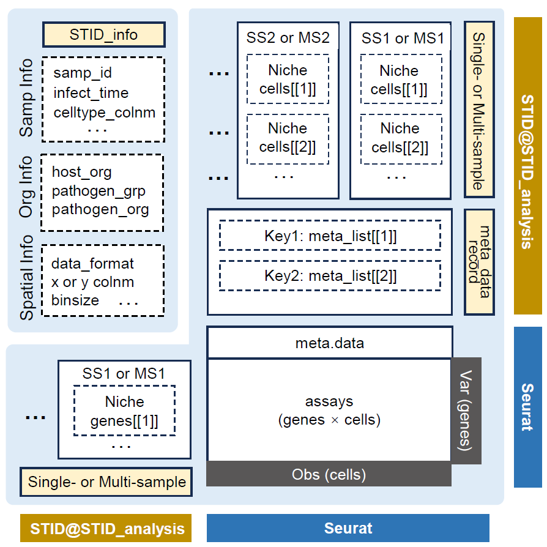
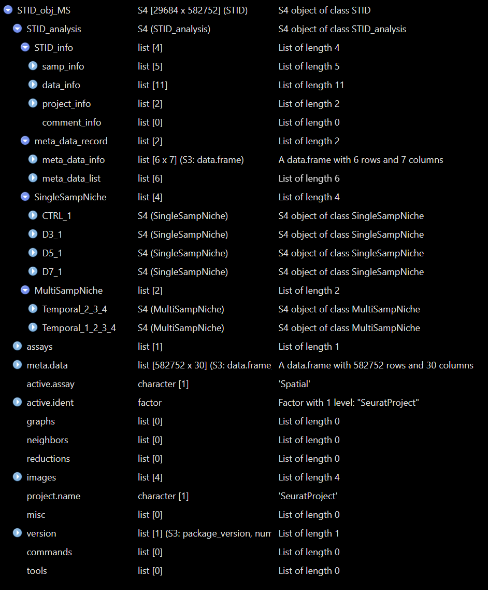

# STID class

## Overview

This vignette introduces the core `STID` object classes and helper
functions used by `STID` workflows. The `STID` class extends a `Seurat`
object with an additional `STID_analysis` slot, so users can keep
regular Seurat assays, metadata, reductions, graphs, and images while
recording infection-specific project information, metadata records,
single-sample niche results, and multi-sample niche results.

This vignette covers:

- the relationship among `STID`, `STID_analysis`, `SingleSampNiche`, and
  `MultiSampNiche`;
- converting a `Seurat` object into an `STID` object;
- reading and updating project information stored in `STID_info`;
- adding, retrieving, and removing metadata records;
- creating and inspecting single-sample and multi-sample niche
  containers;
- converting an `STID` object back to a standard `Seurat` object.

> **Note:** Before running the examples, update the input `Seurat`
> object, sample column, sample-group column, cell-type column,
> coordinate columns, pathogen-gene names, spatial platform, and
> metadata keys to match the dataset under analysis.



STID class data structure

## Prerequisites

``` r
library(tidyverse)
library(Seurat)
library(STID)
```

Most examples below use `eval = FALSE` because they demonstrate object
manipulation patterns. Replace placeholder object names and column names
with those used in the active project.

## Class architecture

`STID` is an S4 class that contains `Seurat`. In practice, this means an
`STID` object can be used like a Seurat object in many common analysis
steps, while also carrying the additional `STID_analysis` container used
by STID-specific workflows.

| Class | Main role | Key slots |
|----|----|----|
| `STID` | Seurat-derived object with infection-specific analysis storage | `STID_analysis`, plus inherited Seurat slots such as `assays`, `meta.data`, `reductions`, `images`, `graphs`, and `misc` |
| `STID_analysis` | Project-level analysis container | `STID_info`, `meta_data_record`, `SingleSampNiche`, `MultiSampNiche` |
| `SingleSampNiche` | Niche-analysis results for one sample | `samp_info`, `niche_info`, `niche_cells`, `niche_genes` |
| `MultiSampNiche` | Integrated niche-analysis results across samples | `samp_info`, `niche_info`, `niche_cells`, `niche_genes` |

The most important storage paths are shown below.

``` r
# Project, sample, data, and comment information
STID_obj@STID_analysis@STID_info

# Registered metadata tables and their provenance records
STID_obj@STID_analysis@meta_data_record

# Single-sample niche objects, usually named by sample ID
STID_obj@STID_analysis@SingleSampNiche

# Multi-sample niche objects, usually named by multi_id
STID_obj@STID_analysis@MultiSampNiche
```


Structure of a real STID object - Comparative


Example output of print(STID object) - Comparative



Structure of a real STID object - Temporal


Example output of print(STID object) - Temporal

> **Note:** Direct slot access is useful for inspection, but analysis
> scripts should prefer accessor and setter functions such as
> [`GetInfo()`](https://yulongqin.github.io/STID/reference/GetInfo.md),
> [`SetInfo()`](https://yulongqin.github.io/STID/reference/SetInfo.md),
> [`GetMetaData()`](https://yulongqin.github.io/STID/reference/GetMetaData.md),
> [`AddMetaData()`](https://yulongqin.github.io/STID/reference/AddMetaData.md),
> [`GetSSNicheCells()`](https://yulongqin.github.io/STID/reference/GetSSNicheCells.md),
> and
> [`GetMSNicheCells()`](https://yulongqin.github.io/STID/reference/GetMSNicheCells.md).

## Convert a Seurat object to an STID object

[`as.STID()`](https://yulongqin.github.io/STID/reference/as.STID.md)
converts a `Seurat` object into an `STID` object. The conversion stores
infection-specific information, spatial-data information, and project
information in `STID_obj@STID_analysis@STID_info`.

During conversion,
[`as.STID()`](https://yulongqin.github.io/STID/reference/as.STID.md)
checks required metadata columns, standardizes coordinate columns to `x`
and `y`, updates the Seurat object for compatibility, records sample
order, initializes empty metadata and niche containers, and replaces
underscores in gene names with hyphens.

> **Note:**
> [`CreateSTIDObject()`](https://yulongqin.github.io/STID/reference/CreateSTIDObject.md)
> is a convenience wrapper. This vignette uses
> [`as.STID()`](https://yulongqin.github.io/STID/reference/as.STID.md)
> directly because it exposes the full conversion interface, including
> `data_platform` and `base_unit`.

``` r
pathogen_genes <- grep("^Pathogen-", rownames(seurat_obj), value = TRUE)

STID_obj <- as.STID(
  seurat_obj = seurat_obj,
  host_org = "mouse",
  pathogen_grp = "parasite",
  pathogen_org = "Echinococcus_multilocularis",
  samp_colnm = "batch",
  samp_grp_colnm = "group",
  celltype_colnm = "anno",
  x_colnm = "x",
  y_colnm = "y",
  pathogen_genes = pathogen_genes,
  data_format = "square_grid",
  data_platform = "StereoSeq",
  binsize = 1,
  coord_interval = 1,
  base_unit = 0.5,
  project_id = "STID_demo",
  description = "Demo project converted from a Seurat object"
)
```

### Coordinate handling

For square-grid data, the conversion checks the most common interval
between unique `x` and `y` coordinates. If the intervals are consistent,
coordinates are divided by the interval and rounded so the stored
coordinate interval becomes 1. For Visium-style hex-grid data,
`coord_interval` is calculated from the spatial scale factor and
`base_unit`.

> **Note:** If `x` and `y` already exist in `meta.data`, they are used
> directly. If they do not exist and `x_colnm` or `y_colnm` is missing,
> STID attempts to extract coordinates from the Seurat spatial image
> slots. If custom coordinate column names are provided, they are
> renamed to `x` and `y` inside the STID object.

``` r
GetCoordInfo(STID_obj)

STID_obj@meta.data %>%
  dplyr::select(batch, group, anno, x, y) %>%
  head()
```

### Platform defaults

If `base_unit` is not supplied,
[`as.STID()`](https://yulongqin.github.io/STID/reference/as.STID.md)
uses platform-specific defaults when available.

| `data_platform` | Default `base_unit` |
|-----------------|--------------------:|
| `StereoSeq`     |                 0.5 |
| `VisiumHD`      |                   2 |
| `SlideSeq`      |                  10 |
| `Visium`        |                  65 |

``` r
GetInfo(STID_obj, info_key = "samp_info")
GetInfo(STID_obj, info_key = "data_info")
GetInfo(STID_obj, info_key = "project_info")
```

## Inspect and update STID information

[`GetInfo()`](https://yulongqin.github.io/STID/reference/GetInfo.md)
retrieves one category from `STID_info`. Use `sub_key` to retrieve
selected fields.

``` r
# Sample-level information
GetInfo(STID_obj, info_key = "samp_info")

# Selected data-structure information
GetInfo(
  STID_obj,
  info_key = "data_info",
  sub_key = c("samp_colnm", "samp_grp_colnm", "celltype_colnm", "data_platform")
)

# Project information
GetInfo(STID_obj, info_key = "project_info")
```

[`SetInfo()`](https://yulongqin.github.io/STID/reference/SetInfo.md)
overwrites an existing information field.
[`AddInfo()`](https://yulongqin.github.io/STID/reference/AddInfo.md)
appends values, and is most useful for `comment_info`.

``` r
STID_obj <- SetInfo(
  STID_obj,
  info_key = "project_info",
  sub_key = "description",
  info_value = "Updated project description after preprocessing"
)

STID_obj <- AddInfo(
  STID_obj,
  info_key = "comment_info",
  sub_key = NULL,
  info_value = list(
    preprocessing = "Low-quality spots were removed before STID conversion.",
    coordinates = "Stereo-seq coordinates were normalized to interval 1."
  )
)
```

## Manage metadata records

`STID` keeps two categories of metadata:

- raw cell metadata in `STID_obj@meta.data`, inherited from Seurat;
- analysis-specific metadata tables stored in
  `STID_obj@STID_analysis@meta_data_record$meta_data_list`, with a
  corresponding provenance table in `meta_data_info`.

[`GetMetaData()`](https://yulongqin.github.io/STID/reference/GetMetaData.md)
can retrieve the special keys `"raw"` and `"coord"`, or retrieve
registered metadata tables by their `meta_key`. It can also combine
multiple metadata sources when `meta_key` is supplied as a list.

``` r
# Raw Seurat/STID metadata
raw_meta <- GetMetaData(STID_obj, meta_key = "raw")[[1]]

# Coordinate-related columns only
coord_meta <- GetMetaData(STID_obj, meta_key = "coord")[[1]]

# Combine raw metadata with a registered analysis metadata table
combined_meta <- GetMetaData(
  STID_obj,
  meta_key = list(c("raw", "infection_score")),
  add_coord = TRUE
)[[1]]
```

### Add metadata

[`AddMetaData()`](https://yulongqin.github.io/STID/reference/AddMetaData.md)
registers a full metadata table. Row names of the added data frame
should match the cell or spot names in `STID_obj@meta.data`.

``` r
infection_score <- STID_obj@meta.data %>%
  rownames_to_column(var = "cell_id") %>%
  mutate(
    pathogen_count = Matrix::colSums(GetAssayData(STID_obj, layer = "counts")[pathogen_genes, , drop = FALSE]),
    pathogen_positive = pathogen_count > 0
  ) %>%
  dplyr::select(cell_id, pathogen_count, pathogen_positive) %>%
  column_to_rownames(var = "cell_id")

STID_obj <- AddMetaData(
  STID_obj = STID_obj,
  meta_key = "infection_score",
  add_data = infection_score,
  dir_nm = "M0_Metadata",
  grp_nm = "infection_score",
  asso_key = "raw",
  description = "Per-cell pathogen count and binary pathogen-positive label"
)

GetMetaInfo(STID_obj)
```

### Add or remove metadata columns

Use
[`AddMetaColumn()`](https://yulongqin.github.io/STID/reference/AddMetaColumn.md)
when the goal is to append columns to an existing metadata table. Use
[`RemoveMetaColumn()`](https://yulongqin.github.io/STID/reference/RemoveMetaColumn.md)
to remove selected columns, and
[`RemoveMetaData()`](https://yulongqin.github.io/STID/reference/RemoveMetaData.md)
to unregister an entire metadata table.

``` r
new_columns <- data.frame(
  manual_qc_label = "pass",
  row.names = rownames(STID_obj@meta.data)
)

STID_obj <- AddMetaColumn(
  STID_obj = STID_obj,
  meta_key = "raw",
  add_data = new_columns
)

STID_obj <- RemoveMetaColumn(
  STID_obj = STID_obj,
  meta_key = "raw",
  remove_colnm = "manual_qc_label"
)

STID_obj <- RemoveMetaData(
  STID_obj = STID_obj,
  meta_key = "infection_score"
)
```

## Create a SingleSampNiche object

[`CreateSingleSampNiche()`](https://yulongqin.github.io/STID/reference/CreateSingleSampNiche.md)
converts niche-detection metadata into one `SingleSampNiche` object per
sample. Each sample-level object stores `niche_info`, `niche_cells`, and
`niche_genes` for one or more `niche_key` values.

For `ROI_type = "ROI"` or `ROI_type = "Spot"`, center, edge, all-region
label, and distance-to-center columns should be supplied. Additional
metadata columns can be added to `niche_cells` by using `other_colnm`
during construction or
[`AddSSNicheCells()`](https://yulongqin.github.io/STID/reference/AddSSNicheCells.md)
after construction.

> **Note:** Update `expanded_niche_key`, ROI columns, negative label,
> sample IDs, and annotation columns according to the output of the
> infection-associated niche-identification workflow.

``` r
niche_key <- "Niche"
expanded_niche_key <- "M2_NicheExpand_CE"

STID_obj_SS <- CreateSingleSampNiche(
  STID_obj = STID_obj,
  loop_id = "LoopAllSamp",
  niche_key = niche_key,
  meta_key = expanded_niche_key,
  ROI_type = "ROI",
  pos_colnm = "ROI_label",
  neg_value = "neg",
  center_colnm = "ROI_center",
  edge_colnm = "ROI_edge",
  all_label_colnm = "All_ROI_label",
  all_dist_colnm = "All_Dist2ROIcenter",
  other_colnm = c("anno"),
  description = "Expanded infection-associated niche regions"
)
```

### Retrieve single-sample niche data

The single-sample getter functions return lists named by sample ID.

``` r
ss_info <- GetSSNicheInfo(
  STID_obj = STID_obj_SS,
  loop_id = "LoopAllSamp",
  niche_key = niche_key
)

ss_cells <- GetSSNicheCells(
  STID_obj = STID_obj_SS,
  loop_id = "LoopAllSamp",
  niche_key = niche_key
)

ss_genes <- GetSSNicheGenes(
  STID_obj = STID_obj_SS,
  loop_id = "LoopAllSamp",
  niche_key = niche_key
)
```

### Add annotations to single-sample niche data

[`AddSSNicheCells()`](https://yulongqin.github.io/STID/reference/AddSSNicheCells.md)
appends selected metadata columns to `niche_cells`.
[`AddSSNicheGenes()`](https://yulongqin.github.io/STID/reference/AddSSNicheGenes.md)
appends a gene-level annotation column to `niche_genes`.

``` r
STID_obj_SS <- AddSSNicheCells(
  STID_obj = STID_obj_SS,
  loop_id = "LoopAllSamp",
  meta_key = "raw",
  select_colnm = c("anno", "group"),
  niche_key = niche_key
)

STID_obj_SS <- AddSSNicheGenes(
  STID_obj = STID_obj_SS,
  gene = pathogen_genes,
  label = rep("pathogen_gene", length(pathogen_genes)),
  add_colnm = "gene_source",
  loop_id = "LoopAllSamp",
  niche_key = niche_key
)
```

## Create a MultiSampNiche object

[`CreateMultiSampNiche()`](https://yulongqin.github.io/STID/reference/CreateMultiSampNiche.md)
combines a shared `niche_key` across selected samples. It requires
existing `SingleSampNiche` entries and uses the sample-group column
recorded in `data_info`.

`compare_mode` can be:

- `"Comparative"`: designed for two-group comparisons; the first group
  order is treated as the control group in downstream comparative
  workflows;
- `"Temporal"`: designed for ordered multi-time or multi-stage samples.

``` r
STID_obj_MS <- CreateMultiSampNiche(
  STID_obj = STID_obj_SS,
  multi_id = "infected_vs_control",
  loop_id = c("Control_1", "Control_2", "DPI_4_1", "DPI_4_2"),
  compare_mode = "Comparative",
  niche_key = niche_key,
  description = "Compare infection-associated niches between control and infected samples"
)
```

### Retrieve multi-sample niche data

The multi-sample getter functions return lists named by `multi_id`.

``` r
ms_info <- GetMSNicheInfo(
  STID_obj = STID_obj_MS,
  loop_id = "LoopAllMulti",
  niche_key = niche_key
)

ms_cells <- GetMSNicheCells(
  STID_obj = STID_obj_MS,
  loop_id = "LoopAllMulti",
  niche_key = niche_key
)

ms_genes <- GetMSNicheGenes(
  STID_obj = STID_obj_MS,
  loop_id = "LoopAllMulti",
  niche_key = niche_key
)
```

### Add annotations to multi-sample niche cells

[`AddMSNicheCells()`](https://yulongqin.github.io/STID/reference/AddMSNicheCells.md)
appends selected metadata columns to each multi-sample `niche_cells`
table.

``` r
STID_obj_MS <- AddMSNicheCells(
  STID_obj = STID_obj_MS,
  loop_id = "LoopAllMulti",
  meta_key = "raw",
  select_colnm = c("anno", "group"),
  niche_key = niche_key
)
```

## Convert STID back to Seurat

[`as.Seurat.STID()`](https://yulongqin.github.io/STID/reference/as.Seurat.STID.md)
removes the STID-specific `STID_analysis` slot and returns a standard
`Seurat` object containing the inherited Seurat components.

``` r
seurat_from_stid <- as.Seurat.STID(STID_obj_MS)
```

## Inspect object summaries

The `show` method displays the regular Seurat summary followed by
STID-specific information such as sample IDs, coordinate columns,
metadata keys, and the number of single-sample and multi-sample niche
containers. The [`print()`](https://rdrr.io/r/base/print.html) method
provides a more detailed STID-specific summary.

``` r
STID_obj_MS
print(STID_obj_MS)
```

## Recommended object-management pattern

A typical analysis keeps separate object names for each major stage,
which makes it easier to reproduce earlier steps or compare alternative
parameters.

``` r
# 1. Convert from Seurat
STID_obj <- as.STID(seurat_obj = seurat_obj, ...)

# 2. Add metadata produced by spot detection, niche detection, or manual annotation
STID_obj <- AddMetaData(STID_obj, meta_key = "infection_score", add_data = infection_score)

# 3. Construct single-sample niche containers
STID_obj_SS <- CreateSingleSampNiche(STID_obj, niche_key = "Niche", meta_key = "M2_NicheExpand_CE", ...)

# 4. Add extra niche-level annotations
STID_obj_SS <- AddSSNicheCells(STID_obj_SS, meta_key = "raw", select_colnm = "anno", niche_key = "Niche")

# 5. Combine samples for multi-sample analyses
STID_obj_MS <- CreateMultiSampNiche(STID_obj_SS, compare_mode = "Comparative", niche_key = "Niche", ...)
```

## Notes

- Confirm that `samp_colnm`, `samp_grp_colnm`, coordinate columns, and
  optional `celltype_colnm` exist before conversion.
- Use consistent sample IDs and sample-group labels;
  [`CreateMultiSampNiche()`](https://yulongqin.github.io/STID/reference/CreateMultiSampNiche.md)
  relies on the sample order recorded in `STID_info`.
- Keep row names synchronized when adding metadata. Added metadata
  tables should use the same cell or spot IDs as `STID_obj@meta.data`.
- Use unique and descriptive `meta_key`, `niche_key`, and `multi_id`
  values. Existing keys may be overwritten by setter functions.
- For ROI- or spot-based niches, verify that positive-label,
  center-label, edge-label, all-label, and distance columns are present
  before creating `SingleSampNiche` objects.
- Prefer accessors and update functions over direct slot mutation in
  analysis notebooks.
- Convert back to `Seurat` only when STID-specific containers are no
  longer needed.

## Session information

``` r
sessionInfo()
#> R version 4.2.0 (2022-04-22 ucrt)
#> Platform: x86_64-w64-mingw32/x64 (64-bit)
#> Running under: Windows 10 x64 (build 22000)
#> 
#> Matrix products: default
#> 
#> locale:
#> [1] LC_COLLATE=Chinese (Simplified)_China.utf8 
#> [2] LC_CTYPE=Chinese (Simplified)_China.utf8   
#> [3] LC_MONETARY=Chinese (Simplified)_China.utf8
#> [4] LC_NUMERIC=C                               
#> [5] LC_TIME=Chinese (Simplified)_China.utf8    
#> 
#> attached base packages:
#> [1] stats     graphics  grDevices utils     datasets  methods   base     
#> 
#> loaded via a namespace (and not attached):
#>  [1] digest_0.6.35     R6_2.6.1          jsonlite_1.8.8    lifecycle_1.0.5  
#>  [5] evaluate_1.0.1    cachem_1.1.0      rlang_1.1.7       cli_3.6.5        
#>  [9] rstudioapi_0.15.0 fs_1.6.3          jquerylib_0.1.4   bslib_0.8.0      
#> [13] ragg_1.3.0        rmarkdown_2.29    pkgdown_2.2.0     textshaping_0.3.6
#> [17] desc_1.4.3        tools_4.2.0       htmlwidgets_1.6.4 yaml_2.3.10      
#> [21] xfun_0.49         fastmap_1.2.0     compiler_4.2.0    systemfonts_1.0.4
#> [25] htmltools_0.5.8.1 knitr_1.49        sass_0.4.9
```
