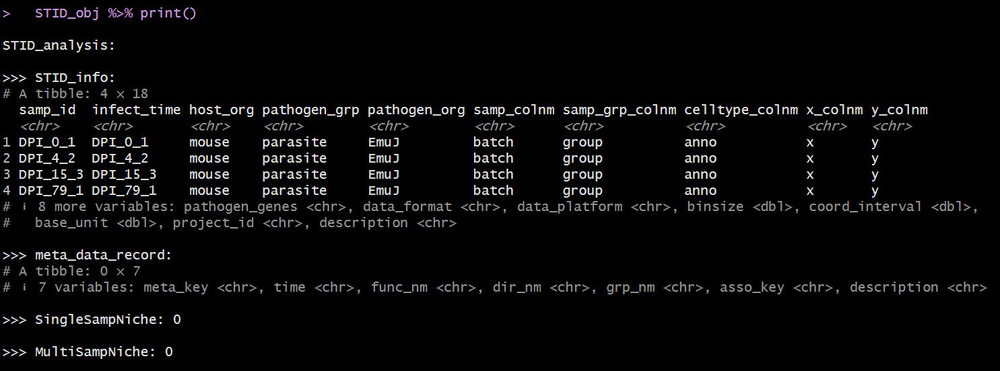

```{r setup, include = FALSE}
knitr::opts_chunk$set(
  collapse = TRUE,
  comment = "#>",
  fig.align = "center",
  fig.width = 7,
  fig.height = 5
)
set.seed(123)
```

## Overview

This vignette describes how to load and preprocess spatial transcriptomics data before constructing an `STID` object for downstream infection-aware spatial analysis.

Preprocessing standardizes the input object so that the data are normalized, dimensionally reduced, clustered, and annotated in a format compatible with downstream STID modules.

This vignette covers:

-   loading an example Seurat object;
-   running a Seurat-based preprocessing workflow;
-   annotating spatial spots or cells with a reference-based method;
-   converting a processed Seurat object into an `STID` object.

> **Note:** Update the example dataset name, organism information, pathogen gene prefix, and metadata column names according to the dataset used in your analysis.

## Prerequisites

```{r packages, message = FALSE, warning = FALSE, eval = FALSE}
library(tidyverse)
library(Seurat)
library(STID)
```

`SingleR` and `celldex` are only required for the optional reference-based annotation step.

## Example data

The example data can be downloaded from [Figshare](https://doi.org/10.6084/m9.figshare.31839988). In this vignette, we use the `stRNA_AE` dataset as an example.

> **Note:** Replace `./stRNA_AE.rds` with the correct local path or a package-provided example dataset.

```{r load-data, eval = FALSE}
stRNA <- readRDS(file = "./stRNA_AE.rds")
stRNA <- suppressMessages(UpdateSeuratObject(stRNA))
# stRNA <- NormalizeData(stRNA)
meta_data <- stRNA@meta.data
table(meta_data$batch)
```

If the input Seurat object already contains reliable clustering results and cell-type annotations, you can skip the `Seurat_pipeline()` and `anno_SingleR()` sections and convert the object directly into an `STID` object.

> **Note:** Confirm that the metadata column used for sample identity, such as `batch`, exists in `stRNA@meta.data`.

## Seurat preprocessing pipeline

This step is optional. Skip it if the input Seurat object has already been normalized, dimensionally reduced, and clustered.

STID provides the wrapper function `Seurat_pipeline()` to streamline Seurat-based preprocessing, including normalization, feature selection, dimensionality reduction, and clustering.

```{r seurat-pipeline, eval = FALSE}
stRNA <- Seurat_pipeline(
  seurat_obj = stRNA,
  data_type = "stRNA",
  resolution_index = seq(0.1, 1.3, 0.2),
  runTSNE_index = FALSE,
  assay_nm = NULL
)
```

#### Details

The preprocessing pipeline performs:

-   data normalization and scaling;
-   identification of highly variable features;
-   principal component analysis (PCA);
-   graph-based clustering across multiple resolutions.

The `resolution_index` argument controls clustering granularity. Adjust this parameter according to the expected spatial complexity and biological heterogeneity of the dataset.

> **Note:** Update `data_type`, `resolution_index`, `runTSNE_index`, and `assay_nm` when applying this workflow to other platforms or assay structures.

## Cell-type annotation using SingleR

This step is optional. Skip it if cell-type annotations are already available in the Seurat metadata.

Reference-based annotation can help interpret spatial spots or cells by mapping query profiles to a reference dataset with known cell-type labels.

```{r singleR-annotation, eval = FALSE, message = FALSE, warning = FALSE}
# library(SingleR)
# library(celldex)

# ref <- celldex::MouseRNAseqData()

stRNA <- anno_SingleR(
  seurat_obj = stRNA,
  ref_obj = ref,
  seurat_colnm = "seurat_clusters",
  ref_colnm = "label.main"
)
```

#### Details

The `anno_SingleR()` function annotates query spots or cells using the `SingleR` framework.

Key arguments include:

-   `ref_obj`: a reference dataset with known cell-type annotations;
-   `seurat_colnm`: the metadata column containing cluster labels in the query Seurat object;
-   `ref_colnm`: the annotation column in the reference dataset.

The resulting annotations are stored in the Seurat object and can be used for:

-   interpreting infection-associated spatial niches;
-   comparing host cell-type composition across samples or groups;
-   downstream niche-level analysis in STID.

> **Note:** Replace `MouseRNAseqData()` with a reference dataset that matches the species, tissue, and experimental context of the query data. Also confirm that `seurat_colnm` and `ref_colnm` exist in the corresponding objects.

## Convert the Seurat object into an STID object

To support infection-aware spatial transcriptomics analysis, STID uses a dedicated object class that stores sample information, host-cell annotations, pathogen metadata, and platform-specific spatial information.

Before conversion, confirm the following information:

-   the sample identifier column;
-   the sample group column;
-   the cell-type annotation column;
-   the host organism;
-   the pathogen group and organism;
-   the pathogen gene list;
-   the spatial bin size, data format, and platform.

```{r convert-to-stid, eval = FALSE}
pathogen_genes <- grep("^EmuJ-", rownames(stRNA), value = TRUE)

STID_obj <- as.STID(
  stRNA,
  samp_colnm = "batch",
  samp_grp_colnm = "group",
  celltype_colnm = "anno",
  host_org = "mouse",
  pathogen_grp = "parasite",
  pathogen_org = "EmuJ",
  pathogen_gene = pathogen_genes,
  binsize = 50,
  data_format = "square_grid",
  data_platform = "StereoSeq"
)

print(STID_obj)
```

#### Details

The `as.STID()` function converts a processed Seurat object into an `STID` object. The generated object is used as the standard input for downstream STID analyses.

The example above assumes that:

-   `batch` stores sample identifiers;
-   `group` stores sample-level experimental groups;
-   `anno` stores cell-type annotations;
-   pathogen genes are identified by the prefix `EmuJ-`;
-   the spatial data were generated using the Stereo-seq platform and represented as a square grid.

> **Note:** These assumptions are dataset-specific. Update `samp_colnm`, `samp_grp_colnm`, `celltype_colnm`, `host_org`, `pathogen_grp`, `pathogen_org`, `pathogen_gene`, `binsize`, `data_format`, and `data_platform` before using this workflow for another dataset.

## Inspect the STID object

The following figure shows the structure of `STID` object.

```{r stid-class-figure, echo = FALSE, out.width = "500px", fig.cap = "STID class structure"}
if (file.exists("figures/Figure1_D.png")) {
  knitr::include_graphics("figures/Figure1_D.png")
}
```

The following figures show example views of the generated `STID` object.

```{r stid-view-figure, echo = FALSE, out.width = "600px", fig.cap = "Example view of the raw STID object."}
if (file.exists("figures/STID_AE_raw.png")) {
  knitr::include_graphics("figures/STID_AE_raw.png")
}
```

```{r stid-print-figure, echo = FALSE, out.width = "600px", fig.cap = "Printed summary of the raw STID object."}
if (file.exists("figures/STID_AE_raw_print.png")) {
  
}
```

## Notes

-   Use a reference dataset that matches the species and tissue context of the spatial transcriptomics data.
-   Verify that all metadata columns passed to `as.STID()` are present in `stRNA@meta.data`.
-   Check the pathogen gene prefix carefully, because an incorrect pattern may remove pathogen-derived features from downstream analysis.
-   For package vignettes, keep large example data outside the package or provide a small, lightweight example object.

## Session information

```{r session-info}
sessionInfo()
```
