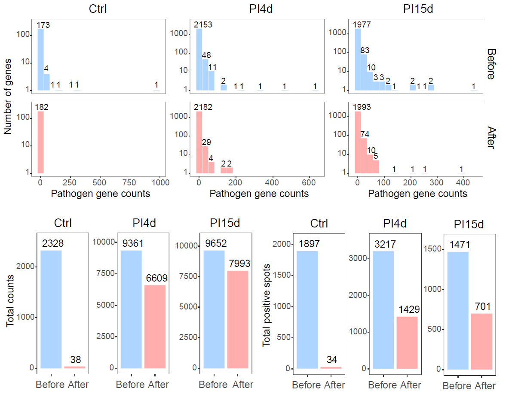
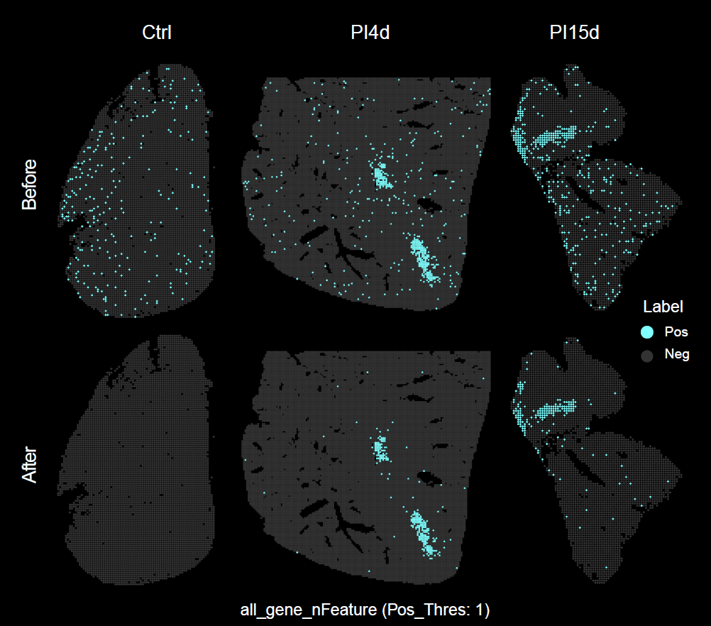

```{r setup, include = FALSE}
knitr::opts_chunk$set(
  collapse = TRUE,
  comment = "#>",
  fig.align = "center",
  fig.width = 7,
  fig.height = 5
)
set.seed(123)
```

## Overview

This vignette describes how to perform pathogen background correction for spatial transcriptomics data using `STID`.

Reliable detection of pathogen-associated signals requires explicit modeling of background contamination. In `STID`, background correction uses reference background or control samples to estimate the distribution of pathogen-associated features and reduce spurious signals before downstream infection-aware spatial analysis.

This vignette covers:

-   preparing a processed `STID` object and a pathogen feature list;
-   selecting background or control samples for background modeling;
-   running `CorrectBackground()`;
-   summarizing pathogen-associated signal before and after correction;
-   generating exploratory spatial maps of pathogen-associated signal.

> **Note:** Update the `STID` object name, pathogen feature list, background sample IDs, assay name, layer name, pathogen gene prefix, group names, and output directory according to the dataset used in your analysis.

## Prerequisites

```{r packages, message = FALSE, warning = FALSE, eval = FALSE}
library(tidyverse)
library(Seurat)
library(STID)
```

## Example data

This vignette use the processed AE `STID_obj` object and a pathogen feature list have already been generated in the preprocessing step.

> **Note:** Replace `STID_obj`, `pathogen_genes`, and `DPI_0_1` with the object name, pathogen feature vector, and background or control sample IDs used in your dataset.

```{r prepare-inputs, eval = FALSE}
STID_obj_before <- STID_obj

# Update this vector to match the background or control samples in your dataset.
background_sample_ids <- c("DPI_0_1")

# Update this object if your pathogen feature list uses a different name.
background_features <- pathogen_genes
```

## Background correction

To reduce background noise from pathogen-associated genes, a control-based background correction strategy is applied. For each pathogen-associated feature, the 95th percentile of nonzero expression values in the background samples is calculated and used as the background expression threshold.

To account for differences in sequencing depth, this threshold is adjusted by the ratio of average unique molecular identifier (UMI) counts between the background samples and all samples. The adjusted threshold is then subtracted from expression values across all spots or cells, and negative corrected values are set to zero.

```{r correct-background, eval = FALSE}
options("parallel_workers" = 1)

STID_obj_after <- CorrectBackground(
  STID_obj = STID_obj_before,
  bg_samp_id = background_sample_ids,
  bg_features = background_features,
  PosThres_prob = 0.95,
  assay_id = "Spatial",
  layer_id = "counts",
  grp_nm = "Final_CE_0.95",
  dir_nm = "M1_CorrectBackground"
)
```

#### Details

-   `bg_samp_id`: background or control sample IDs used to estimate the background signal distribution. Update this argument to match your dataset.
-   `bg_features`: pathogen-associated features used for background modeling. Update this argument if your pathogen feature vector has a different object name.
-   `PosThres_prob`: probability threshold used to estimate the background expression cutoff. The example above uses `0.95`.
-   `assay_id` and `layer_id`: assay and data layer used for correction. Update these arguments if your object uses different assay or layer names.
-   `grp_nm`: name assigned to the corrected signal group in the object metadata. Update this name to reflect the threshold or correction setting used in your analysis.
-   `dir_nm`: output directory for background correction results. Update this path or directory name as needed.

The choice of `PosThres_prob` determines the balance between sensitivity and specificity. It should be calibrated according to sequencing depth, background signal level, and expected pathogen load.

#### Output figure

The following figure summarizes pathogen-associated signal after background correction.

```{r show-background-correction-summary, echo = FALSE, out.width = "600px", fig.cap = "Summary of pathogen-associated signal after background correction."}
if (file.exists("figures/Figure2_B.png")) {
  
}
```

## Spatial distribution of pathogen-associated signal

This section generates exploratory spatial maps of pathogen-associated signal before and after background correction. Formal detection of infection-associated spots is described in the next vignette, `04_Infection-associated_spot_detection.html`.

> **Note:** Update the pathogen gene prefix in `pattern`, the pathogen feature vector, metadata key, assay name, layer name, and output group names according to your dataset.

```{r calculate-pathogen-signal, eval = FALSE}
high_exp_genes <- GetTopGenes(
  STID_obj_before,
  top_n = 10,
  pattern = "EmuJ-",
  grp_by_samp = FALSE,
  grp_by_celltype = FALSE,
  assay_id = "Spatial",
  layer_id = "counts"
)

raw_pathogen_signal_before <- GetGeneStat(
  STID_obj = STID_obj_before,
  features = pathogen_genes,
  prefix = "all_gene",
  func = "sum"
)

STID_obj_before <- AddMetaColumn(
  STID_obj = STID_obj_before,
  add_data = raw_pathogen_signal_before,
  meta_key = "raw",
  ignore_rownm = FALSE
)

raw_pathogen_signal_after <- GetGeneStat(
  STID_obj = STID_obj_after,
  features = pathogen_genes,
  prefix = "all_gene",
  func = "sum"
)

STID_obj_after <- AddMetaColumn(
  STID_obj = STID_obj_after,
  add_data = raw_pathogen_signal_after,
  meta_key = "raw",
  ignore_rownm = FALSE
)
```

> **Note:** If your installed `STID` version uses the legacy argument name `igrnore_rownm`, replace `ignore_rownm` with `igrnore_rownm` in the two `AddMetaColumn()` calls above.

```{r plot-pathogen-spatial-signal, eval = FALSE}
pathogen_signal_columns_before <- grep(
  "all_gene",
  colnames(STID_obj_before@meta.data),
  value = TRUE
)

STID_obj_before <- SpotDetect_Gene(
  STID_obj_before,
  features = high_exp_genes,
  feature_colnm = pathogen_signal_columns_before,
  PosThres_prob = 0,
  PosThres_count = 1,
  col = c("grey20", "#80FFFF"),
  black_bg = TRUE,
  pt_size = 1,
  blur_method = NULL,
  blur_n = 1,
  blur_sigma = 0.5,
  plot_method = "single",
  grp_nm = "CE_correct_before_all_gene_black"
)

pathogen_signal_columns_after <- grep(
  "all_gene",
  colnames(STID_obj_after@meta.data),
  value = TRUE
)

STID_obj_after <- SpotDetect_Gene(
  STID_obj_after,
  features = high_exp_genes,
  feature_colnm = pathogen_signal_columns_after,
  PosThres_prob = 0,
  PosThres_count = 1,
  col = c("grey20", "#80FFFF"),
  black_bg = TRUE,
  pt_size = 1,
  blur_method = NULL,
  blur_n = 1,
  blur_sigma = 0.5,
  plot_method = "single",
  grp_nm = "CE_correct_after_all_gene_black"
)
```

#### Output figure

The following figure shows the spatial distribution of pathogen-associated signal before and after background correction.

```{r show-pathogen-spatial-map, echo = FALSE, out.width = "500px", fig.cap = "Spatial distribution of pathogen-associated signal before and after background correction."}
if (file.exists("figures/Figure2_A.png")) {
  
}
```

## Notes

-   Apply background correction before spatial classification or downstream pathogen signal interpretation.
-   Confirm that background samples represent true negative or baseline conditions before running correction.
-   Check `meta.data` and the output files in `dir_nm` to confirm that corrected signals were generated successfully.
-   The corrected object preserves the original object structure while updating pathogen signal estimates.
-   Recalibrate `PosThres_prob` when applying this workflow to datasets with different sequencing depth, pathogen burden, or background contamination levels.

## Session information

```{r session-info}
sessionInfo()
```
