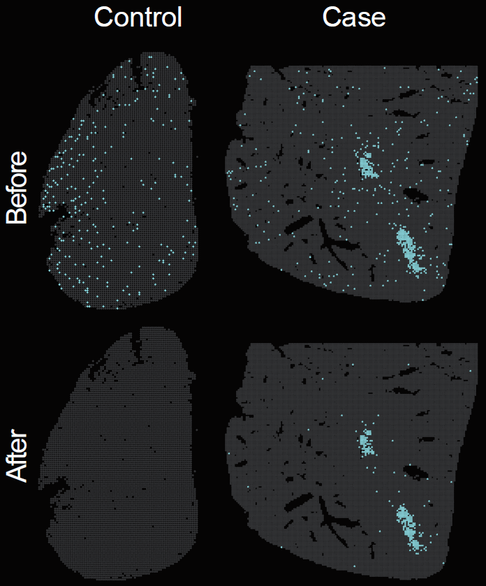

```{r setup, include = FALSE}
knitr::opts_chunk$set(
  collapse = TRUE,
  comment = "#>",
  fig.align = "center",
  fig.width = 7,
  fig.height = 5
)
set.seed(123)
```

## Overview

This vignette describes how to perform pathogen background correction for spatial transcriptomic data of infectious diseases using `STID`.

Accurate detection of pathogen-derived background signals requires explicit modeling of background contamination. In `STID`, background correction uses reference background or control samples to estimate the distribution of pathogen-associated features and reduce spurious signals before downstream spatial transcriptomic analysis of infectious diseases.

This vignette covers:

-   preparing a processed `STID` object and a pathogen feature list;
-   selecting control samples or spatial background regions for background modeling;
-   running `CorrectBackground()`;
-   summarizing pathogen-derived background signal before and after correction;
-   generating spatial distribution maps of pathogen-derived background signals.


```{r pathogen-background-correction, echo = FALSE, fig.align = "center", out.width = "300px", fig.cap = "Spatial distribution of pathogen-derived background signal before and after background correction."}
if (file.exists("figures/Figure2_A_partial.png")) {
  
}
```

> **Note:** Update the `STID` object name, pathogen feature list, background sample IDs, assay name, layer name, pathogen gene prefix, group names, and output directory according to the dataset used in your analysis.

> **Reference code:** For more runnable code examples, please refer to the [article code](https://github.com/YulongQin/STID/tree/main/article_code).


## Prerequisites

```{r packages, message = FALSE, warning = FALSE, eval = FALSE}
library(tidyverse)
library(Seurat)
library(STID)
```

## Example data

This vignette uses the processed AE STID_obj object and a pathogen feature list that have already been generated in the preprocessing step. Background can be estimated from control samples or, when needed, from spatially defined background regions.

> **Note:** Replace `STID_obj`, `pathogen_genes`, and `DPI_0_1` with the object name, pathogen feature vector, and background or control sample IDs used in your dataset.

```{r prepare-inputs, eval = FALSE}
STID_obj_before <- STID_obj

# Update this vector to match the background or control samples in your dataset.
background_sample_ids <- c("DPI_0_1")

# Update this object if your pathogen feature list uses a different name.
background_features <- pathogen_genes
```

## Background correction

To reduce background noise from pathogen-associated genes, background signal can be estimated from control samples, predefined background regions, or interactively selected background regions. `CorrectBackground()` uses `ctrl_samp_id` for control samples, `bg_region_cell` for predefined regions, and `bg_region_lasso = TRUE` for interactive lasso selection. When both control samples and background regions are supplied, the larger correction value is used.

For control-sample correction, UMI adjustment is enabled by default (`adjust_UMI = TRUE`) to account for sequencing-depth differences. Corrected values below zero are set to zero.

```{r correct-background, eval = FALSE}
options("parallel_workers" = 4)

STID_obj_after <- CorrectBackground(
  STID_obj = STID_obj_before,
  ctrl_samp_id = background_sample_ids,
  bg_features = background_features,
  PosThres_prob = 0.95,
  # Optional region-based background definition:
  # group_by = "nCount_Spatial",
  # bg_region_cell = NULL,
  # bg_region_lasso = TRUE,
  assay_id = "Spatial",
  layer_id = "counts",
  grp_nm = "Final_CE_0.95",
  dir_nm = "M1_CorrectBackground"
)
```


The choice of `PosThres_prob` determines the balance between sensitivity and specificity. It should be calibrated according to sequencing depth, background signal level, and expected pathogen load.

The following figure summarizes pathogen-derived background signal after background correction.

```{r show-background-correction-summary, echo = FALSE, fig.align = "center", out.width = "600px", fig.cap = "Summary of pathogen-derived background signal after background correction."}
if (file.exists("figures/Figure2_B.png")) {
  knitr::include_graphics("figures/Figure2_B.png")
}
```

## Spatial distribution of pathogen-derived background signal

This section generates exploratory spatial maps of pathogen-derived background signal before and after background correction. Formal detection of infection-associated positive spots is described in the [Infection associated spot detection](https://yulongqin.github.io/STID/articles/04_Infection-associated_spot_detection.html) vignette.

> **Note:** Update the pathogen gene prefix in `pattern`, the pathogen feature vector, metadata key, assay name, layer name, and output group names according to your dataset.

Calculate the overall expression of pathogen genes and add the results to meta.data.

```{r calculate-pathogen-signal, eval = FALSE}
high_exp_genes <- GetTopGenes(
  STID_obj_before,
  top_n = 10,
  pattern = "EmuJ-",
  grp_by_samp = FALSE,
  grp_by_celltype = FALSE,
  assay_id = "Spatial",
  layer_id = "counts"
)

# before correction
raw_pathogen_signal_before <- GetGeneStat(
  STID_obj = STID_obj_before,
  features = pathogen_genes,
  prefix = "all_gene",
  func = "sum"
)

STID_obj_before <- AddMetaColumn(
  STID_obj = STID_obj_before,
  add_data = raw_pathogen_signal_before,
  meta_key = "raw",
  ignore_rownm = FALSE
)

# after correction
raw_pathogen_signal_after <- GetGeneStat(
  STID_obj = STID_obj_after,
  features = pathogen_genes,
  prefix = "all_gene",
  func = "sum"
)

STID_obj_after <- AddMetaColumn(
  STID_obj = STID_obj_after,
  add_data = raw_pathogen_signal_after,
  meta_key = "raw",
  ignore_rownm = FALSE
)
```

Using identical parameters, calculate the spatial distribution of pathogen-infected positive spots in the STID object before and after pathogen background correction. 


```{r plot-pathogen-spatial-signal, eval = FALSE}
# before correction
pathogen_signal_columns_before <- grep(
  "all_gene",
  colnames(STID_obj_before@meta.data),
  value = TRUE
)

STID_obj_before <- SpotDetect_Gene(
  STID_obj_before,
  features = high_exp_genes,
  feature_colnm = pathogen_signal_columns_before,
  PosThres_prob = 0,
  PosThres_count = 2,
  col = c("grey20", "#80FFFF"),
  black_bg = TRUE,
  pt_size = 1,
  blur_method = NULL,
  blur_n = 1,
  blur_sigma = 0.5,
  plot_method = "single",
  grp_nm = "CE_correct_before_all_gene_black"
)

# after correction
pathogen_signal_columns_after <- grep(
  "all_gene",
  colnames(STID_obj_after@meta.data),
  value = TRUE
)

STID_obj_after <- SpotDetect_Gene(
  STID_obj_after,
  features = high_exp_genes,
  feature_colnm = pathogen_signal_columns_after,
  PosThres_prob = 0,
  PosThres_count = 2,
  col = c("grey20", "#80FFFF"),
  black_bg = TRUE,
  pt_size = 1,
  blur_method = NULL,
  blur_n = 1,
  blur_sigma = 0.5,
  plot_method = "single",
  grp_nm = "CE_correct_after_all_gene_black"
)
```

The following figure shows the spatial distribution of pathogen-derived background signal before and after background correction.

```{r show-pathogen-spatial-map, echo = FALSE, fig.align = "center", out.width = "500px", fig.cap = "Spatial distribution of pathogen-derived background signal before and after background correction."}
if (file.exists("figures/Figure2_A.png")) {
  knitr::include_graphics("figures/Figure2_A.png")
}
```


## Notes

-   Apply pathogen background correction before downstream infection-associated spatial transcriptomic analysis.
-   Confirm that control samples or selected spatial background regions represent true baseline conditions before running correction.
-   Use `ctrl_samp_id` for control samples; use `bg_region_cell` or `bg_region_lasso = TRUE` when the background must be defined spatially.
-   The corrected STID object preserves the original object structure while updating pathogen gene expression.
-   Recalibrate `PosThres_prob` when applying this workflow to datasets with different sequencing depth, pathogen burden, or background contamination levels.


## Next steps

This vignette generated a background-corrected `STID` object and reduced nonspecific pathogen-derived signals in control or background samples. In the next vignette, we will use the corrected expression matrix to identify pathogen-infected spots and host-responsive spots based on gene expression or gene set scores.


## Session information

```{r session-info}
sessionInfo()
```
