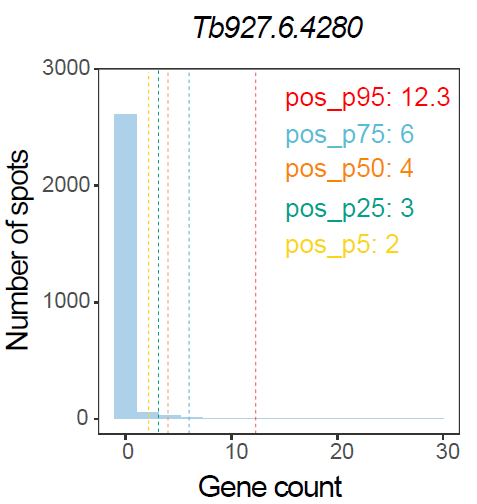
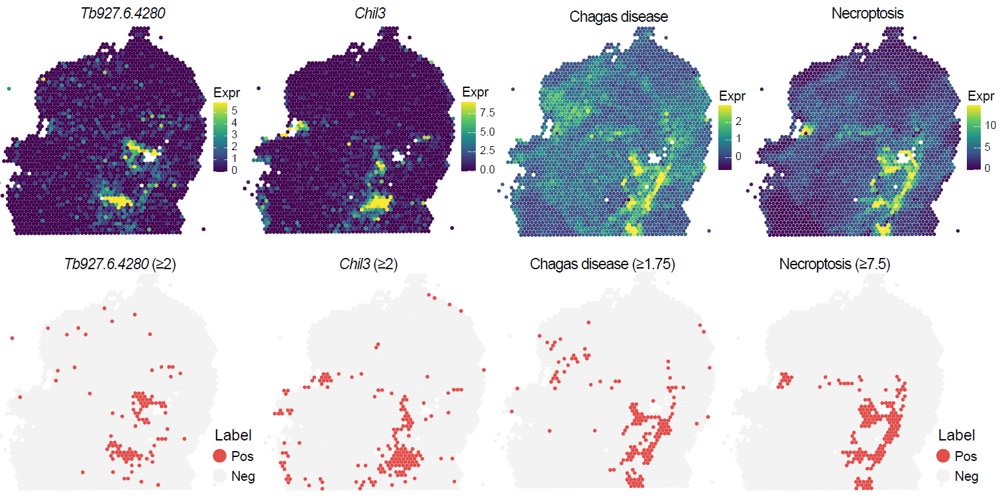

```{r setup, include = FALSE}
knitr::opts_chunk$set(
  collapse = TRUE,
  comment = "#>",
  fig.align = "center",
  fig.width = 7,
  fig.height = 5
)
set.seed(123)
```

## Overview

This vignette describes how to identify infection-associated spatial locations using `STID` after preprocessing and, when appropriate, pathogen background correction.

Infection-associated spots can be detected from either gene-level signals or gene-set scores. The gene-level strategy uses pathogen-derived genes or host response genes to define positive spatial locations, whereas the gene-set strategy summarizes coordinated biological programs and identifies spots with elevated pathway- or process-level activity.

This vignette covers:

-   preparing an example `STID` object for infection-associated spot detection;
-   defining pathogen-derived and host response gene sets;
-   identifying infection-associated spots using aggregated gene-level signals;
-   identifying infection-associated spots using gene-set scores;
-   visualizing threshold-based detection results and spatial distributions.

> **Note:** Update the input object name, sample metadata columns, pathogen gene list, host response gene list, gene-set collections, detection thresholds, plotting parameters, output group names, and saved object path according to the dataset used in your analysis.

## Prerequisites

```{r packages, message = FALSE, warning = FALSE, eval = FALSE}
library(tidyverse)
library(Seurat)
library(STID)
```

## Example data

The example data can be downloaded from [Figshare](https://doi.org/10.6084/m9.figshare.31839988). In this vignette, we use the `stRNA_Tbb` dataset as an example.

> **Note:** Replace `./stRNA_Tbb.rds` with the correct local path or a package-provided example dataset.

```{r load-data, eval = FALSE}
stRNA <- readRDS(file = "./stRNA_Tbb.rds")
stRNA <- suppressMessages(UpdateSeuratObject(stRNA))
stRNA <- NormalizeData(stRNA)
meta_data <- stRNA@meta.data
table(meta_data$group)
```

#### Construct the STID object

This example uses a Visium-based mouse tissue dataset infected with *Trypanosoma brucei brucei*. The gene vectors below define pathogen-derived features and host response markers used for downstream detection.

```{r define-features, eval = FALSE}
pathogen_genes <- c("Tb927.7.5940", "Tb927.6.4280")
host_response_genes <- c(
  "Ttr", "Cd138", "Il10", "Il10ra", "Aif1", "Chil3", "Arg1"
)
```

> **Note:** Replace `pathogen_genes` and `host_response_genes` with features relevant to the pathogen, tissue, host species, and biological question under investigation. Confirm that all gene identifiers match the row names of the input Seurat object.

```{r construct-stid-object, eval = FALSE}
STID_obj <- as.STID(
  stRNA,
  samp_colnm = "group",
  samp_grp_colnm = "group",
  celltype_colnm = NULL,
  host_org = "mouse",
  pathogen_grp = "parasite",
  pathogen_org = "trypanosome",
  pathogen_gene = pathogen_genes,
  data_format = "hex_grid",
  data_platform = "Visium"
)

print(STID_obj)
```

> **Note:** Update `samp_colnm`, `samp_grp_colnm`, `celltype_colnm`, `host_org`, `pathogen_grp`, `pathogen_org`, `data_format`, and `data_platform` to match the metadata and spatial platform of the analyzed dataset.

Because a subset of pathogen-derived features in the `stRNA_Tbb` example shows atypical signal patterns, this vignette demonstrates infection-associated spot detection without applying pathogen background correction to this dataset. For datasets with suitable background or control samples, pathogen background correction should be performed before formal infection-associated spot detection.

## Detect infection-associated spots using gene-level signals

Gene-level detection identifies positive spatial locations from pathogen-derived expression or host response marker expression. For each sample, the expression distribution is evaluated, and a quantile-based threshold is used to classify spots as positive or negative. By default, nonzero expression values can be used to estimate the threshold, and the selected cutoff should be calibrated according to spatial expression patterns and frequency distributions.

For multiple genes, aggregated expression across the selected features is used for spot-level detection. Optional smoothing can be applied before thresholding to reduce local noise.

```{r define-plot-colors, eval = FALSE}
COLOR_DIS_CON <- list(
  dis = c("grey95", "#E34D4A"),
  con = c("#440154FF", "#3B528BFF", "#21908CFF", "#5DC863FF", "#FDE725FF")
)
```

```{r calculate-gene-level-signals, eval = FALSE}
pathogen_signal <- GetGeneStat(
  STID_obj = STID_obj,
  features = pathogen_genes,
  prefix = "pathogen_gene",
  func = "sum"
)

STID_obj <- AddMetaColumn(
  STID_obj = STID_obj,
  add_data = pathogen_signal,
  meta_key = "raw",
  ignore_rownm = FALSE
)

host_response_signal <- GetGeneStat(
  STID_obj = STID_obj,
  features = host_response_genes,
  prefix = "host_response_gene",
  func = "sum"
)

STID_obj <- AddMetaColumn(
  STID_obj = STID_obj,
  add_data = host_response_signal,
  meta_key = "raw",
  ignore_rownm = FALSE
)
```

> **Note:** If the installed `STID` version uses the legacy argument name `igrnore_rownm`, replace `ignore_rownm` with `igrnore_rownm` in the `AddMetaColumn()` calls above.

```{r detect-gene-level-spots, eval = FALSE}
pathogen_signal_columns <- grep(
  "pathogen_gene",
  colnames(STID_obj@meta.data),
  value = TRUE
)

STID_obj <- SpotDetect_Gene(
  STID_obj,
  features = pathogen_genes,
  feature_colnm = pathogen_signal_columns,
  PosThres_prob = 0,
  PosThres_count = 2,
  col = COLOR_DIS_CON,
  black_bg = FALSE,
  pt_size = 2.2,
  vmax = "p99",
  blur_method = NULL,
  blur_n = 1.5,
  blur_sigma = 0.5,
  plot_method = "single",
  grp_nm = "Tbb_pathogen_gene_signal_white"
)

host_response_signal_columns <- grep(
  "host_response_gene",
  colnames(STID_obj@meta.data),
  value = TRUE
)

STID_obj <- SpotDetect_Gene(
  STID_obj,
  features = host_response_genes,
  feature_colnm = host_response_signal_columns,
  PosThres_prob = 0,
  PosThres_count = 2,
  col = COLOR_DIS_CON,
  black_bg = FALSE,
  pt_size = 2.2,
  blur_method = NULL,
  blur_n = 1,
  blur_sigma = 0.5,
  plot_method = "single",
  grp_nm = "Tbb_host_response_gene_signal_white"
)
```

#### Details

-   `features`: gene features used to define infection-associated or host response-associated signal. Update this vector for each dataset.
-   `feature_colnm`: metadata columns containing aggregated gene-level signal. These columns should correspond to the selected feature set.
-   `PosThres_prob`: quantile-based probability threshold for positive-spot detection. Recalibrate this value according to the signal distribution.
-   `PosThres_count`: count-based cutoff for positive-spot detection. Increase this value when low-level background signal is expected.
-   `blur_method`, `blur_n`, and `blur_sigma`: optional smoothing parameters used before visualization or thresholding.
-   `grp_nm`: output group name stored in the `STID` object. Use informative names that describe the dataset and detection strategy.

#### Output figure

The following figure summarizes threshold-based classification of infection-associated spots using gene-level signals.

```{r show-gene-level-thresholds, echo = FALSE, out.width = "400px", fig.cap = "Threshold-based classification of infection-associated spots using gene-level signals."}
if (file.exists("figures/Figure2_F.png")) {
  
}
```

## Detect infection-associated spots using gene-set scores

Gene-set score-based detection identifies spatial locations with elevated activity of predefined biological programs. `STID` supports algorithm-based scoring methods, such as `AddModuleScore`, `AUCell`, and `UCell`, as well as expression-based summary metrics such as mean or total expression.

The same thresholding strategy used for gene-level detection can be applied to gene-set scores. Spots with scores above the selected threshold are classified as positive.

```{r detect-pcd-geneset-spots, eval = FALSE}
Gene_Geneset <- STID::Gene_Geneset

pcd_geneset_df <- Gene_Geneset$Mouse$Geneset$Mouse_PCD_geneset
pcd_geneset_list <- lapply(pcd_geneset_df, na.omit)
names(pcd_geneset_list)

STID_obj <- SpotDetect_Geneset(
  STID_obj,
  geneset_list = pcd_geneset_list,
  score_method = "AddModuleScore",
  n_iter = 5,
  nbin = 24,
  seed = 10,
  PosThres_prob = 0,
  PosThres_score = 7.5,
  pt_size = 2.2,
  col = COLOR_DIS_CON,
  black_bg = FALSE,
  blur_method = NULL,
  plot_method = "single",
  grp_nm = "Tbb_PCD_geneset_white"
)
```

```{r detect-parasite-response-geneset-spots, eval = FALSE}
parasite_response_geneset_df <- Gene_Geneset$Mouse$Geneset$KEGG$Mouse_KEGG_Detect_parasitic_geneset
parasite_response_geneset_list <- lapply(parasite_response_geneset_df, na.omit)
names(parasite_response_geneset_list)

STID_obj <- SpotDetect_Geneset(
  STID_obj,
  geneset_list = parasite_response_geneset_list,
  score_method = "AddModuleScore",
  n_iter = 5,
  nbin = 24,
  PosThres_prob = 0,
  PosThres_score = 1.75,
  pt_size = 2.2,
  col = COLOR_DIS_CON,
  black_bg = FALSE,
  blur_method = NULL,
  plot_method = "single",
  grp_nm = "Tbb_parasite_response_geneset_white"
)

saveRDS(STID_obj, file = "./STID_obj_Tbb_SpotDetect.rds")
```

#### Details

-   `geneset_list`: named list of gene sets used for scoring. Replace this object with gene sets appropriate for the host species and biological process of interest.
-   `score_method`: scoring method used to quantify gene-set activity. Select a method that is appropriate for the data type and normalization strategy.
-   `n_iter`, `nbin`, and `seed`: parameters used by `AddModuleScore`. Adjust these values when using different feature pools or scoring configurations.
-   `PosThres_score`: score-based cutoff for positive-spot detection. Recalibrate this threshold for each gene-set collection and dataset.
-   `grp_nm`: output group name stored in the `STID` object. Use a name that identifies the dataset, gene-set collection, and visualization background.

#### Output figure

The following figure shows the spatial distribution of infection-associated spots identified using gene-set scores.

```{r show-geneset-spatial-map, echo = FALSE, out.width = "600px", fig.cap = "Spatial distribution of infection-associated spots identified using gene-set scores."}
if (file.exists("figures/Figure2_G.png")) {
  
}
```

## Notes

-   Perform pathogen background correction before infection-associated spot detection when suitable background or control samples are available.
-   Confirm that pathogen-derived genes, host response genes, and gene-set features are present in the input object before running detection.
-   Calibrate `PosThres_prob`, `PosThres_count`, and `PosThres_score` according to the observed signal distribution, sequencing depth, expected pathogen burden, and tissue-specific background level.
-   Use sample-specific threshold evaluation when infection burden or sequencing depth differs substantially across samples.
-   Use informative `grp_nm` values because they are used to organize downstream metadata and visualization outputs.
-   Review spatial maps and threshold summaries together to avoid interpreting isolated low-signal spots as infection-associated regions.

## Session information

```{r session-info}
sessionInfo()
```
