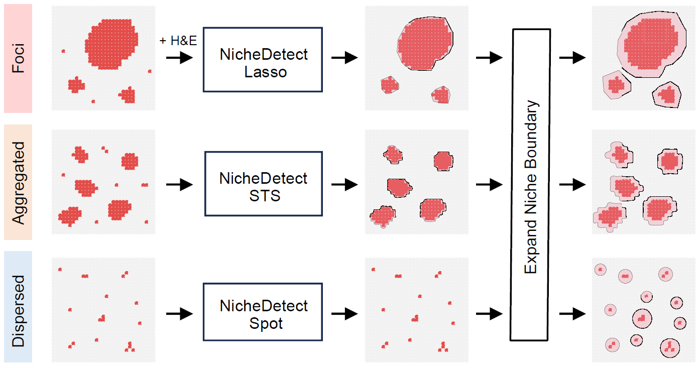
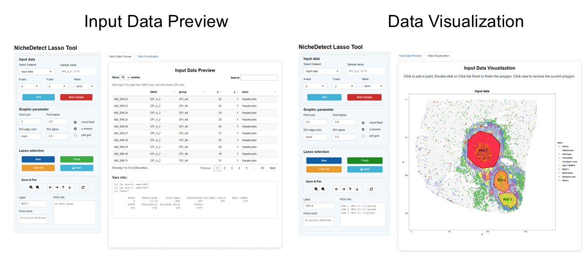
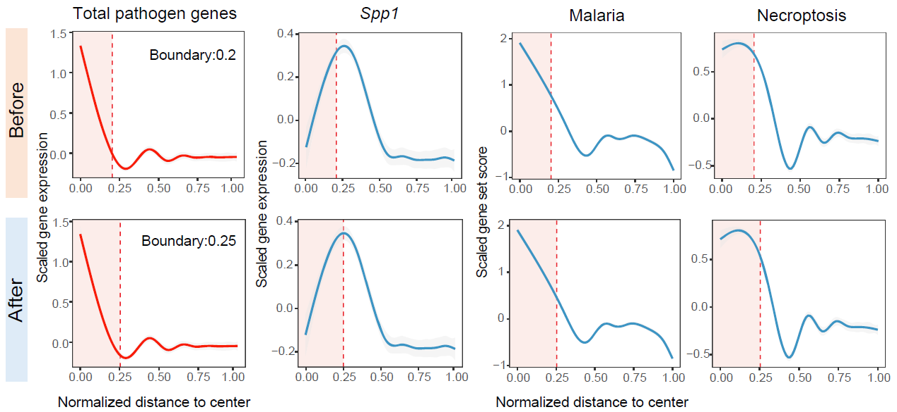
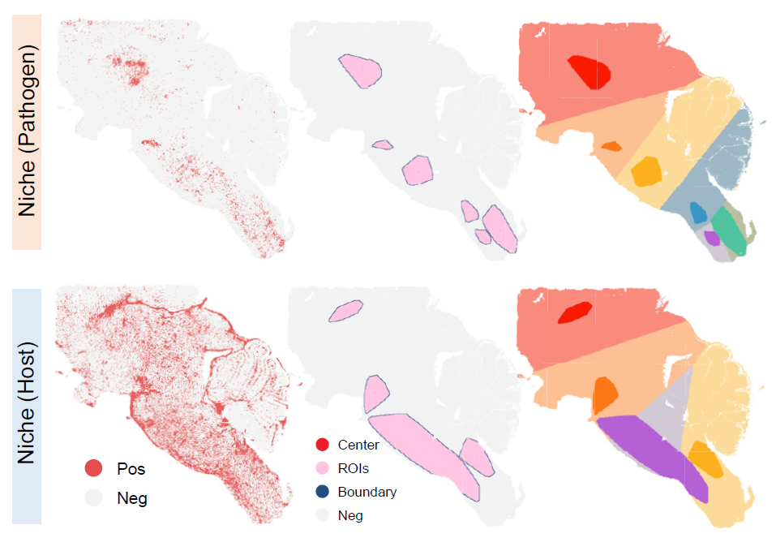
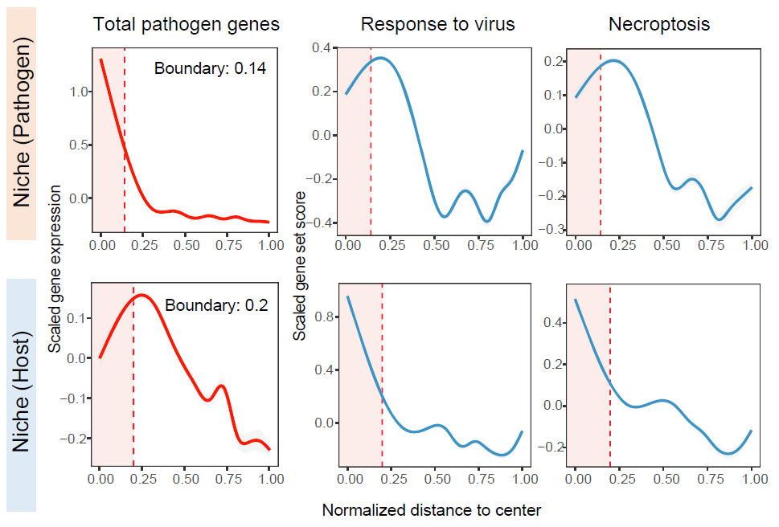
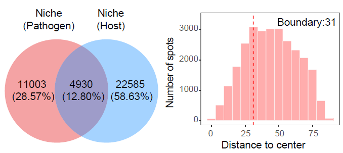
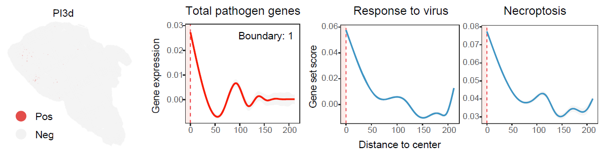

```{r setup, include = FALSE}
knitr::opts_chunk$set(
  collapse = TRUE,
  comment = "#>",
  fig.align = "center",
  fig.width = 7,
  fig.height = 5
)
set.seed(123)
```

## Overview

This vignette describes how to identify infection-associated niches using `STID` after preprocessing, background correction when required, and infection-associated spot detection.

`STID` supports three complementary niche identification modes according to the spatial organization of positive spots:

-   **Foci-type niches**, which represent highly localized infection-associated regions;
-   **Aggregated-type niches**, which represent spatially clustered positive regions with broader regional structure;
-   **Dispersed-type niches**, which represent spatially distributed positive spots without strong regional aggregation.

This vignette covers:

-   identifying foci-type niches using lasso-based spatial boundary detection;
-   identifying aggregated-type niches using regional spatial transcriptomic signal aggregation;
-   identifying dispersed-type niches at the positive-spot level;
-   visualizing niche boundaries and distance-dependent signal profiles.


```{r niche-strategy-figure, echo = FALSE, fig.align = "center", out.width = "600px", fig.cap = "Overview of the three infection-associated niche identification strategies."}
if (file.exists("figures/Figure3_A.png")) {
  
}
```

> **Note:** Update the input object names, niche-identification parameters according to the dataset used in your analysis.

> **Reference code:** For more runnable code examples, please refer to the [article code](https://github.com/YulongQin/STID/tree/main/article_code).


## Prerequisites

```{r packages, message = FALSE, warning = FALSE, eval = FALSE}
library(tidyverse)
library(Seurat)
library(STID)
```

## Example data

The foci-type example uses the AE `STID_obj_after` object generated in infection-associated spot detection workflow, and the analysis focuses on the `DPI_4_2 (PI4d)` sample. 

The aggregated-type uses the JE `STID_obj` object generated in infection-associated spot detection workflow, and the analysis focuses on the `D5_1 (PI5d)` sample. 

The dispersed-type uses the JE `STID_obj` object generated in infection-associated spot detection workflow, and the analysis focuses on the `D3_1 (PI3d)` sample. 


## Foci-type niche identification

For foci-type niches, clear infectious foci were first confirmed in H&E images. `NicheDetect_Lasso` was then used to delineate foci-associated niches by integrating infected spots, host-responsive spots, cell-type annotations, and H&E histology.


Foci-type niche identification is designed for highly localized infection-associated regions.

> **Note:** Replace `STID_obj_after`, `DPI_4_2`, `anno`, `batch`, color vectors, marker genes, gene-set names, and metadata keys with the corresponding values from your dataset.

```{r prepare-foci-input, eval = FALSE}
foci_celltype_colors <- c(
  "HsPCs" = "#E41A1C",
  "Hepatocytes" = "grey95",
  "Infla Heps" = "#4DAF4A",
  "Fibroblasts" = "#984EA3",
  "Cho/Spp1+ cells" = "#FFFF33",
  "Spp1+ MoMFs" = "#FF7F00",
  "MoKCs" = "#377EB8",
  "Neutrophils" = "#F781BF",
  "B/plasma cells" = "#A65628",
  "Others" = "#8DA0CB"
)
```

```{r detect-foci-niches, eval = FALSE}
STID_obj_lasso <- NicheDetect_Lasso(
  STID_obj = STID_obj_after,
  meta_key = "coord",
  group_by = "anno",
  col = foci_celltype_colors,
  grp_nm = "AE_lasso"
)

print(STID_obj_lasso)

foci_lasso_key <- "M2_NicheDetect_Lasso_AE_lasso"
lasso_meta <- GetMetaData(
  STID_obj_lasso,
  meta_key = foci_lasso_key,
  add_coord = FALSE
)[[1]]
```

```{r show-foci-lasso-boundary, echo = FALSE, fig.align = "center", out.width = "700px", fig.cap = "Foci-type niche boundary detected using lasso-based spatial delineation."}
if (file.exists("figures/merge_photo/merge1.PNG")) {
  
}
```

### Visualize foci-type niche regions

After niche identification, boundary spots were defined using kNN-based neighborhood relationships, and each ROI center was estimated from median spot coordinates. Distances to the nearest center were then calculated, and bystander spots were assigned to the closest ROI.

The following plots show the spatial distribution of lasso-defined regions of interest and the corresponding region labels.

```{r plot-foci-niches, eval = FALSE}
FOCI_DARK <- c("#F81B02FF", "#FC7715FF", "#FCB11C")
FOCI_LIGHT <- c("#F88A7E", "#FCC093", "#FCDB9A")

# ROI
Plot_Spatial(
  plot_data = lasso_meta,
  x_colnm = "x",
  y_colnm = "y",
  group_by = "ROI_region",
  facet_grpnm = "batch",
  datatype = "discrete",
  col = list(dis = c("grey95", "#FFC4E1", "#244D7F", "#EB1E2C"), con = NULL),
  pt_size = 1,
  vmin = NULL,
  vmax = "p99",
  title = NULL,
  subtitle = NULL,
  black_bg = FALSE
)

# Region
Plot_Spatial(
  plot_data = lasso_meta,
  x_colnm = "x",
  y_colnm = "y",
  group_by = "All_ROI_label2",
  facet_grpnm = "batch",
  datatype = "discrete",
  col = list(dis = c(FOCI_LIGHT, FOCI_DARK), con = NULL),
  pt_size = 1.1,
  vmin = NULL,
  vmax = "p99",
  title = NULL,
  subtitle = NULL,
  black_bg = FALSE
)
```

### Expand foci-type niche boundaries

`NicheExpand` can refine initial niches by adding bystander spots within a selected distance from each ROI boundary.

Niche expansion can be used to include spatial neighborhoods surrounding the detected foci. The expansion distance should be selected according to platform resolution, bin size, and the expected physical scale of infection-associated regions.

```{r expand-foci-niches, eval = FALSE}
STID_obj_expand <- NicheExpand(
  STID_obj = STID_obj_lasso,
  meta_key = foci_lasso_key,
  pos_colnm = "ROI_label",
  center_colnm = "ROI_center",
  expand_dist = 8,
  grp_nm = "AE_expand"
)

print(STID_obj_expand)

foci_expand_key <- "M2_NicheExpand_AE_expand"
expand_meta <- GetMetaData(
  STID_obj_expand,
  meta_key = foci_expand_key,
  add_coord = TRUE
)[[1]]
```

> **Note:** Update `expand_dist` according to the bin size and the expected spatial radius of the niche boundary in your dataset.

```{r plot-expanded-foci-niches, eval = FALSE}
# ROI
Plot_Spatial(
  plot_data = expand_meta,
  x_colnm = "x",
  y_colnm = "y",
  group_by = "ROI_region",
  facet_grpnm = "batch",
  datatype = "discrete",
  col = list(dis = c("grey95", "#FFC4E1", "#244D7F", "#EB1E2C"), con = NULL),
  pt_size = 1,
  vmin = NULL,
  vmax = "p99",
  title = NULL,
  subtitle = NULL,
  black_bg = FALSE
)

# Region
Plot_Spatial(
  plot_data = expand_meta,
  x_colnm = "x",
  y_colnm = "y",
  group_by = "All_ROI_label2",
  facet_grpnm = "batch",
  datatype = "discrete",
  col = list(dis = c(FOCI_LIGHT, FOCI_DARK), con = NULL),
  pt_size = 1.1,
  vmin = NULL,
  vmax = "p99",
  title = NULL,
  subtitle = NULL,
  black_bg = FALSE
)
```

```{r show-expanded-foci-niches, echo = FALSE, fig.align = "center", out.width = "500px", fig.cap = "Expanded foci-type niche regions."}
if (file.exists("figures/Figure3_C.png")) {
  knitr::include_graphics("figures/Figure3_C.png")
}
```

### Plot distance-dependent signal profiles

STID summarizes distance-dependent gradients from niche centers to surrounding tissue. Gene-expression profiles are smoothed with GAMs, while cell-composition profiles are calculated in distance bins; both outputs can be visualized with niche boundaries annotated.

Distance profiles summarize how pathogen-derived genes, host-responsive genes, or gene-set scores change from the niche center toward the surrounding tissue.

```{r plot-foci-distance-profiles, eval = FALSE}
foci_gene_detection_key <- "M1_SpotDetect_Gene_AE_correct_after_host_gene_white"
foci_pcd_detection_key <- "M1_SpotDetect_Geneset_AE_correct_after_PCD_white"
foci_parasite_geneset_key <- "M1_SpotDetect_Geneset_AE_correct_after_KEGG_Parasite_white"

# Profiles before niche expansion.
Plot_DistLine_Exp(
  STID_obj = STID_obj_lasso,
  features = c("EmuJ-002209100", "Spp1", "Il1b"),
  feature_colnm = "all_gene_nFeature(sum)",
  col = c("#F81B02FF", "#3B95C4FF", "#3B95C4FF", "#F81B02FF"),
  facet_grpnm = "batch",
  meta_key = list(c(foci_gene_detection_key, foci_lasso_key))
)

Plot_DistLine_Exp(
  STID_obj = STID_obj_lasso,
  features = NULL,
  feature_colnm = c("Necroptosis"),
  col = c("#3B95C4FF"),
  facet_grpnm = "batch",
  meta_key = list(c(foci_pcd_detection_key, foci_lasso_key))
)

Plot_DistLine_Exp(
  STID_obj = STID_obj_lasso,
  features = NULL,
  feature_colnm = c("Malaria"),
  col = c("#3B95C4FF"),
  facet_grpnm = "batch",
  meta_key = list(c(foci_parasite_geneset_key, foci_lasso_key))
)

# Profiles after niche expansion.
Plot_DistLine_Exp(
  STID_obj = STID_obj_expand,
  features = c("EmuJ-002209100", "Spp1", "Il1b"),
  feature_colnm = "all_gene_nFeature(sum)",
  col = c("#F81B02FF", "#3B95C4FF", "#3B95C4FF", "#F81B02FF"),
  facet_grpnm = "batch",
  meta_key = list(c(foci_gene_detection_key, foci_expand_key))
)

Plot_DistLine_Exp(
  STID_obj = STID_obj_expand,
  features = NULL,
  feature_colnm = c("Necroptosis"),
  col = c("#3B95C4FF"),
  facet_grpnm = "batch",
  meta_key = list(c(foci_pcd_detection_key, foci_expand_key))
)

Plot_DistLine_Exp(
  STID_obj = STID_obj_expand,
  features = NULL,
  feature_colnm = c("Malaria"),
  col = c("#3B95C4FF"),
  facet_grpnm = "batch",
  meta_key = list(c(foci_parasite_geneset_key, foci_expand_key))
)
```

```{r show-foci-distance-profiles, echo = FALSE, fig.align = "center", out.width = "700px", fig.cap = "Distance-dependent feature profiles for foci-type niches."}
if (file.exists("figures/Figure3_F.png")) {
  
}
```

> **Note:** Replace the marker genes, gene-set names, metadata keys, and `facet_grpnm` with values that correspond to the features and sample metadata in your dataset.


## Aggregated-type niche identification

For aggregated-type niches, `NicheDetect_STS` automatically identifies clustered positive regions after low-density filtering and kNN-based refinement of positive spots. Region-level mode uses DBSCAN and hull reconstruction to define niche regions, whereas spot-level mode uses kNN graphs and connected components to delineate contiguous positive-spot clusters.


Aggregated-type niche identification detects spatially clustered regions based on pathogen-infected or host-responsive positive spots. In the JEV example, the `D5_1 (PI5d)` sample is used to illustrate aggregated spatial organization.

> **Note:** Replace detection metadata keys, positive-label columns, `density_thres`, `region_detect_method`, and output group names according to the spatial aggregation pattern and detection results in your dataset.

```{r detect-aggregated-niches, eval = FALSE}
# pathogen-infected niche
STID_obj_aggregated <- NicheDetect_STS(
  STID_obj = STID_obj,
  meta_key = "M1_SpotDetect_Gene_JEV_multisamp_microbe_gene",
  spatial_scale_method = "region",
  region_detect_method = "convex",
  update_spots = FALSE,
  ROI_size = NULL,
  density_thres = 1,
  pos_colnm = "Label_all_gene_nFeature(sum)",
  description = NULL,
  grp_nm = "STS_JEV_multisamp_microbe_region",
  dir_nm = "M2_NicheDetect_STS"
)

pathogen_niche_key <- "M2_NicheDetect_STS_STS_JEV_multisamp_microbe_region"
pathogen_meta <- GetMetaData(
  STID_obj_aggregated,
  meta_key = pathogen_niche_key,
  add_coord = FALSE
)[[1]]

# host-responsive niche
STID_obj_aggregated <- NicheDetect_STS(
  STID_obj = STID_obj_aggregated,
  meta_key = "M1_SpotDetect_Gene_JEV_multisamp_GO_viral_white",
  spatial_scale_method = "region",
  region_detect_method = "convex",
  update_spots = TRUE,
  ROI_size = NULL,
  density_thres = 0.3,
  pos_colnm = "Label_RESPONSE_TO_VIRUS",
  description = NULL,
  grp_nm = "STS_JEV_multisamp_host_region",
  dir_nm = "M2_NicheDetect_STS"
)

print(STID_obj_aggregated)

host_niche_key <- "M2_NicheDetect_STS_STS_JEV_multisamp_host_region"
host_meta <- GetMetaData(
  STID_obj_aggregated,
  meta_key = host_niche_key,
  add_coord = FALSE
)[[1]]
```


The `density_thres` parameter should be calibrated to the expected compactness of pathogen-positive or host-responsive positive regions.


### Visualize aggregated niches

The following plots show the spatial distributions of pathogen-infected and host-responsive aggregated niches.

```{r plot-aggregated-niches, eval = FALSE}
PATHOGEN_DARK <- c("#50C49FFF", "#FC7715FF", "#FCB11C", "#F81B02FF", "#3B95C4FF", "#B560D4FF")
PATHOGEN_LIGHT <- c("#BBBFA1", "#FCC093", "#FCDB9A", "#F88A7E", "#9DB7C4", "#D1CAD4")
HOST_DARK <- c("#F81B02FF", "#FC7715FF", "#FCB11C", "#B560D4FF")
HOST_LIGHT <- c("#F88A7E", "#FCC093", "#FCDB9A", "#D1CAD4")

# Pathogen: ROI
Plot_Spatial(
  plot_data = pathogen_meta,
  x_colnm = "x",
  y_colnm = "y",
  group_by = "ROI_region",
  facet_grpnm = "new_samp",
  datatype = "discrete",
  col = list(dis = c("grey95", "#FFC4E1", "#244D7F", "#EB1E2C"), con = NULL),
  pt_size = 1,
  vmin = NULL,
  vmax = "p99",
  title = NULL,
  subtitle = NULL,
  black_bg = FALSE
)

# Pathogen: Region
Plot_Spatial(
  plot_data = pathogen_meta,
  x_colnm = "x",
  y_colnm = "y",
  group_by = "All_ROI_label2",
  facet_grpnm = "new_samp",
  datatype = "discrete",
  col = list(dis = c(PATHOGEN_LIGHT, PATHOGEN_DARK), con = NULL),
  pt_size = 1.1,
  vmin = NULL,
  vmax = "p99",
  title = NULL,
  subtitle = NULL,
  black_bg = FALSE
)

# Host: ROI
Plot_Spatial(
  plot_data = host_meta,
  x_colnm = "x",
  y_colnm = "y",
  group_by = "ROI_region",
  facet_grpnm = "new_samp",
  datatype = "discrete",
  col = list(dis = c("grey95", "#FFC4E1", "#244D7F", "#EB1E2C"), con = NULL),
  pt_size = 1,
  vmin = NULL,
  vmax = "p99",
  title = NULL,
  subtitle = NULL,
  black_bg = FALSE
)

# Host: Region
Plot_Spatial(
  plot_data = host_meta,
  x_colnm = "x",
  y_colnm = "y",
  group_by = "All_ROI_label2",
  facet_grpnm = "new_samp",
  datatype = "discrete",
  col = list(dis = c(HOST_LIGHT, HOST_DARK), con = NULL),
  pt_size = 1.1,
  vmin = NULL,
  vmax = "p99",
  title = NULL,
  subtitle = NULL,
  black_bg = FALSE
)
```

```{r show-aggregated-niche-map, echo = FALSE, fig.align = "center", out.width = "600px", fig.cap = "Spatial distribution of pathogen-infected and host-responsive aggregated niches."}
if (file.exists("figures/Figure3_G.png")) {
  
}
```

### Plot distance-dependent signal profiles

Distance profiles can be used to compare molecular signal gradients from the center of aggregated niches toward surrounding tissue.

```{r plot-aggregated-distance-profiles, eval = FALSE}
# Profiles for pathogen-infected niche.
Plot_DistLine_Exp(
  STID_obj = STID_obj_aggregated,
  features = c("NS5", "Ccl2"),
  feature_colnm = "all_gene_nFeature(sum)",
  loop_id = "D5_1",
  col = c("#F81B02FF", "#3B95C4FF", "#F81B02FF"),
  facet_grpnm = "grp",
  meta_key = list(c("M1_SpotDetect_Gene_JEV_multisamp_microbe_gene", pathogen_niche_key))
)

Plot_DistLine_Exp(
  STID_obj = STID_obj_aggregated,
  features = NULL,
  feature_colnm = c("RESPONSE_TO_VIRUS"),
  loop_id = "D5_1",
  col = "#3B95C4FF",
  facet_grpnm = "grp",
  meta_key = list(c("M1_SpotDetect_Gene_JEV_multisamp_GO_viral_white", pathogen_niche_key))
)

Plot_DistLine_Exp(
  STID_obj = STID_obj_aggregated,
  features = NULL,
  feature_colnm = c("Necroptosis"),
  loop_id = "D5_1",
  col = "#3B95C4FF",
  facet_grpnm = "grp",
  meta_key = list(c("M1_SpotDetect_Geneset_JEV_correct_before_PCD_white", pathogen_niche_key))
)

# Profiles for host-responsive niche.
Plot_DistLine_Exp(
  STID_obj = STID_obj_aggregated,
  features = c("NS5", "Ccl2"),
  feature_colnm = "all_gene_nFeature(sum)",
  loop_id = "D5_1",
  col = c("#F81B02FF", "#3B95C4FF", "#F81B02FF"),
  facet_grpnm = "grp",
  meta_key = list(c("M1_SpotDetect_Gene_JEV_multisamp_microbe_gene", host_niche_key))
)

Plot_DistLine_Exp(
  STID_obj = STID_obj_aggregated,
  features = NULL,
  feature_colnm = c("RESPONSE_TO_VIRUS"),
  loop_id = "D5_1",
  col = "#3B95C4FF",
  facet_grpnm = "grp",
  meta_key = list(c("M1_SpotDetect_Gene_JEV_multisamp_GO_viral_white", host_niche_key))
)

Plot_DistLine_Exp(
  STID_obj = STID_obj_aggregated,
  features = NULL,
  feature_colnm = c("Necroptosis"),
  loop_id = "D5_1",
  col = "#3B95C4FF",
  facet_grpnm = "grp",
  meta_key = list(c("M1_SpotDetect_Geneset_JEV_correct_before_PCD_white", host_niche_key))
)
```

```{r show-aggregated-distance-profiles, echo = FALSE, fig.align = "center", out.width = "600px", fig.cap = "Distance-dependent feature profiles for aggregated niches."}
if (file.exists("figures/Figure3_H.png")) {
  
}
```


### Compare pathogen-infected and host-responsive niches

`CompareNiche()` quantifies the spatial relationship between two niche definitions, such as pathogen-infected niches and host-responsive niches.

```{r compare-aggregated-niches, eval = FALSE}
CompareNiche(
  STID_obj = STID_obj_aggregated,
  meta_key1 = pathogen_niche_key,
  meta_key2 = host_niche_key,
  bins = 15
)
```

The following plot shows the spatial overlap between pathogen-infected and host-responsive aggregated niches, as well as the distance distribution of host-responsive niche spots to the nearest pathogen-infected niche center.

```{r show-aggregated-niche-comparison, echo = FALSE, fig.align = "center", out.width = "600px", fig.cap = "Spatial comparison between pathogen-infected and host-responsive aggregated niches."}
if (file.exists("figures/Figure3_I.png")) {
  
}
```


## Dispersed-type niche identification

For dispersed-type niches, `NicheDetect_Spot` treats each positive spot as an independent niche.

Dispersed-type niche identification is designed for infection-associated signals that are spatially distributed rather than concentrated in continuous regions. In the JEV example, the `PI3d` sample is used to illustrate dispersed positive-spot organization.

> **Note:** Replace positive-label columns, metadata keys, and output group names according to the dispersed infection-associated spots in your dataset.

```{r detect-dispersed-niches, eval = FALSE}
STID_obj_dispersed <- NicheDetect_Spot(
  STID_obj = STID_obj,
  pos_colnm = "Label_all_gene_nFeature(sum)",
  meta_key = "M1_SpotDetect_Gene_JEV_multisamp_microbe_gene",
  description = NULL,
  grp_nm = "D3_1"
)

print(STID_obj_dispersed)

dispersed_niche_key <- "M2_NicheDetect_Spot_D3_1"
```

```{r plot-dispersed-distance-profiles, eval = FALSE}
Plot_DistLine_Exp(
  STID_obj = STID_obj_dispersed,
  features = c("NS5", "Ccl2"),
  feature_colnm = "all_gene_nFeature(sum)",
  loop_id = "D3_1",
  col = c("#F81B02FF", "#3B95C4FF", "#F81B02FF"),
  distance_scale = FALSE,
  exp_scale = FALSE,
  facet_grpnm = "grp",
  meta_key = list(c("M1_SpotDetect_Gene_JEV_multisamp_microbe_gene", dispersed_niche_key))
)

Plot_DistLine_Exp(
  STID_obj = STID_obj_dispersed,
  features = NULL,
  feature_colnm = c("RESPONSE_TO_VIRUS"),
  loop_id = "D3_1",
  col = "#3B95C4FF",
  distance_scale = FALSE,
  exp_scale = FALSE,
  facet_grpnm = "grp",
  meta_key = list(c("M1_SpotDetect_Gene_JEV_multisamp_GO_viral_white", dispersed_niche_key))
)

Plot_DistLine_Exp(
  STID_obj = STID_obj_dispersed,
  features = NULL,
  feature_colnm = c("Necroptosis"),
  loop_id = "D3_1",
  col = "#3B95C4FF",
  distance_scale = FALSE,
  exp_scale = FALSE,
  facet_grpnm = "grp",
  meta_key = list(c("M1_SpotDetect_Geneset_JEV_correct_before_PCD_white", dispersed_niche_key))
)
```

```{r show-dispersed-niche-profiles, echo = FALSE, fig.align = "center", out.width = "700px", fig.cap = "Distance-dependent feature profiles for dispersed-type niches."}
if (file.exists("figures/Figure3_K.png")) {
  
}
```


## Notes

-   Confirm that infection-associated positive spots have been generated before running niche identification.
-   Select the niche identification mode according to the observed spatial organization of positive spots.
-   Use foci-type detection for compact spatial regions, aggregated-type detection for broader clustered regions, and dispersed-type detection for non-contiguous positive spots.
-   Calibrate `density_thres`, `expand_dist`, `ROI_size`, and thresholding parameters according to platform resolution, bin size, tissue structure, and expected infection burden.
-   Verify all metadata keys generated by spot detection and niche identification before plotting or comparing niches.


## Next steps 

This vignette identified infection-associated niches and, when needed, expanded niche boundaries for downstream spatial-gradient analysis. In the next vignette, we will use these niche labels to construct single-sample niche objects and characterize their spatial organization, cellular composition, molecular features, cell–cell communication, gene regulatory networks, and host–pathogen interactions.


## Session information

```{r session-info}
sessionInfo()
```
