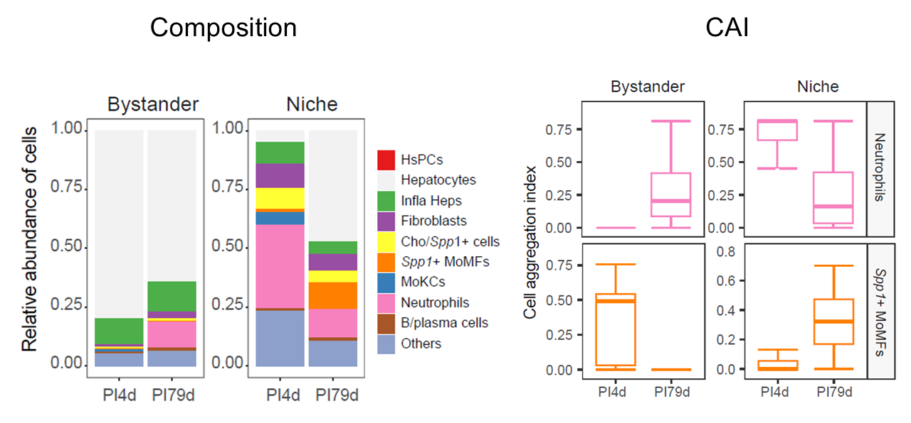
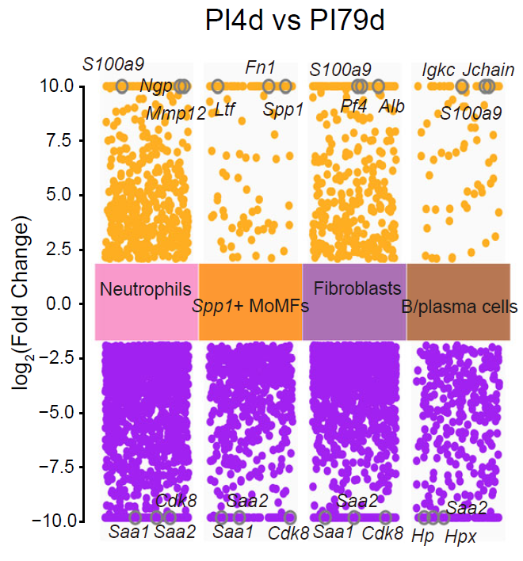
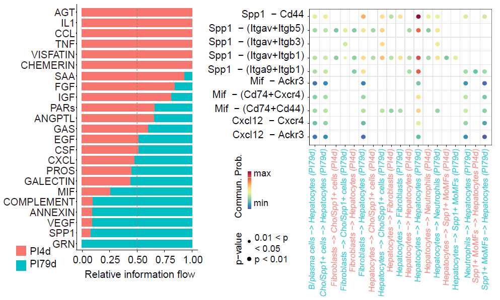
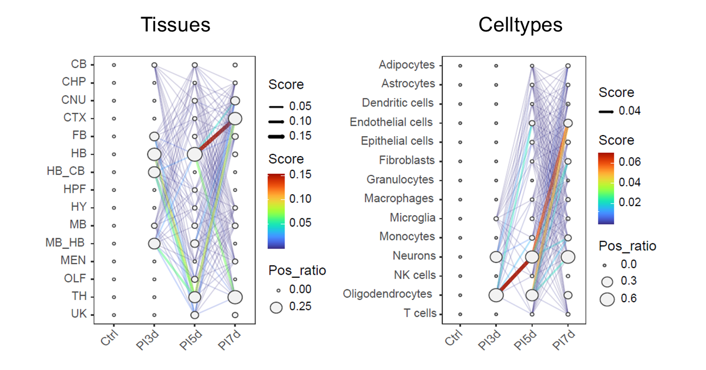
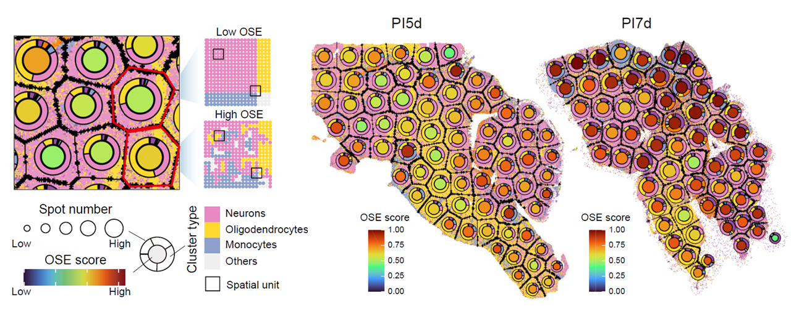
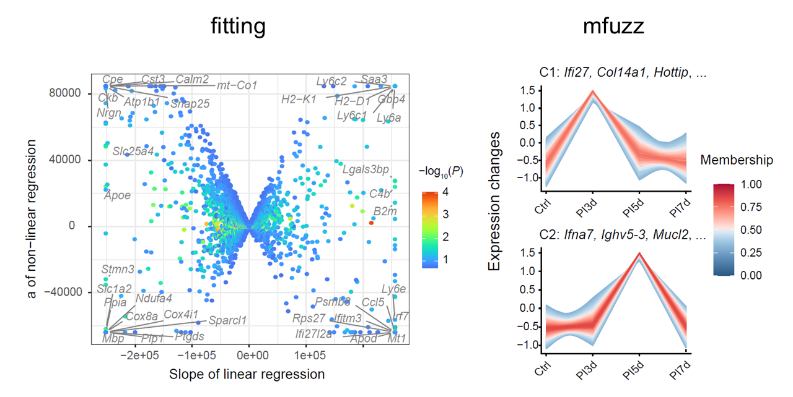

```{r setup, include = FALSE}
knitr::opts_chunk$set(
  collapse = TRUE,
  comment = "#>",
  fig.align = "center",
  fig.width = 7,
  fig.height = 5
)
set.seed(123)
```

## Overview

This vignette presents a multi-sample workflow in `STID` for comparing infection-associated niches across samples, conditions, or ordered time points. Starting from single-sample niche objects, it constructs separate comparative and temporal multi-sample objects and evaluates how niche composition, spatial organization, molecular programs, and pathogen distribution vary across samples.

This vignette covers:

- constructing multi-sample niche objects for comparative and temporal analyses;
- quantifying pathogen-positive burden, tissue and cell-type composition, and cellular aggregation;
- identifying niche-associated genes and cell–cell communication patterns across samples;
- inferring pathogen invasion trajectories and temporal gene modules;
- quantifying spatial organizational entropy during infection progression.

```{r multi-sample-strategy-figure, echo = FALSE, fig.align = "center", out.width = "700px", fig.cap = "Overview of multi-sample niche analysis."}
if (file.exists("figures/Figure5_A.png")) {
  knitr::include_graphics("figures/Figure5_A.png")
}
```

> **Note:** Set the input `STID` object, sample identifiers, comparison mode, niche keys, metadata keys, annotation columns, color vectors, gene filters, output group names, and figure paths according to the dataset being analyzed.

> **Reference code:** For more runnable code examples, please refer to the [article code](https://github.com/YulongQin/STID/tree/main/article_code).

## Prerequisites

```{r packages, message = FALSE, warning = FALSE, eval = FALSE}
library(tidyverse)
library(Seurat)
library(STID)
```

> **Note:** The core workflow uses `tidyverse`, `Seurat`, and `STID`. Downstream sections may additionally require `CellChat` and `Mfuzz`.

## Example data

### Prepare a comparative multi-sample niche object

This example uses the single-sample niche object generated in the previous vignette. Here, `STID_obj_SS` contains expanded niche boundaries and associated metadata for the AE dataset.

`CreateMultiSampNiche()` aggregates selected single-sample niches into a multi-sample object. In comparative mode, `loop_id` specifies the samples or sample groups to compare.

```{r prepare-comparative-ms-niche, eval = FALSE}
STID_obj_MS_comparative <- CreateMultiSampNiche(
  STID_obj = STID_obj_SS,
  multi_id = NULL,
  loop_id = c("DPI_4_2", "DPI_79_1"),
  compare_mode = "Comparative",
  niche_key = "Niche",
  description = NULL
)
```

> **Note:** Replace `STID_obj_SS`, `loop_id`, `compare_mode`, and `niche_key` with the corresponding object, sample identifiers, and niche key in your dataset. The downstream comparison identifier, such as `Comparative_2_4`, must match an identifier stored in the resulting multi-sample object.

### Prepare a temporal multi-sample niche object

This example uses the expanded focal-niche object generated by the infection-associated niche identification workflow. Here, `STID_obj_aggregated` contains expanded niche boundaries for the JE dataset.

For temporal analysis, construct single-sample niche metadata for each time point and then combine the ordered samples into a temporal multi-sample object. The example creates separate pathogen-infected niche and host-responsive niche. 

```{r prepare-temporal-ms-niche, eval = FALSE}
# Define cell-type colors
cell_palette <- c(
  "#E41A1C", "#377EB8", "#000080", "#4DAF4A", "#984EA3",
  "#FF7F00", "#FFFF33", "#A65628", "#F781BF", "#66C2A5",
  "#8DA0CB", "#E78AC3", "#A6D854", "#FFD92F", "#E5C494"
)
cell_levels <- sort(unique(STID_obj_aggregated@meta.data$new_cell))
if (length(cell_levels) > length(cell_palette)) {
  stop("Extend `cell_palette` so that each `new_cell` level has a unique color.")
}
col_lasso_cell <- setNames(
  cell_palette[seq_along(cell_levels)],
  cell_levels
)

col_lasso_cell2 <- c(
  "Adipocytes" = "#E41A1C",
  "Astrocytes" = "#377EB8",
  "Dendritic cells" = "#000080",
  "Endothelial cells" = "#4DAF4A",
  "Epithelial cells" = "#984EA3",
  "Fibroblasts" = "#FF7F00",
  "Macrophages" = "#FFFF33",
  "Microglia" = "#F781BF",
  "Monocytes" = "#66C2A5",
  "Neurons" = "#8DA0CB",
  "NK cells" = "#E78AC3",
  "Oligodendrocytes" = "#A6D854",
  "T cells" = "#FFD92F"
)

# Construct single-sample niche metadata
STID_obj_SS_temporal <- CreateSingleSampNiche(
  STID_obj = STID_obj_aggregated,
  niche_key = "Niche_microbe",
  meta_key = list("M2_NicheDetect_STS_STS_JEV_multisamp_microbe_region"),
  ROI_type = "ROI",
  pos_colnm = "ROI_label",
  center_colnm = "ROI_center",
  edge_colnm = "ROI_edge",
  all_label_colnm = "All_ROI_label",
  all_dist_colnm = "All_Dist2ROIcenter",
  description = NULL
)

STID_obj_SS_temporal <- CreateSingleSampNiche(
  STID_obj = STID_obj_SS_temporal,
  niche_key = "Niche_host",
  meta_key = list("M2_NicheDetect_STS_STS_JEV_multisamp_host_region"),
  ROI_type = "ROI",
  pos_colnm = "ROI_label",
  center_colnm = "ROI_center",
  edge_colnm = "ROI_edge",
  all_label_colnm = "All_ROI_label",
  all_dist_colnm = "All_Dist2ROIcenter",
  description = NULL
)

STID_obj_SS_temporal <- AddSSNicheCells(
  STID_obj = STID_obj_SS_temporal,
  meta_key = "raw",
  select_colnm = "new_tissue",
  niche_key = "Niche_microbe"
)

STID_obj_SS_temporal <- AddSSNicheCells(
  STID_obj = STID_obj_SS_temporal,
  meta_key = "raw",
  select_colnm = "new_tissue",
  niche_key = "Niche_host"
)

# Construct multi-sample niche metadata
STID_obj_MS_temporal <- CreateMultiSampNiche(
  STID_obj = STID_obj_SS_temporal,
  multi_id = "Temporal_1_2_3",
  loop_id = c("D0_1","D3_1", "D5_1", "D7_1"), 
  compare_mode = "Temporal",
  niche_key = "Niche_microbe",
  description = NULL
)

STID_obj_MS_temporal <- CreateMultiSampNiche(
  STID_obj = STID_obj_MS_temporal,
  multi_id = "Temporal_1_2_3",
  loop_id = c("D0_1","D3_1", "D5_1", "D7_1"),
  compare_mode = "Temporal",
  niche_key = "Niche_host",
  description = NULL
)
```

## Comparative multi-sample analysis

Most single-sample niche functions can be applied to multi-sample objects by setting `samp_mode = "MS"` and specifying the relevant multi-sample `loop_id`. This section uses `STID_obj_MS_comparative` to compare composition, aggregation, differential expression, and cell–cell communication across samples.

> **Note:** Set `loop_id`, `samp_grp_index`, `meta_key`, `niche_key`, `group_by`, and color vectors for each comparison. Use `LoopAllMulti` to summarize all multi-sample groups or a specific identifier such as `Comparative_2_4` for one comparison. 

### Tissue composition, cell-type composition, and cell aggregation

`AddMSNicheCells()` appends selected metadata to the multi-sample niche object. `CalSampComp()` compares pathogen-positive proportions or annotation-level composition, and `CalSampCAI()` evaluates local aggregation of annotated cell populations.

```{r calculate-ms-composition-and-cai, eval = FALSE}
col_lasso <- c(
  "HsPCs" = "#E41A1C",
  "Hepatocytes" = "grey95",
  "Infla Heps" = "#4DAF4A",
  "Fibroblasts" = "#984EA3",
  "Cho/Spp1+ cells" = "#FFFF33",
  "Spp1+ MoMFs" = "#FF7F00",
  "MoKCs" = "#377EB8",
  "Neutrophils" = "#F781BF",
  "B/plasma cells" = "#A65628",
  "Others" = "#8DA0CB"
)
col_lasso2 <- c(
  "HsPCs" = "#E41A1C",
  "Hepatocytes" = "#66C2A5",
  "Infla Heps" = "#4DAF4A",
  "Fibroblasts" = "#984EA3",
  "Cho/Spp1+ cells" = "#FFFF33",
  "Spp1+ MoMFs" = "#FF7F00",
  "MoKCs" = "#377EB8",
  "Neutrophils" = "#F781BF",
  "B/plasma cells" = "#A65628",
  "Others" = "#8DA0CB"
)

# Pathogen-positive proportion
STID_obj_MS_comparative <- AddMSNicheCells(
  STID_obj = STID_obj_MS_comparative,
  loop_id = "Comparative_2_4",
  meta_key = "M1_SpotDetect_Gene_AE_correct_after_all_gene_white",
  select_colnm = "Label_all_gene_nFeature(sum)",
  niche_key = "Niche"
)

CalSampComp(
  STID_obj = STID_obj_MS_comparative,
  samp_mode = "MS",
  loop_id = "LoopAllMulti",
  samp_grp_index = TRUE,
  meta_key = "M1_SpotDetect_Gene_AE_correct_after_all_gene_white",
  niche_key = NULL,
  group_by = "Label_all_gene_nFeature(sum)",
  col = rev(c("#E41A1C", "#377EB8")),
  return_data = FALSE
)

# Tissue and cell-type composition
CalSampComp(
  STID_obj = STID_obj_MS_comparative,
  samp_mode = "MS",
  loop_id = "LoopAllMulti",
  samp_grp_index = TRUE,
  niche_key = NULL,
  group_by = "anno",
  col = col_lasso,
  return_data = FALSE
)

# Cell aggregation index
ms_cai <- CalSampCAI(
  STID_obj = STID_obj_MS_comparative,
  samp_mode = "MS",
  loop_id = "LoopAllMulti",
  samp_grp_index = TRUE,
  meta_key = NULL,
  niche_key = "Niche",
  group_by = "anno",
  k_neighbors = 8,
  min_agg_size = 10,
  dist_thres = 1,
  col = col_lasso
)
```

```{r show-ms-composition-and-cai, echo = FALSE, fig.align = "center", out.width = "700px", fig.cap = "Pathogen-positive proportions, annotation composition, and aggregation across multi-sample niches."}
if (file.exists("figures/merge_photo/merge6.PNG")) {
  
}
```

### Differential gene expression analysis

`CalSampDEGs()` identifies genes associated with selected cell populations or niche groups across multi-sample comparisons. The example filters predicted genes and pathogen-derived features before testing host transcriptional differences.

> **Note:** Set `loop_id`, `group_by`, `group_value`, `assay_id`, thresholds, gene filters, and `grp_nm` for the comparison and feature space. If the selected `niche_key` yields too few genes, use broader annotation groups or adjust the tested group set.

```{r calculate-ms-degs, eval = FALSE}
MS_DEGs <- CalSampDEGs(
  STID_obj = STID_obj_MS_comparative,
  samp_mode = "MS",
  loop_id = "Comparative_2_4",
  samp_grp_index = TRUE,
  logfc_thres = 2,
  group_by = "anno",
  group_value = c("Neutrophils", "Spp1+ MoMFs", "Fibroblasts", "B/plasma cells"),
  assay_id = "Spatial",
  padj_thres = 0.05,
  adjust_method = "BH",
  col = col_lasso,
  remove_genes = c(
    grep("^Gm", rownames(STID_obj_MS_comparative), value = TRUE),
    grep("^EmuJ", rownames(STID_obj_MS_comparative), value = TRUE)
  ),
  grp_nm = "Comparative_2_4_All"
)
```

```{r show-ms-degs, echo = FALSE, fig.align = "center", out.width = "500px", fig.cap = "Differential expression analysis across comparative multi-sample niches."}
if (file.exists("figures/Figure5_D.png")) {
  
}
```

### Cell–cell communication analysis

Cell–cell communication results generated in the single-sample workflow can be visualized in multi-sample niches by setting `samp_mode = "MS"` in `Plot_NicheCellComm()`. This reuses the same `CellComm_data` object for sample-level comparisons.

> **Note:** Use a `CellComm_data` object generated from the same expression matrix and annotation scheme. Set `loop_id`, signaling pathways, ligand-receptor pairs, and color vectors according to the comparison.

```{r plot-ms-cell-communication, eval = FALSE}
CellComm_data <- readRDS("./outputdata/M3_CalSampCellComm/CalSampCellComm/CellComm_data.rds")

Plot_NicheCellComm(
  STID_obj = STID_obj_MS_comparative,
  CellComm_data = CellComm_data,
  samp_mode = "MS",
  loop_id = "Comparative_2_4",
  signaling = c("CXCL", "CCL", "SAA", "SPP1", "MIF", "VEGF", "FGF"),
  pairLR.use = NULL,
  col = col_lasso2
)
```

```{r show-ms-cell-communication, echo = FALSE, fig.align = "center", out.width = "600px", fig.cap = "Cell–cell communication patterns across comparative multi-sample niches."}
if (file.exists("figures/Figure5_E.png")) {
  
}
```

## Temporal multi-sample analysis

Temporal multi-sample analysis uses ordered sample identifiers to evaluate changes in pathogen distribution, spatial organization, and host transcriptional programs. The following sections use `STID_obj_MS_temporal`, which contains temporal niches generated with `compare_mode = "Temporal"`.

> **Note:** Confirm that `loop_id` follows the biological time order, that metadata columns are harmonized across samples, and that `samp_grp_index` matches the structure of the temporal object.

### Pathogen invasion trajectory analysis

`CalSampPathoTrack()` infers potential pathogen propagation between adjacent time points by combining pathogen-positive load in source annotations with the increase in pathogen-positive load in target annotations.

For two adjacent time points, the propagation score is defined as:

$$
\mathrm{Score}_{\mathrm{source} \to \mathrm{target}} = \mathrm{Load}_{\mathrm{source},t} \times \left(\mathrm{Load}_{\mathrm{target},t+1} - \mathrm{Load}_{\mathrm{target},t}\right)
$$

Only target annotations with increased pathogen-positive load are retained. The resulting network summarizes the inferred direction and relative magnitude of pathogen spread across tissues or cell types.

> **Note:** Set `loop_id`, `pos_colnm`, `neg_value`, `meta_key`, `group_by`, `col`, `grp_nm`, and `dir_nm` to match the pathogen-detection metadata and annotation level. Use tissue-level or cell-type-level annotations according to the biological question.

```{r calculate-pathogen-invasion-trajectory, eval = FALSE}
CalSampPathoTrack(
  STID_obj = STID_obj_MS_temporal,
  loop_id = "Temporal_1_2_3",
  pos_colnm = "Label_all_gene_nFeature(sum)",
  neg_value = "neg",
  samp_grp_index = FALSE,
  meta_key = "M1_SpotDetect_Gene_JEV_multisamp_microbe_gene",
  niche_key = NULL,
  group_by = "new_cell",
  col = col_lasso_cell,
  return_data = FALSE,
  grp_nm = "Temporal_1_2_3_cell",
  dir_nm = "M4_CalSampPathoTrack"
)
```

```{r show-pathogen-invasion-trajectory, echo = FALSE, fig.align = "center", out.width = "700px", fig.cap = "Inferred pathogen invasion trajectories across temporal multi-sample niches."}
if (file.exists("figures/merge_photo/merge7.PNG")) {
  
}
```

### Spatial organizational entropy analysis

`CalSampOSE()` quantifies spatial organizational entropy (OSE) to evaluate changes in local tissue or cell-type organization during infection. Higher entropy indicates greater heterogeneity in local spatial organization.

Spots are grouped into local spatial units, unit-type frequencies are summarized within each region, and entropy is normalized by the expected number of observed unit types to improve comparability across regions with different spot counts.

The adjusted entropy is:

$$
E_{\mathrm{adjusted}} = \frac{E_{\mathrm{observed}}}{\mathrm{ExpectedCoveredSpecies}(N, n)}
$$

where `N` is the total number of possible unit types and `n` is the number of observed local spatial units.

> **Note:** Set `loop_id`, `meta_key`, `group_by`, color vectors, `grp_nm`, and `dir_nm` according to the temporal object. Use `only_plot = FALSE` when entropy values are needed for downstream statistics.

```{r calculate-spatial-organizational-entropy, eval = FALSE}
CalSampOSE(
  STID_obj = STID_obj_MS_temporal,
  loop_id = "Temporal_1_2_3",
  meta_key = "M1_SpotDetect_Gene_JEV_multisamp_microbe_gene",
  group_by = "new_cell",
  col = col_lasso_cell,
  only_plot = TRUE,
  return_data = FALSE,
  grp_nm = "Temporal_1_2_3_cell",
  dir_nm = "M4_CalSampOSE"
)
```

```{r show-spatial-organizational-entropy, echo = FALSE, fig.align = "center", out.width = "700px", fig.cap = "Spatial organizational entropy across temporal multi-sample niches."}
if (file.exists("figures/merge_photo/merge8.PNG")) {
  
}
```

### Temporal gene module identification

`CalSampGeneTrend()` identifies dynamic host transcriptional programs across ordered samples. The function supports trend fitting for directional or nonlinear temporal patterns and fuzzy clustering for module-level trajectories.

In fitting mode, genes are classified by linear and quadratic trend components. In clustering mode, fuzzy c-means clustering groups genes into temporal modules and identifies core genes by membership scores.

> **Note:** Set `loop_id`, `meta_key`, `niche_key`, `group_by`, `gene_list`, `method`, gene filters, `grp_nm`, and `dir_nm` according to the temporal comparison. Use `method = "fitting"` for interpretable trend classes and `method = "mfuzz"` for module-level trajectories.

```{r calculate-temporal-gene-modules, eval = FALSE}
# fitting
gene_trend_fit <- CalSampGeneTrend(
  STID_obj = STID_obj_MS_temporal,
  loop_id = "Temporal_1_2_3",
  samp_grp_index = FALSE,
  meta_key = "M1_SpotDetect_Gene_JEV_multisamp_microbe_gene",
  niche_key = NULL,
  group_by = NULL,
  gene_list = NULL,
  method = "fitting",
  col = col_lasso_cell,
  remove_genes = c(
    grep("^Gm", rownames(STID_obj_MS_temporal), value = TRUE),
    grep("Rik$", rownames(STID_obj_MS_temporal), value = TRUE)
  ),
  return_data = TRUE,
  grp_nm = "Temporal_1_2_3_fitting_all",
  dir_nm = "M4_CalSampGeneTrend"
)

# mfuzz
gene_trend_mfuzz <- CalSampGeneTrend(
  STID_obj = STID_obj_MS_temporal,
  loop_id = "Temporal_1_2_3",
  samp_grp_index = FALSE,
  meta_key = "M1_SpotDetect_Gene_JEV_multisamp_microbe_gene",
  niche_key = NULL,
  group_by = NULL,
  gene_list = NULL,
  method = "mfuzz",
  col = col_lasso_cell,
  remove_genes = c(
    grep("^Gm", rownames(STID_obj_MS_temporal), value = TRUE),
    grep("Rik$", rownames(STID_obj_MS_temporal), value = TRUE)
  ),
  return_data = TRUE,
  grp_nm = "Temporal_1_2_3_mfuzz_all",
  dir_nm = "M4_CalSampGeneTrend"
)
```

```{r show-temporal-gene-modules, echo = FALSE, fig.align = "center", out.width = "700px", fig.cap = "Temporal gene modules across ordered multi-sample niches."}
if (file.exists("figures/merge_photo/merge9.PNG")) {
  
}
```

## Notes

- Confirm that sample identifiers, annotation columns, niche metadata, and named color vectors are consistent across all selected samples.
- Review `loop_id`, `compare_mode`, `niche_key`, `meta_key`, `group_by`, `samp_grp_index`, and output names before running each section.
- For temporal analyses, order `loop_id` according to the biological time course and harmonize metadata levels across time points.

## Next steps

This vignette demonstrates comparative and temporal analyses across multiple samples to characterize niche remodeling, pathogen propagation, spatial organization, and dynamic host responses during infection progression. The generated results can be used for figure preparation, biological interpretation, or customized downstream analyses with the `STID` [plotting](https://yulongqin.github.io/STID/articles/Plotting_functions.html) and [utility](https://yulongqin.github.io/STID/articles/Utility_functions.html) functions.

## Session information

```{r session-info}
sessionInfo()
```
